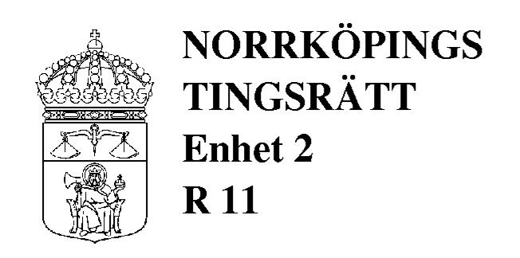
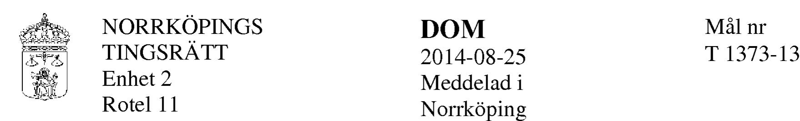

#### **ÖVERKLAGAT AVGÖRANDE**

Norrköpings tingsrätts dom 2014-08-25 i mål T 1373-13, se bilaga A

#### **KLAGANDE**

ASSOWEH Sougueh Egueh Buraale Ahmed, 730305-8353 Emil Hedelius Gata 132 603 76 Norrköping

Ombud och rättshjälpsbiträde: Advokat Denise Lagercrantz Box 17171 104 62 Stockholm

#### **MOTPART**

RAHMA Mohamoud Ahmed, 800810-4187 Dagsbergsvägen 140 Lgh 1804 603 51 Norrköping

Ombud och rättshjälpsbiträde genom substitution: Advokat Bo Nilsson Vasavägen 9 641 31 Katrineholm

# **SAKEN** Barns boende

#### **HOVRATTENS DOMSLUT**

Hovrätten ändrar tingsrättens dom endast på det sättet att det i punkten 2 i domslutet även ska stå följande. Byte av boende ska ske på måndagar i ojämna veckor, med början den 30 juni 2014 då barnen ska bo hos Assoweh Ahmed.

Hovrätten bestämmer ersättning enligt rättshjälp slagen (1996:1619) åt Denise Lagercrantz till 3 190 kr. Av beloppet avser 2 552 kr arbete och 638 kr mervärdesskatt.

Hovrätten bestämmer ersättning enligt rättshjälp slagen (1996:1619) åt Bo Nilsson till 2 392 kr. Av beloppet avser l 914 kr arbete och 478 kr mervärdesskatt.

Dok.Id 201903

www. gotaho vratt. se

# **YRKANDEN M.M. I HOVRATTEN**

Genom den överklagade domen fastställde tingsrätten en överenskommelse mellan parterna som innebar dels att vårdnaden om deras barn skulle vara gemensam, dels att barnen skulle vara växelvis boende hos parterna fjorton dagar i taget med byte på måndagar.

Assoweh Ahmed har yrkat att hovrätten ska ändra tingsrättens dom på så sätt att det i domslutet läggs till vilka datum byte av boende ska ske.

Rahma Ahmed har medgett ändringsyrkandet.

Hovrätten har med stöd av 50 kap. 13 § första stycket rättegångsbalken avgjort målet utan huvudförhandling.

# **HOVRÄTTENS DOMSKÄL**

Parterna är överens om att barnen ska bo växelvis hos dem med fjorton dagar åt gången. De är också överens om att det växelvisa boendet skulle inledas måndagen den 16 juni 2014 (vecka 25), då barnen skulle till Rahma Ahmed, och att byte därefter skulle ske måndagen den 30 juni 2014 (vecka 27), då barnen skulle till Assoweh Ahmed, osv.

För att tingsrättens dom ska vara verkställbar bör det framgå av domslutet när byte ska ske. Det som parterna är överens om i detta hänseende får också anses vara förenligt med barnens bästa.

# HUR MAN ÖVERKLAGAR, se bilaga B

Överklagande senast den 7 november 2014

I avgörandet har deltagit hovrättsråden Björn Karlsson, Anna Sjöman och Ulrika Tyrén (referent).

Hovrätten är enig.

# Rättelse/komplettering

Dom, 2014-08-25

### **Rättelse och komplettering, 2014-09-05**

Beslutat av: rådmannen Anders Heiborn

Tingsrätten rättar och kompletterar Domslutet under punkten l så att dess lydelse ska vara enligt följande:

1. Tingsrätten förordnar att vårdnaden om barnen Mohamed Aadam Buraale, 000604-0133, Nasteo Aadan Buraale, 021020-1729, Nasrin Aadan Buraale, 031207-3042, Yusuf Aadan Buraale, 070501-3712 och Kaled Aadan Buraale, 050819-5955 ska vara gemensam.

# **PARTER**

# **KÄRANDE**

RAHMA Mohamoud Ahmed, 800810-4187 Medborgare i Somalia Dagsbergsvägen 140 Lgh 1804 603 51 Norrköping

Ombud och biträde enligt rättshjälp slagen: Advokat Bo Nilsson Advokatfirman Bo Nilsson AB Vasavägen 9 641 31 Katrineholm

#### **SVARANDE**

ASSOWEH Sougueh Egueh Buraale Ahmed, 730305-8353 Medborgare i Somalia Emil Hedelius Gata 132 603 76 Norrköping

Ombud och biträde enligt rättshjälp slagen: Advokat Denise Lagercrantz Advokatfirman Lagercrantz AB Box 17171 104 62 Stockholm

#### **DOMSLUT**

- 1. Tingsrätten förordnar att vårdnaden om barnen Mohamed Aadan Buraale, 000604-0133, Nasteho Aadan Buraale, 021220-1729, Nasrin Aadan Buraale, 070501-3712 ska vara gemensam.
- 2. Barnen under punkt l ska vara växelvis boende hos Rahma Mohamoud Ahmed och Aadan Buraale Ahmed med 14 dagar i taget. Byte av boende sker på måndagar i skolan eller, vid lov, vid huvudbiblioteket i Norrköping.
- 3. Tingsrätten fastställer ersättningen enligt rättshjälp slagen åt a) Bo Nilsson till 40 900 kr, varav 35 090 kr för arbete och 5 810 kr för utlägg.
  - b) Denise Lagercrantz till 26 518 kr, varav 24 324 kr för arbete och 2 194 kr för tidsspillan. Av beloppet 26 518 kr utgör 5 304 kr mervärdesskatt.

#### Dok.Id 308414

Av beloppet 40 900 kr utgör 8 180 kr mervärdesskatt

### **YRKANDEN M M**

Rahma Mohamoud Ahmed har yrkat i enlighet med domsbilaga 1. Aadan Buraale Ahmed har bestritt yrkandena.

Under handläggningens gång har parterna enats om den överenskommelse som framgår av domslutet.

# **DOMSKÄL**

Den överenskommelse som parterna träffat får anses vara bäst för barnen. Den ska således fastställas i dom i enlighet med vad parterna yrkat.

Tingsrätten fastställer ersättningen enligt rättshjälp slagen till Denise Lagercrantz utifrån vad hon begärt, vilket är ett skäligt belopp.

När det gäller ersättningen till Bo Nilsson har han i ett sent skede av målet övertagit rollen som ombud och rättshjälpsbiträde. Det innebär att huvuddelen av biträdeshjälpen till Rahma Ahmed har det tidigare biträdet, jur kand Andrea Rogefors på samma advokatbyrå, svarat för. Bo Nilsson har i allt fall yrkar ersättning för 30 timmars arbete. Det ska jämföras med Denise Lagercrantz som yrkat ersättning för ca 15 timmars arbete. Andrea Rogefors och Bo Nilsson har gett in tre skrifter till tingsrätten om sammanlagt sex sidor. Parternas biträden har närvarat vid två muntliga förberedelser om två timmar respektive 20 minuter. Även om Andrea Rogefors och Bo Nilsson haft fler kontakter än Denise Lagercrantz haft med sin huvudman, framstår den nedlagda arbetstiden, 30 timmar, som oskälig. Tingsrätten fastställer därför ersättningen för arbete till Bo Nilsson motsvarande 22 timmars arbete. Ersättningen i övrigt fastställs enligt yrkande.

NORRKÖPINGS DOM T 1373-13 TINGSRÄTT 2014-08-25 Enhet 2

# **HUR MAN ÖVERKLAGAR;** se domsbilaga 2.

Överklagande senast den 15 september 2014, ställs till Göta hovrätt. Prövningstillstånd krävs.

Anders Heiborn

Rådman

**GÖTA HOVRÄTT** Bilaga

# **ANVISNINGAR FÖR ÖVERKLAGANDE**

Den som vill överklaga ska göra detta skriftligen.

Överklagandet ställs till Högsta domstolen men ska inlämnas eller insändas till hovrätten. Skrivelsen ska ha kommit in till hovrätten senast den dag som anges under rubriken "Hur man överklagar". Någon tidsgräns gäller dock inte för beslut om häktning, kvarhållande i häkte, tillstånd till restriktioner enligt 24 kap. 5 a § rättegångsbalken eller reseförbud.

Beslutet om skyldighet för någon att ersätta rättegångskostnader, ersättningsbeslut i övrigt samt beslut om avräkning av tiden för frihetsberövande får överklagas utan att man klagar på domen i övrigt.

Det krävs prövningstillstånd för att Högsta domstolen ska pröva ett överklagande. Kravet på prövningstillstånd gäller dock inte när Justitiekanslern eller någon av Riksdagens ombudsmän överklagar i ett mål där allmänt åtal förs.

Högsta domstolen får meddela prövningstillstånd endast om

- 1. det är av vikt för ledning av rättstillämpningen att överklagandet prövas av Högsta domstolen; eller
- 2. det finns synnerliga skäl till en prövning, såsom att det finns grund för resning eller att domvilla förekommit eller att målets utgång i hovrätten uppenbarligen beror på grovt förbiseende eller grovt misstag.

Om prövningstillstånd meddelas i ett av två eller flera likartade mål, som samtidigt föreligger för bedömande, kan prövningstillstånd meddelas även i övriga mål.

I överklagandet till Högsta domstolen ska följande uppgifter lämnas

- 1. klagandens namn, postadress och telefonnummer,
- 2. den dom eller det beslut som överklagas (dagen för hovrättens avgörande och hovrättens målnummer),
- 3. den ändring som yrkas i hovrättens avgörande,
- 4. grunderna för överklagandet med uppgift om i vilket avseende hovrättens skäl enligt klagandens mening är oriktiga,
- 5. de omständigheter som åberopas för att prövningstillstånd ska meddelas, när sådant tillstånd krävs och
- 6. de bevis som åberopas med uppgift om vad som ska styrkas med varje bevis.

Skrivelsen bör vara egenhändigt undertecknad av klaganden eller klagandens ombud.