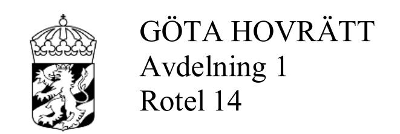
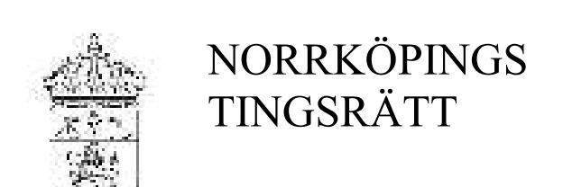

**DOM** 2020-03-03 Jönköping

Mål nr T 778-19

# **ÖVERKLAGAT AVGÖRANDE**

Norrköpings tingsrätts dom 2019-02-06 i mål T 982-18, se bilaga A

## **PARTER**

## **Klagande**

Stif Istifo, 19810801-3676 Durkgatan 7 603 85 Norrköping

Ombud: Advokat Johanna Bergman Edelbergs Advokatbyrå AB Holmentornet 602 32 Norrköping

#### **Motpart**

Khetam Murad, 19850407-5121 Skogslyckegatan 16 Lgh 1003 587 26 Linköping

Ombud och biträde enligt rättshjälpslagen: Jur.kand. Johan Levin Levin Juristbyrå Södra Promenaden 140 602 31 Norrköping

### **SAKEN**

Vårdnad m.m.

\_\_\_\_\_\_\_\_\_\_\_\_\_\_\_\_\_\_\_

## **HOVRÄTTENS DOMSLUT**

Med upphävande av tingsrättens domslut, utom såvitt avser beslutet om ersättning till rättshjälpsbiträdet, bestämmer hovrätten, i enlighet med parternas överenskommelse, följande

1. Den gemensamma vårdnaden om Gabriel Istifo, 080417-8770, och Julia Istifo, 091123-0100, ska alltjämt bestå.

Dok.Id 298427

- 2. Gabriel Istifo och Julia Istifo ska alltjämt ha sitt stadigvarande boende hos Stif Istifo.
- 3. Gabriel Istifo och Julia Istifo ska ha rätt till umgänge med Khetam Murad enligt följande.
  - a. Vartannat veckoslut, jämna veckor, från fredag vid skolans/fritids slut eller i fall av ledig dag från kl. 16.00, till söndag kl. 18.00. Khetam Murad ska vid umgängestillfällenas början hämta barnen på skola/fritids eller i fall av ledig dag hemma hos Stif Istifo. Stif Istifo ska vid umgängestillfällenas slut hämta barnen hemma hos Khetam Murad.
  - b. Jullovsumgänge, varje år, dels från den 22 december vid skolans/fritids slut eller i fall av ledig dag från kl. 10.00, till den 25 december kl. 15.00, dels från den 1 januari kl. 10.00 till den 4 januari kl. 18.00. Khetam Murad ska vid umgängestillfällenas början hämta barnen på skola/fritids eller i fall av ledig dag hemma hos Stif Istifo. Stif Istifo ska vid umgängestillfällenas slut hämta barnen hemma hos Khetam Murad.
  - c. Påsklovsumgänge, varje år, från skärtorsdagen vid skolans/fritids slut eller i fall av ledig dag från kl. 10.00, till påskdagen kl. 15.00. Khetam Murad ska vid umgängestillfällenas början hämta barnen på skola/fritids eller i fall av ledig dag hemma hos Stif Istifo. Stif Istifo ska vid umgängestillfällenas slut hämta barnen hemma hos Khetam Murad.
  - d. Vartannat sportlov och höstlov från sista skoldagen före lovets början till första skoldagen vid lovets slut, med början år 2021. Khetam Murad ska vid umgängestillfällenas början hämta barnen på skola/fritids eller i fall av ledig dag hemma hos Stif Istifo. Stif Istifo ska vid umgängestillfällenas slut hämta barnen hemma hos Khetam Murad.
  - e. Sommarlovsumgänge med sammanlagt tre veckor fördelat på tre perioder om en vecka vardera. Khetam Murad ska ha rätt att välja

veckor under jämna år och ska senast den 1 april anmäla till Stif Istifo vilka veckor som hon önskar.

Vad hovrätten har beslutat ovan ska gälla omedelbart, utan hinder av att domen inte vunnit laga kraft.

Hovrätten bestämmer ersättning enligt rättshjälpslagen (1996:1619) åt Johan Levin till 43 081 kr. Av beloppet avser 28 238 kr arbete, 5 140 kr tidsspillan, 1 087 kr utlägg och 8 616 kr mervärdesskatt.

\_\_\_\_\_\_\_\_\_\_\_\_\_\_\_\_\_\_\_

# **YRKANDEN I HOVRÄTTEN**

Sedan Stif Istifo överklagat tingsrättens dom i fråga om vårdnad och umgänge, samt Ketam Murad framställt yrkande om utökat umgänge, har parterna träffat den överenskommelse som framgår av domslutet. De har gemensamt begärt att hovrätten ska döma i enlighet med överenskommelsen.

# **HOVRÄTTENS DOMSKÄL**

Det som parterna har kommit överens om får anses förenligt med Gabriels och Julias bästa. Det finns därmed förutsättningar att döma i enlighet med överenskommelsen.

Det är förenligt med barnens bästa att det som hovrätten beslutat gäller omedelbart utan hinder av att domen inte vunnit laga kraft.

# **HUR MAN ÖVERKLAGAR,** se bilaga B

Överklagande senast den 31 mars 2020.

I avgörandet har deltagit hovrättslagmannen Mats Lundeholm, hovrättsrådet Frida Barrstrand (referent) och tf. hovrättsassessorn Sebastian Lindroth samt nämndemännen Eva Eriksson och Per Rosengren.

#### **Hovrätten är enig.**

**DOM** 2019-02-06 Meddelad i Norrköping

Mål nr T 982-18

# **PARTER**

#### **Kärande**

Stif Istifo, 19810801-3676 Durkgatan 7 603 85 Norrköping

Ombud: Advokat Johanna Bergman Edelbergs Advokatbyrå AB Holmentornet 602 32 Norrköping

#### **Svarande**

Khetam Murad, 19850407-5121 Skogslyckegatan 16 Lgh 1003 587 26 Linköping

Ombud och biträde enligt rättshjälpslagen: Jur.kand. Johan Levin Levin Juristbyrå Södra Promenaden 140 602 31 Norrköping

\_\_\_\_\_\_\_\_\_\_\_\_\_\_\_\_\_\_\_\_\_\_

#### **DOMSLUT**

- 1. Stif Istifos yrkande om ensam vårdnad om Gabriel Istifo, 080417-8770, och Julia Istifo, 091123-0100, lämnas utan bifall
- 2. Gabriel Istifo och Julia Istifo ska ha sitt fasta boende hos Stif Istifo. Vad sålunda förordnats ska gälla även för tiden intill dess lagakraftägande dom föreligger
- 3. Gabriel Istifo och Julia Istifo ska ha rätt till umgänge med Khetam Murad enligt följande
  - vartannat veckoslut från lördag kl 10.00 till söndag kl 18.00 under jämna veckor

#### Dok.Id 448542

- varannan julhelg från den 22 december efter skolans slut till den 28 december kl 15.00 med början år 2020
- varannan nyårshelg från den 28 december kl 15.00 till första skoldagen vid lovets slut med början år 2019
- vartannat sportlov från sista skoldagen före lovets början till första skoldagen vid lovets slut med början år 2021
- vartannat påsklov från sista skoldagen före lovets början till första skoldagen vid lovets slut med början år 2020
- vartannat höstlov från sista skoldagen före lovets början till första skoldagen vid lovets slut med början år 2019
- sommarumgänge under vecka 25-32 med sammanlagt fyra veckor uppdelade på två perioder om två veckor vardera. Varje tvåveckorsperiod från söndag kl 15.00 till söndag kl 18.00. Khetam Murad ska ha rätt att välja veckor under jämna år och ska senast den 1 april anmäla till Stif Istifo vilka veckor som hon önskar. Sommarumgänge ska ske med början år 2020
- Vid hämtning och lämning i samband med umgängesrättstillfällena ska detta ske vid skolan eller, då det inte är skoldag, ska Khetam Murad hämta barnen hos Stif Istifo vid umgängesrättstillfällenas början och denne ska efter umgängesrättstillfällena hämta barnen hos Khetam Murad.

Vad sålunda förordnats under punkten 3 ska gälla även för tiden intill dess lagakraftägande dom föreligger

4. Tingsrätten fastställer ersättning enligt rättshjälpslagen åt Johan Levin till 114 971 kr. Av beloppet avser 91 977 kr arvode och 22 994 kr mervärdesskatt.

## **YRKANDEN M M**

Stif Istifo har i första hand yrkat att han ensam ska tillerkännas vårdnaden om parternas barn Gabriel, 080417-8770, och Julia, 091123-0100. I andra hand har han yrkat att tingsrätten ska förordna att barnen ska ha sitt fasta boende hos honom. Yrkandena har jämväl framställts interimistiskt.

Khetam Murad har bestritt yrkandet om ensam vårdnad men medgivit yrkandet om barnens boende.

Hon har för egen del yrkat att den gemensamma vårdnaden ska bestå samt yrkat umgängesrätt enligt följande:

- vartannat veckoslut från lördag kl 10.00 till söndag kl 18.00 under jämna veckor
- varannan julhelg från den 22 december efter skolans slut till den 28 december kl 15.00 med början år 2020
- varannan nyårshelg från den 28 december kl 15.00 till första skoldagen vid lovets slut med början år 2019
- vartannat sportlov från sista skoldagen före lovets början till första skoldagen vid lovets slut med början år 2019
- vartannat påsklov från sista skoldagen före lovets början till första skoldagen vid lovets slut med början år 2020
- vartannat höstlov från sista skoldagen före lovets början till första skoldagen vid lovets slut med början år 2019
- sommarumgänge under vecka 25-32 med sammanlagt fyra veckor uppdelade på två perioder om två veckor vardera. Varje tvåveckorsperiod från söndag kl 15.00 till söndag kl 18.00. Khetam Murad ska ha rätt att välja veckor under jämna år och ska senast den 1 april anmäla till Stif Istifo vilka veckor som hon önskar
- Vid hämtning och lämning i samband med umgängesrättstillfällena ska detta ske vid skolan eller, då det inte är skoldag, ska Khetam Murad hämta barnen hos Stif Istifo vid

umgängesrättstillfällenas början och denne ska efter umgängesrättstillfällena hämta barnen hos Khetam Murad.

Khetam Murad har jämväl framställt yrkandena om umgängesrätt interimistiskt.

Stif Istifo har medgett yrkandena om umgängesrätt enligt följande:

- var tredje lördag mellan kl 10.00 och 18.00
- varannan julhelg från den 23 december kl 15.00 till den 24 december kl 15.00
- under sportlov, påsklov och höstlov dagumgänge med en övernattning hos Khetam Murad

Yrkandena i övrigt har han bestritt. Han har dock inte haft något att erinra mot att hämtning och lämning sker på sätt Khetam Murad yrkat.

## **BAKGRUND**

Parterna har gemensam vårdnad om sina barn Gabriel och Julia. Stif Istifo och Khetam Murad träffades år 2006 och ingick äktenskap år 2007. Båda har sitt ursprung i Syrien. Stif Istifo hade flyttat tidigare till Sverige medan Khetam Murad flyttade hit efter äktenskapets ingående. Under äktenskapet uppstod konflikter mellan parterna, vilket bland annat fick till följd att Sif Istifo dömdes till villkorlig dom och samhällstjänst för att ha misshandlat Khetam Murad. I samband med detta placerades Khetam Murad och barnen i ett skyddat boende och kom efter anvisning från Norrköpings kommun att vistas några månader på Villa Lindö som är en utredningsenhet. Placeringen varade från november 2013 till januari 2014. Under utredningstiden framkom påtagliga brister, både vad gällde Khetam Murads förmåga att tillgodose barnens grundläggande behov och hennes känslomässiga anknytning till dem. Det framkom även att hon under placeringstiden slog barnen. I samband med en psykiatrisk utredning, som verkställdes under placeringen på Villa Lindö, konstaterades att Khetam Murad led av posttraumatiskt stressyndrom till följd av hot och misshandel samt att hon företedde vissa kognitiva svårigheter. Vid en psykologutredning framkom att hon hade en begåvning som bedömdes ligga under genomsnittet. Utifrån bedömningen att Khetam

Murad uppvisade brister i sin föräldraförmåga och då våld förekommit i hemmet, blev barnen omhändertagna enligt lagen med särskilda bestämmelser om vård av unga (LVU) och placerade i ett familjehem i Västervik. Under år 2014 blev Khetam Murad, efter överenskommelse mellan parterna, ensam vårdnadshavare för barnen. I syfte att försöka få till stånd ett upphörande av LVU-vården kom Stif Istifo och Khetam Murad under 2015 överens om att vårdnaden åter skulle vara gemensam. På grund av missförhållanden i familjehemmet blev barnen under hösten 2017 placerade, fortfarande enligt LVU, hos Stif Istifo. Omhändertagandet enligt LVU upphörde i oktober 2018 och barnen bor alltjämt hos Stif Istifo och går i skola i Norrköping. - Sedan barnen under 2017 flyttat till Stif Istifo har Khetam Murad haft umgänge med barnen fem timmar under dagtid vid ett tillfälle var tredje vecka. Härutöver träffade parterna en överenskommelse om umgänge med en övernattning under julhelgen 2018. Khetam Murad och barnen vistades då hos hennes föräldrar i Norrköping.

## **PARTERNAS UTVECKLING AV TALAN**

#### Stif Istifo

Khetam Murad brister i omsorgen om barnen, vilka brister är bestående, vilket gör henne olämplig som vårdnadshavare. Det föreligger bestående och djupgående samarbetsproblem mellan parterna, vilket medför att det saknas förutsättningar för gemensam vårdnad.

Bristerna i Khetam Murads kognitiva förmåga har medfört att hon haft svårt att hantera dagliga problem. Det i sin tur ledde till stress för Stif Istifo, eftersom han fick sköta allt i hemmet. Det förekom verbala konflikter mellan parterna och ibland även knuffar. Han har dock aldrig misshandlat Khetam Murad. Han samarbetar fullt ut med socialförvaltningen och är mycket lyhörd för deras synpunkter. Han har på deras inrådan gått i terapi och även deltagit i verksamheten vid Frideborg som är en inrättning för bearbetning av relationsvåld. Det ställdes även krav på Khetam Murad

att ta emot olika former av stöd och behandling i form av samtalsterapi men hon har inte vidtagit några sådana åtgärder för att få detta till stånd eller inte förstått vad som krävs. I samtliga frågor som gäller barnen uppstår det konflikter mellan parterna. Hon har exempelvis krånglat när det gällt ansökan om pass för barnen och för att få till stånd en korrekt folkbokföring. Han sätter barnens intressen främst till skillnad från Khetam Murad. Det är alltid han som får ta initiativ till olika aktiviteter för barnen.

### Khetam Murad

Hon är lämplig som vårdnadshavare. Hon har inga psykiska problem. Förhållandena år 2014 var helt annorlunda och ska ses mot bakgrunden av att Stif Istifo under äktenskapet var mycket kontrollerande samt utsatte henne för fysisk och psykisk misshandel. De tidigare utredningarna om hennes sinnestillstånd är numera helt irrelevanta. Hon har börjat ett nytt liv, utbildat sig till barnskötare och har anställning i kommunens vikariepool. Den tidigare konflikten med Stif Istifo har hon lämnat bakom sig. Hon har inga som helst tankar på att blockera några frågor som rör vårdnaden.

## **DOMSKÄL**

Parterna har åberopat en tämligen omfattande skriftlig bevisning, bland annat olika utredningar som socialförvaltningen gjort sedan år 2014.

Fritt partsförhör har hållits med Stif Istifo och Khetam Murad.

På bägge parters begäran har vittnesförhör hållits med socialsekreteraren Sara Lunde. På Stif Istifos begäran har vittnesförhör hållits med socialsekreteraren Susanne Alvarez. På Khetam Murads begäran har vittnesförhör också hållits med Elias Vardi (en släkting till henne) och med Ranin Murad (syster till Khetam).

Tingsrätten har från socialnämnden inhämtat utredning i frågorna om vårdnad, boende och umgängesrätt. Utredningen är daterad den 18 september 2018.

I utredningen anförs, vad gäller vårdnaden, att barnens behov av stabilitet i sin vardag nu och på lång sikt medför att Stif Istifo behöver ha ensam vårdnad. Det framhålls att barnen inte ska behöva ställas inför förnyade byten av bostad, skola och fritidsaktiviteter. Om endast en förälder har huvudansvaret ges förutsättningar för att barnen upplever sin situation som förutsägbar. Enligt utredaren är Stif Istifo mest lämpad, framför allt eftersom barnen bor hos honom.

Vad gäller frågan om barnens boende konstaterar utredaren att föräldrarna är överens i denna fråga samt pekar ånyo på behovet av stabilitet för barnen.

Slutligen, vad gäller umgängesfrågan, anförs i utredningen att frågan är svårbedömd mot bakgrund av barnens otrygga bakgrund samt att umgänget behöver prövas och utvärderas. Enligt utredaren kan umgänget börja med heldagsumgänge för att senare trappas upp till umgänge med övernattning.

### Tingsrättens bedömning

I likhet med vad som anförs i vårdnadsutredningen, finner tingsrätten att det är av stor vikt att Gabriel och Julia får stabilitet och förutsägbarhet i sin vardagliga tillvaro. Dessa krav uppfylls också genom att barnen, enligt vad parterna är överens om, ska ha sitt fasta boende hos Stif Istifo. Därigenom kommer han att utöva den vardagliga och faktiska vårdnaden om dem.

Mot den nu nämnda bakgrunden blir frågan om Khetam Murads eventuella bristande föräldraförmåga av mindre vikt. Vad gäller denna förmåga är inte utredningen i målet helt entydig. De psykiatriska och psykologiska utredningar som genomförts kring årsskiftet 2013/2014 talar förvisso för att hon har en nedsatt kognitiv förmåga. Det är dock osäkert i vilken utsträckning hennes beteenden under tiden på Villa Lindö

påverkats av de uppslitande konflikter som förekommit under äktenskapet. Det bör även noteras att Khetam Murad i tiden därefter genomfört studier och skaffat sig en anställning som avser just arbete med barn. Enligt tingsrättens mening ger inte utredningen stöd för att Khetam Murad skulle vara så olämplig som förälder att hon av det skälet bör skiljas även från den rättsliga vårdnaden.

Frågan blir då om det föreligger så djupgående motsättningar mellan parterna att en gemensam vårdnad av det skälet är utesluten. Det bör först erinras om att lagstiftarens utgångspunkt är att vårdnaden som regel bör vara gemensam (jfr 6 kap 5 § andra stycket föräldrabalken). Det har under huvudförhandlingen framkommit att det finns en viss ömsesidig misstro mellan parterna. Å andra sidan har exempelvis parterna kunnat samarbeta på ett mycket bra sätt vad gällt praktiska arrangemang kring barnens hittillsvarande umgänge med Khetam Murad. Stif Istifo har, förutom svårigheter att få till stånd passansökan och ansökan om folkbokföring för barnen, främst hänfört sig till de besvär som uppkommer genom att barnens skola i stor utsträckning kräver underskrift av båda vårdnadshavarna på olika dokument. Enligt honom har det förelegat stora svårigheter att förmå Khetam Murad att medverka till detta. Det har också, genom förhören med både Stif Istifo och Khetam Murad, framkommit att Khetam Murad visat bristande intresse för barnens förhållanden i skolan. Hon har å sin sida förklarat detta med att Stif Istifo inte underrättat henne om viktigare tilldragelser i skolan men hon har själv inte kontaktat skolan för att få information.

Som framgått är parterna överens om barnens boende och de är också överens om att barnen i ökad utsträckning ska ha umgänge med Khetam Murad, låt vara att de är oense om den närmare omfattningen av denna umgängesrätt. Det innebär att föräldrarna någorlunda regelbundet kommer att ha kontakt med varandra. Vidare har upplysts att bägge träffas i stort sett varje söndag, då de är medlemmar i samma kyrkliga församling i Norrköping. De praktiska svårigheterna med att få till stånd erforderliga underskrifter kan således inte vara alltför stora. Det är också tingsrättens intryck att Khetam Murads senfärdighet i samband med undertecknande av dokument inte berott på bristande vilja utan snarare på ett slags oförstånd. Sammanfattningsvis

kan inte tingsrätten finna att parternas samarbetsproblem är av så djupgående natur att en gemensam vårdnad är utesluten. Stif Istifos yrkande i denna del ska därför lämnas utan bifall. I enlighet med parternas överenskommelse och då det är i överensstämmelse med barnens bästa, ska förordnas om att dessa ska ha sitt fasta boende hos Stif Istifo.

Vad gäller frågan om umgänge har Stif Istifo medgett sådant i begränsad omfattning under dagtid, bortsett från de längre skolloven då han medgett att umgänget kan innefatta en övernattning. I vårdnadsutredningen förordas ett begränsat umgänge som successivt utökas med en övernattning för att senare, om det faller väl ut, kan övergå till ett mera sedvanligt helgumgänge.

Vid samtal som hållits med barnen under vårdnadsutredningen har dessa uttryckt att tiden för umgänget varit alltför kort och de har också önskat att få stanna över natt. Detta ligger också i linje med vad som är normalt vid umgänge med den förälder som barnet inte bor hos. Det är svårt att se att ett mera sedvanligt umgänge mellan Khetam Murad och hennes barn skulle vara olämpligt. Därvid kan beaktas att barnen nu är nio respektive tio år gamla och därmed har större möjligheter att agera om umgänget av någon anledning inte skulle falla väl ut. Eftersom umgänget i huvudsak hitintills varit begränsat till dagumgänge bör, som anförs i vårdnadsutredningen, umgänget successivt utökas för att på sikt övergå till ett mera normalt sådant. Något vägande skäl för att förvägra barnen redan nu umgänge med en övernattning föreligger inte. Khetam Murads yrkande om umgänge lördag till söndag ska därför bifallas. För att uppnå kravet på en successiv utökning av umgänget och då vad gäller längre skollov, har tingsrätten som framgår av domslutet gjort sådana justeringar i Khetam Murads yrkanden att första längre skollov med flera övernattningar infaller under höstlovet 2019.

## **HUR MAN ÖVERKLAGAR**, se bilaga 1 (TR-02)

Överklagande ställt till Göta hovrätt ska ha inkommit till tingsrätten senast den 27 februari 2019.

Lars Dahlstedt

# **Hur man överklagar**

Dom i tvistemål, tingsrätt TR-02

Vill du att domen ska ändras i någon del kan du överklaga. Här får du veta hur det går till.

## **Överklaga skriftligt inom 3 veckor**

Ditt överklagande ska ha kommit in till domstolen inom 3 veckor från domens datum. Sista datum för överklagande finns på sista sidan i domen.

# **Överklaga efter att motparten överklagat**

Om ena parten har överklagat i rätt tid, har den andra parten också rätt att överklaga även om tiden har gått ut. Det kallas att anslutningsöverklaga.

En part kan anslutningsöverklaga inom en extra vecka från det att överklagandetiden har gått ut. Ett anslutningsöverklagande måste alltså komma in inom 4 veckor från domens datum.

Ett anslutningsöverklagande upphör att gälla om det första överklagandet dras tillbaka eller av något annat skäl inte går vidare.

#### **Så här gör du**

- **1.** Skriv tingsrättens namn och målnummer.
- **2.** Förklara varför du tycker att domen ska ändras. Tala om vilken ändring du vill ha och varför du tycker att hovrätten ska ta upp ditt överklagande (läs mer om prövningstillstånd längre ner).
- **3.** Tala om vilka bevis du vill hänvisa till. Förklara vad du vill visa med varje bevis. Skicka med skriftliga bevis som inte redan finns i målet.

Det är inte säkert att du kan lägga fram nya bevis. Vill du göra det ska du förklara varför du inte lagt fram bevisen tidigare.

Vill du ha nya förhör med någon som redan förhörts eller en ny syn (till exempel besök på en plats), ska du berätta det och förklara varför.

Tala också om ifall du vill att motparten ska komma personligen vid en huvudförhandling.

**4.** Lämna namn och personnummer eller organisationsnummer.

Lämna aktuella och fullständiga uppgifter om var domstolen kan nå dig: postadresser, e-postadresser och telefonnummer.

Om du har ett ombud, lämna också ombudets kontaktuppgifter.

- **5.** Skriv under överklagandet själv eller låt ditt ombud göra det.
- **6.** Skicka eller lämna in överklagandet till tingsrätten. Du hittar adressen i domen.

# **Vad händer sedan?**

Tingsrätten kontrollerar att överklagandet kommit in i rätt tid. Har det kommit in för sent avvisar domstolen överklagandet. Det innebär att domen gäller.

Om överklagandet kommit in i tid, skickar tingsrätten överklagandet och alla handlingar i målet vidare till hovrätten.

Har du tidigare fått brev genom förenklad delgivning, kan även hovrätten skicka brev på detta sätt.

\_\_\_\_\_\_\_\_\_\_\_\_\_\_\_\_\_\_\_\_\_\_\_\_\_\_\_\_\_\_\_\_\_\_\_\_\_\_\_\_\_\_\_\_\_\_\_\_\_\_\_\_\_\_\_\_\_\_\_\_\_\_\_\_\_

#### **Prövningstillstånd i hovrätten**

När överklagandet kommer in till hovrätten tar domstolen först ställning till om målet ska tas upp till prövning.

Hovrätten ger prövningstillstånd i fyra olika fall.

- Domstolen bedömer att det finns anledning att tvivla på att tingsrätten dömt rätt.
- Domstolen anser att det inte går att bedöma om tingsrätten har dömt rätt utan att ta upp målet.
- Domstolen behöver ta upp målet för att ge andra domstolar vägledning i rättstillämpningen.
- Domstolen bedömer att det finns synnerliga skäl att ta upp målet av någon annan anledning.

Om du *inte* får prövningstillstånd gäller den överklagade domen. Därför är det viktigt att i överklagandet ta med allt du vill föra fram.

#### **Vill du veta mer?**

Ta kontakt med tingsrätten om du har frågor. Adress och telefonnummer finns på första sidan i domen.

Mer information finns på www.domstol.se .

# **Hur man överklagar hovrättens avgörande**

\_\_\_\_\_\_\_\_\_\_\_\_\_\_\_\_\_\_\_\_\_\_\_\_\_\_\_\_\_\_\_\_\_\_\_\_\_\_\_\_\_\_\_\_\_\_\_\_\_\_\_\_\_\_

Den som vill överklaga hovrättens avgörande ska göra det genom att skriva till Högsta domstolen. Överklagandet ska dock skickas eller lämnas till hovrätten.

#### **Senaste tid för att överklaga**

Överklagandet ska ha kommit in till hovrätten senast den dag som anges i slutet av hovrättens avgörande.

Beslut om häktning, restriktioner enligt 24 kap. 5 a § rättegångsbalken eller reseförbud får överklagas utan tidsbegränsning.

Om överklagandet har kommit in i rätt tid, skickar hovrätten överklagandet och alla handlingar i målet vidare till Högsta domstolen.

#### **Prövningstillstånd i Högsta domstolen**

Det krävs prövningstillstånd för att Högsta domstolen ska pröva ett överklagande. Högsta domstolen får meddela prövningstillstånd endast om

- 1. det är av vikt för ledning av rättstillämpningen att överklagandet prövas av Högsta domstolen eller om
- 2. det finns synnerliga skäl till sådan prövning, så som att det finns grund för resning, att domvilla förekommit eller att målets utgång i hovrätten uppenbarligen beror på grovt förbiseende eller grovt misstag.

#### **Överklagandets innehåll**

Överklagandet ska innehålla uppgifter om

- 1. klagandens namn, adress och telefonnummer,
- 2. det avgörande som överklagas (hovrättens namn och avdelning samt dag för avgörandet och målnummer),
- 3. den ändring i avgörandet som klaganden begär,
- 4. de skäl som klaganden vill ange för att avgörandet ska ändras,
- 5. de skäl som klaganden vill ange för att prövningstillstånd ska meddelas, samt
- 6. de bevis som klaganden åberopar och vad som ska bevisas med varje bevis.

#### **Förenklad delgivning**

Om målet överklagas kan Högsta domstolen använda förenklad delgivning vid utskick av handlingar i målet, under förutsättning att mottagaren där eller i någon tidigare instans har fått information om sådan delgivning.

## **Mer information**

För information om rättegången i Högsta domstolen, se www.hogstadomstolen.se