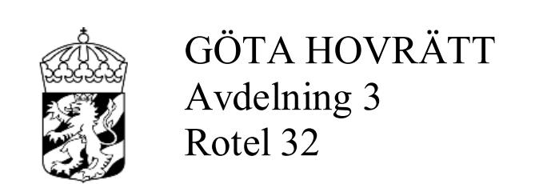
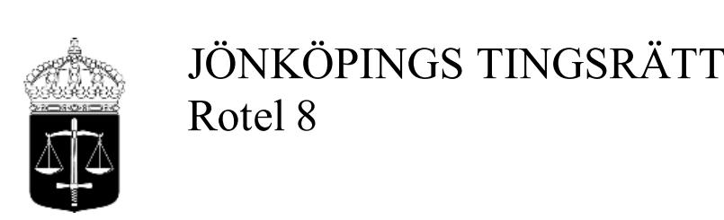
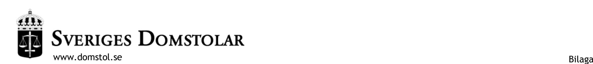

**DOM**2021-01-07
Jönköping

Mål nr T 3360-19

## ÖVERKLAGAT AVGÖRANDE

Jönköpings tingsrätts dom 2019-09-30 i mål T 3763-18, se bilaga A

#### **PARTER**

### Klagande

Inger MADELEINE Andersson, 19830714-2482 Samsetgatan 35 Lgh 1401 554 49 Jönköping

Ombud: Jurist Linda Kron Stance Juristbyrå Tegnérgatan 15 111 40 Stockholm

#### Motpart

JOSÉ Manuel Cao Calvo, 19741123-2213 Flintgatan 14 331 30 Värnamo

Ombud och rättshjälpsbiträde: Jur.kand. Catherine Högman Ramos Juristfirman Högman Ramos Box 5385 102 49 Stockholm

#### **SAKEN**

Vårdnad m.m.

# HOVRÄTTENS DOMSLUT

Hovrätten ändrar tingsrättens dom och beslutar följande.

1. Vårdnaden om Adrian Cao Andersson, 160312-4817, ska fortsättningsvis utövas av Madeleine Andersson ensam.

Dok.Id 334904

- 2. Adrian Cao Andersson ska ha rätt till umgänge med José Cao Calvo enligt följande.
  - a) Dagumgänge, från kl. 09.30 till kl. 17.30, under två veckor sommaren år 2021, i Sverige,
  - b) dagumgänge, från kl. 09.30 till kl. 17.30, under tre veckor varje sommar, i Sverige, med början år 2022,
  - c) dagumgänge, från kl. 09.30 till kl. 17.30, vartannat nyår, ojämna år, från den 29 december till den 4 januari, i Sverige, med början år 2021,
  - d) dagumgänge, från kl. 09.30 till kl. 17.30, vartannat år, jämna år, från den 22 december till den 4 januari, i Sverige, med början år 2022, samt
  - e) telefonumgänge, umgänge via Skype, Whatsapp eller likande vid tre tillfällen varje vecka.

José Cao Calvo ska senast den 15 april varje år skriftligen meddela Madeleine Andersson vilka veckor han önskar sommarumgänge, och Madeleine Andersson ska i sin tur senast den 30 april svara honom och meddela vilka veckor hon önskar. Vid motstående intressen har José Cao Calvo rätt att välja veckor först jämna år och Madeleine Andersson ojämna år. Om part inte hört av sig inom utsatt tid övergår förtursrätten till den andra parten oavsett år.

Vid umgänge enligt punkterna 2 a) till d) hämtar José Cao Calvo Adrian på förskolan/skolan, eller om denna är stängd eller Adrian av annan orsak inte är där, utanför Madeleine Anderssons bostad. Efter avslutat umgänge hämtar Madeleine Andersson Adrian utanför José Cao Calvos bostad.

- 3. Vad hovrätten har beslutat om i punkten 2 e) ska gälla omedelbart utan hinder av att domen inte vunnit laga kraft.
- 4. Hovrätten fastställer ersättning enligt rättshjälpslagen åt Catherine Högman Ramos till 72 459 kr. Av beloppet avser 48 972 kr arbete, 8 995 kr tidsspillan och 14 492 kr mervärdesskatt.

\_\_\_\_\_\_\_\_\_\_\_\_\_\_\_\_\_\_\_

# **YRKANDEN M.M. I HOVRÄTTEN**

Madeleine Andersson har yrkat att hovrätten ska tillerkänna henne ensam vårdnad om parternas gemensamma barn Adrian, född år 2016.

José Cao Calvo har motsatt sig att tingsrättens dom ändras i fråga om vårdnad. Han har i hovrätten yrkat att hovrätten ska förordna att Adrian ska ha rätt till umgänge med honom enligt följande.

- a) Två sammanhängande veckor under sommaren år 2021 i Sverige med skyldighet för honom att informera Madeleine Andersson om tidpunkt för sommarumgänget skriftligen via mejl senast den 15 april 2021,
- b) tre sammanhängande veckor under sommaren år 2022 i Spanien med skyldighet för honom att informera Madeleine Andersson om tidpunkt för sommarumgänget skriftligen via mejl senast den 15 april 2022,
- c) fyra sammanhängande veckor under sommaren år 2023 i Spanien med skyldighet för honom att informera Madeleine Andersson om tidpunkt för sommarumgänget skriftligen via mejl senast den 15 april 2023, och
- d) härefter sommarumgänge varje år motsvarande punkten c),
- e) två veckor vartannat år i samband med jul/nyår, i Spanien, ojämna år, med början år 2021, samt
- f) varje vecka telefonumgänge via Skype/Whatsapp eller liknande tre gånger per vecka.

Yrkandet under f) har framställts även interimistiskt.

Slutligen har José Cao Calvo yrkat att vid umgänge utomlands ska han hämta Adrian på flygplats Arlanda, Göteborg eller Köpenhamn och Madeleine Andersson hämta Adrian på flygplats i Madrid. Vid umgänge i Sverige ska José Cao Calvo hämta Adrian på förskolan/skolan, eller om denna är stängd eller Adrian inte är där av annan orsak, utanför Madeleine Anderssons bostad. Efter avslutat umgänge ska Madeleine Andersson hämta Adrian utanför José Cao Calvos bostad.

Madeleine Andersson har motsatt sig yrkandena om sammanhängande umgänge under sommar och jul. Hon har gått med på att hovrätten ger Adrian rätt till umgänge med José Cao Calvo enligt följande.

- a) Dagumgänge under två veckor sommaren år 2021, i Sverige, som sedan förhoppningsvis kan resultera i övernattningar efter en tid,
- b) dagumgänge under tre veckor sommaren år 2022, i Sverige, som sedan förhoppningsvis kan resultera i övernattningar efter en tid, eventuellt kan Madeleine Andersson förlägga en vecka av sin semester i Spanien för umgänge där,
- c) dagumgänge under tre veckor under sommaren, i Sverige, som sedan förhoppningsvis kan resultera i övernattningar efter en tid, eventuellt kan Madeleine Andersson förlägga en till två veckor av sin semester i Spanien för umgänge där, med början sommaren år 2023,
- d) dagumgänge i Sverige vartannat år från den 22 december till den 4 januari, alternativt dagumgänge i Sverige jul/nyår från den 22 december till den 28 december ojämna år och från den 29 december till den 4 januari jämna år – för det fall hovrätten bifaller dagumgänge i Sverige under två veckor vartannat år medger Madeleine Andersson ändå dagumgänge vartannat nyår från den 29 december till den 4 januari de år umgänge annars inte skulle ske över jul och nyår, samt
- e) telefonumgänge eller likande vid tre tillfällen per vecka.

För det fall hovrätten beslutar om umgänge i Spanien har Madeleine Andersson medgett att hämtning/lämning kan ske på flygplats Arlanda, Köpenhamn eller Landvetter.

José Cao Calvo har motsatt sig umgänge enligt Madeleine Anderssons medgivande, utom avseende e).

# **GRUNDER M.M. I HOVRÄTTEN**

Parterna har i hovrätten i huvudsak åberopat samma omständigheter och utvecklat sin talan i allt väsentligt på samma sätt som vid tingsrätten. Därtill har parterna, beträffande tiden efter tingsrättens dom, tillagt sammanfattningsvis följande.

### *Madeleine Andersson*

Parternas samarbetssvårigheter är så allvarliga att det finns skäl att upplösa den gemensamma vårdnaden om Adrian. Madeleine Andersson är den av parterna som bäst kan tillgodose Adrians behov. Det finns inga risker med att hon anförtros ensam vårdnad om Adrian. José Cao Calvo är olämplig som vårdnadshavare då han till följd av bristande föräldraförmåga saknar förmåga att se Adrians behov.

José Cao Calvo har under parternas relation utsatt Madeleine Andersson för psykiska kränkningar. Han uttrycker sig fortfarande kränkande gentemot Madeleine Andersson och parterna har alltjämt svårt att ha en dialog med varandra. Det har under hela processen krävts hjälp av utomstående för att parterna skulle kunna komma överens om umgänget. José Cao Calvo reflekterar genomgående kring egna önskemål och utifrån ett rättviseperspektiv. José Cao Calvo kommer fortsatt att utnyttja den gemensamma vårdnaden som ett maktmedel mot Madeleine Andersson utan att se till vad som gagnar Adrian. Av utredningen framgår att José Cao Calvo inte litar på Madeleine Andersson. Åberopade sms visar tydligt på den misstro som finns från José Cao Calvos sida och på det sätt han uttrycker sig i förhållande till Madeleine Andersson. Vidare visar de att han undanhåller viktig information som Madeleine Andersson behöver för att kunna förbereda Adrian inför umgänge m.m. samt att han inte heller är sanningsenlig, exempelvis angående sina planer för framtiden med arbete i Spanien. Madeleine Andersson å andra sidan, delger José Cao Calvo viktig information, vilket hon kommer att fortsätta göra även om hon får ensam vårdnad.

José Cao Calvo har inte tagit något eget ansvar för Adrian. Adrian behöver rutiner och förutsebarhet. José Cao Calvo ser inte till Adrians bästa och bortser från att han har varit frånvarande under större delen av Adrians liv. Madeleine Andersson har hela tiden försökt tillgodose ett umgänge mellan Adrian och José Cao Calvo, senast genom att erbjuda möjlighet till umgänge i sitt hem, vilket José Cao Calvo var motvillig till. Det senaste umgänget visar på samma typ av misstro, bristande förståelse och tro på automatisk rätt till Adrian från José Cao Calvos sida som tidigare. Adrian är inte mogen för ett längre sammanhängande umgänge med José Cao Calvo.

## *José Cao Calvo*

Tingsrättens dom är riktig, även om beslutet om umgänge är överspelat. Hur Madeleine Andersson upplevt relationen under tiden parterna bodde tillsammans är inte relevant nu. Det vore skadligt för Adrian om Madeleine Andersson får ensam vårdnad om honom. Madeleine Andersson är visserligen inte olämplig som vårdnadshavare, men inte heller José Cao Calvo är olämplig som vårdnadshavare. José Cao Calvo och Madeleine Andersson är separerade sedan lång tid tillbaka och de har samarbetat på ett nödvändigt sätt kring Adrian. José Cao Calvo instämmer i tingsrättens resonemang angående parternas samarbetsförmåga. Samarbetet har fungerat kring de få saker som varit aktuella. José Cao Calvo har exempelvis samtyckt till Adrians flytt. José Cao Calvo har också ansträngt sig för att få ta del av information från förskolan. Kontakten med Madeleine Andersson fungerar utmärkt om José Cao Calvo gör som hon säger. Han har börjat göra det eftersom han vill ha kontakt med Adrian. Madeleine Andersson däremot har inte ansträngt sig för att Adrian ska lära sig spanska. Adrians farföräldrar har inte heller träffat honom sedan han var ett år.

José Cao Calvo flyttade till Sverige i augusti 2018 för att han ville vara nära Adrian. Han hade ordnat arbete i Sverige, men innan han började arbetet ringde Madeleine Andersson till hans blivande chef och baktalade honom, vilket påverkade möjligheten för honom att fortsätta sitt arbete där. José Cao Calvo tog de orosanmälningar som hade gjorts på allvar. Han deltog i möten och försökte samarbeta. Vårdnads- och umgängesutredningen är vinklad till Madeleine Anderssons fördel. Utredarna missuppfattade José Cao Calvos uppgifter angående en eventuell flytt. José Cao Calvo försökte få fortsatt arbete i Sverige under den tid han bodde här. Först den 15 oktober 2019 var han på en intervju för arbete i Spanien.

José Cao Calvo är mycket nöjd med det umgänge han haft med Adrian under det år som gått sedan han flyttade tillbaka till Spanien. José Cao Calvo är glad för att Madeleine Andersson mer och mer låter honom och Adrian prata spontant. Den rådande pandemin har gjort att José Cao Calvo inte kunnat ta sig till Sverige under det gångna året. Inför nuvarande besök i Sverige kontaktade José Cao Calvo Madeleine Andersson i god tid. Madeleine Andersson bestämde hur umgänget skulle gå till. José Cao Calvo uppfattade det som obekvämt att ha umgänge i Madeleine Anderssons bostad, men accepterade det. Han ville inte ha umgänge hemma hos henne eftersom han var rädd för att hon skulle anmäla honom. Istället har José Cao Calvo kvar sitt boende i Värnamo och har ordnat så att han också kan låna en lägenhet i Jönköping för umgänge med Adrian. Umgänget med Adrian har fungerat bra. För närvarande är det inte aktuellt för José Cao Calvo att flytta till Sverige, men om han kan få arbete här är det inte uteslutet. José Cao Calvos målsättning är att ha en fin kontakt med Adrian, att få träffa honom i Sverige och så småningom i Spanien.

När det gäller den av Madeleine Andersson åberopade ljudfilen med ett samtal med Adrian, ska det noteras att det var José Cao Calvo som under ett umgänge lät Adrian ringa till Madeleine Andersson. På inspelningen hörs att José Cao Calvo är mycket tålmodig och stöttar Adrian, dessutom på ett för honom främmande språk. Det är inte heller så att José Cao Calvo i telefonsamtalet motsätter sig att avbryta umgänget. En situation som den aktuella kan bli jobbig för vilket barn som helst och det är upp till föräldrarna gemensamt att bryta innan det blir för svårt för barnet.

## **UTREDNINGEN I HOVRÄTTEN**

Parterna har i huvudsak lagt fram samma utredning som vid tingsrätten. I tillägg till denna har Madeleine Andersson som skriftlig bevisning i hovrätten åberopat ytterligare sms-korrespondens mellan parterna och publicering av preliminär tillsättning av tjänster respektive av tillsatta tjänster vid universitetet Brañas do illó, Rio Samo II i Spanien.

När det gäller de ljudfiler Madeleine Andersson har åberopat, har den ljudfil som avser samtal med Adrian under umgänge spelats upp i vissa delar vid huvudförhandlingen i hovrätten.

José Cao Calvo har som skriftlig bevisning i hovrätten åberopat ytterligare smskorrespondens mellan parterna, mejlkorrespondens mellan honom själv och Madeleine Andersson respektive Adrians förskola, flyttanmälan-samtycke till Skatteverket och brev som Madeleine Andersson skrivit till honom respektive till sina föräldrar via mejl. Han har inte längre åberopat en videoupptagning av överlämning vid umgänge.

På Madeleine Anderssons begäran har omförhör (fritt partsförhör) med henne själv samt med vittnet Anna Sandberg hållits. Därutöver har hon i hovrätten åberopat vittnesförhör med familjerättssekreteraren Isabell Wigertz.

På José Cao Calvos begäran har omförhör (fritt partsförhör) med honom själv samt med vittnet Constantin Nicoara hållits. Därutöver har han i hovrätten åberopat vittnesförhör med Sofia Fernandez Caparros, Ulf Ericsson och Linda Gyllensten.

Nedan har antecknats vad de hörda personerna i huvudsak har uppgett vid omförhör samt vid nya vittnesförhör.

Madeleine Andersson: Relationen med José Cao Calvo (nedan i referatet José) var till en början bra, men ganska snart började José med kränkande kommentarer, framför allt av sexuell karaktär. Många gånger ville hon inte ha sex med José men blev tvingad till det. De kränkande kommentarerna fortsatte under hela relationen. Det blev normalt för henne. Hon tog också avstånd från sin familj. När hon fick Adrian kände hon att det inte var normalt och att hon ville skydda honom. Hon ville inte att hennes barn skulle leva med sådana kommentarer. Även om José aldrig skulle utsätta honom för sådana kommentarer så skulle han få leva mitt i det och det skulle inte vara bra för honom. Det blev ett uppvaknande för henne. När hon separerade från José fick hon genom Adrians BHV-sköterska kontakt med en kurator, som i sin tur hänvisade henne till en kurator som var inriktad på den typ av utsatthet som hon hade upplevt. Den första kuratorskontakten ägde rum i november 2016. Hon har aldrig försökt ta livet av sig. Hon har aldrig gått till en psykolog. Hon har ingen misstänkt diagnos och hon är inte bipolär.

Adrian är en glad och kommunikativ pojke som behöver förberedelser och förklaringar. Det är svårt för honom att bara ta ett ja eller nej. Ska han vara med om något nytt, åka till en ny plats eller träffa en ny person, behöver han förberedas några dagar i förväg genom att man pratar om det och t.ex. visar bilder. I annat fall blir han ledsen, orolig och otrygg och söker närhet. Det är inte hon som övertolkar detta. Förskolan, mormor och morfar, hennes bror och vänner upplever alla samma sak, liksom även familjerättens utredare gjorde.

Samarbetet med José är svårt. De tycker olika och kommer inte överens. José tror att hon tar beslut som ska skada honom eller för att kontrollera honom, men hon tar beslut för Adrians bästa. José använder den gemensamma vårdnaden för att kontrollera henne. Hon måste stämma av med honom om hon ska åka någonstans med Adrian. Senast reagerade han över att hon inte informerat honom om att Adrian följde med en förskolekompis hem. Trots att hon har Adrian på heltid måste hon hela tiden redovisa för José vad hon gör med Adrian. José har velat ha bilder på Adrian ibland, t.ex. när hon har sagt att Adrian är hemma från förskolan för att han är sjuk. Då har José inte trott på henne och velat att hon ska skicka bilder som visar att de är hemma. Likaså när de har varit i stugan i Halmstad, har han velat att hon ska skicka bilder som visar att hon är med och att Adrian inte är där med någon annan. Det som försvårar samarbetet mellan dem är att José inte vill lyssna. Hon försöker hjälpa honom och förklara hur Adrian är, men José tar det som att hon trakasserar honom. José tycker att hon kontrollerar honom och vill inte ta del av information hon lämnar. Adrian och José hade kunnat komma varandra närmare om José förstod hur Adrian fungerar.

Hon kan tillräckligt mycket spanska för att uppfatta sms:en från José som kränkande och aggressiva. Hon har uppfattat kommunikationen med José som omöjlig. Han säger att han är på hennes sida om hon gör som han säger, men inte annars. Hon ska göra det som är bäst för honom, inte för Adrian. Hon blir stressad och orolig och känner sig pressad när hon pratar med José. Hon upplever att hon har svårt att stå emot José i förhållande till hur han vill ha det. Utifrån att hon levt med José i elva år i den typ av relation som de hade, med många kränkningar från Josés sida, väcks det många minnen och känslor i henne när han återkommer med samma beteende som han hade då.

Hon förstår innebörden av ensam vårdnad. Hon har det i praktiken redan nu, i och med att José bor i Spanien och hon ensam sköter allting kring sonen. Hon tror inte att hon och José kan ha gemensam vårdnad. Hon tror att José kommer att använda den för att fortsatt ha kontroll över henne och att hon kommer att behöva be honom om lov när hon ska göra saker med Adrian. José kommer inte att se till Adrians bästa utan till sitt rättvisetänk. José vill godkänna alla resor hon gör med Adrian, även inom Sverige. Han säger att de har gemensam vårdnad och att hon är skyldig att be honom om lov. Med ensam vårdnad slipper hon kontrollfrågor från José, behöver inte fråga om lov om hon ska göra en weekendresa inom Sverige, kan välja den skola som passar Adrian bäst och i övrigt göra det som blir bäst för Adrian utan att José hindrar det. José har inte förbjudit henne att ta med Adrian på resor, även om han en gång sagt att om inte han får ta med pojken till Spanien så får inte hon ta med honom till Köpenhamn, ett ultimatum han dock tog tillbaka senare. Hon är villig att vid ensam vårdnad lämna en insynsfullmakt för José och skulle därutöver fortsätta informera honom på samma sätt som i dag. Fram tills nu har hon informerat honom om allt, t.ex. besök på ögonmottagningen och BHV. När José bodde i Värnamo bjöd hon in honom till alla sådana besök, men han valde att inte följa med. Trots det informerade hon honom direkt efteråt om vad som hänt under besöken. Detsamma avseende föräldramöten. Under året som gått har det inte varit några papper som behövts skrivas på. José har inte vägrat skriva på papper vid förskolebyte, men han har varit "på henne" två, tre gånger om att de ska byta förskola eftersom han inte tycker att den nuvarande förskolan är bra. Hon kan tänka sig att när det blir fråga om skolval så kommer hon att behöva förhandla med José om vad som blir bäst för Adrian. Hon anser att det måste bli det som blir bäst för Adrian och henne så att det blir smidigt med hämtning och lämning. Det kommer att vara mycket papper som ska skickas, hon tror inte att skolan använder digitala påskrifter, och att det kanske är svarsfrister som ska hållas. Hennes kollegor som har barn, liksom hennes pojkvän som har barn i skolåldern, säger att det är så. Det skulle inte räcka att José ger henne en fullmakt för exempelvis skolan eftersom de inte kan samarbeta och det är ständiga strider mellan dem. Hon har inga planer på att bo utomlands eller någon annanstans i Sverige. Adrian har sin stabilitet i Jönköping.

Hon har haft Adrian själv sedan han var sex månader och hon har alltid sett till att han har en god kontakt med sin pappa. Hon ser inte att det skulle bli annorlunda om hon har ensam vårdnad. När Adrian säger att han är ledsen eller inte vill till pappa, kan hon och José inte mötas i diskussioner kring detta. José slår ifrån sig och vill inte bemöta det. Hon tror att det hade varit skillnad om de tillsammans kunnat komma fram till en lösning så att det blir bra för Adrian. Hon tycker att Adrian ska ha en fin och nära relation med José. Hon anser att hon visar det när hon den här gången lånade ut sin lägenhet till honom för att han där skulle kunna umgås med Adrian. Hon vet att Adrian är trygg i sitt hem och tror att han och José kan mötas bäst om Adrian är i sin invanda hemmiljö. Hade hon inte varit mån om att de ska ha en fin relation hade hon aldrig gett José en extranyckel till sin lägenhet, utan José hade fått lösa umgängesplatsen själv.

När det gäller umgänget ser José till sina rättigheter och inte Adrians bästa. Hon får ofta höra att det inte är Adrian utan de som föräldrar som ska bestämma och att eftersom hon är mycket med Adrian så har han också rätt att vara det. Inför huvudförhandlingen hade José inte träffat Adrian på nästan ett år, ändå sa han att han ville träffa Adrian på söndagen den 29 november och helgen efter det ha fyra nätters övernattning. Hon sa att de först får se hur Adrian reagerar, att det eventuellt går med övernattning men att de måste ta hänsyn till att Adrian inte träffat honom på ett år. José hänvisade då till att hon kontrollerar honom, bestämmer och är egoistisk.

Inför Josés flytt till Sverige i augusti 2018 skypade han med Adrian och berättade att han snart skulle komma till Sverige. När hon frågade honom, sa José att han skulle stanna under en längre period, men att hon inte hade med att göra var han skulle bo eller vad han skulle göra. När José sedan kom till Sverige krävde han sin rätt till Adrian för att hon redan hade haft honom i två och ett halvt år och att det nu var hans tur. Hon sa att det krävdes en upptrappning av umgänget eftersom han bara hade varit med Adrian stundvis och att de hade haft en far och sonrelation på distans. José ville inte acceptera detta utan pratade om vad som var rättvist. Hon fick ta reda på Josés adress via hitta.se. Hon ringde till Josés blivande chef på Garantell när José sagt att han skulle komma till Sverige, eftersom han inte velat svara på hennes frågor och hon inte visste om det han sagt var sant. Hon var orolig för att José skulle dyka upp. Hon sa i samtalet att hon var

Josés sons mamma och frågade om det stämde att José fått anställning på Garantell. Hon berättade att hon och José haft en turbulent och stökig relation, att de haft samarbetssvårigheter och att det var viktigt att hon fick veta när José skulle komma till Sverige för att hon skulle kunna förbereda Adrian på detta. Hon var väldigt tydlig med att säga att de hade gjort en bra rekrytering eftersom José är en bra arbetstagare. Hon är säker på att hon inte sa något negativt om José. Det var hennes KBT-terapeut som sa åt henne att hon skulle ringa och ta reda på mer information, men i dag hade hon inte gjort det.

När José kom till Sverige i augusti 2018 tyckte han att hon trakasserade honom när hon ville dela med sig av rutiner kring Adrian. José ville ha heldagsumgänge med övernattningar, vilket hon inte tyckte var bra. Hon ville att de skulle trappa upp umgänget och erbjöd José att träffa Adrian i lägenheten, men det ville han inte. Efter umgänge med José ville Adrian vara tätt intill henne hela tiden. Vid det första tillfället efter två övernattningar, den 12-14 april 2019, var Adrian väldigt ledsen när hon hämtade honom och ville inte vara hos pappa mer. Han började sova på hennes mage, han var orolig för att hon inte skulle hämta honom på förskolan och rädd för att hon skulle försvinna och för att hon inte älskade honom längre. Hon märkte en markant skillnad på Adrian. Upptrappningen var inte till hans bästa. Adrian skulle känna sig mer trygg om José lyssnade in honom bättre och lyssnade på det hon har att berätta om Adrian. Han säger ofta att han inte vill vara med pappa mer eller sova hos pappa. Han säger också att han inte får berätta om umgängena, inte för att det är något konstigt, men José vill inte att hon ska veta något om umgängena. Vid ett tillfälle i juli 2019 då hon varit med Adrian i Halmstad föreslog hon för José att Adrian skulle få ett längre helgumgänge med honom istället för det tidigare onsdagsumgänget. José ville inte detta och de sågs därför i en lekpark i Ljungby. Adrian var förtvivlad och vägrade gå ut ur bilen. José sa åt henne att lämna Adrian med honom, men hon kände inte att hon kunde göra det utan var med i parken. När Adrian kände sig trygg backade hon, men fick emellanåt "trygga upp" Adrian. Vid ett annat tillfälle då Adrian haft en veckas umgänge med José, efter fem, sex veckors helgumgänge, fick Adrian en panikångestattack i bilen när hon hämtat honom. Han fick nästan ingen luft, han var apatisk och hon fick ingen kontakt med honom. Hon frågade vad det var. Hennes kompis Anna försökte lirka med honom, men det gick inte. När de kom hem låg de i soffan i ett och ett halvt dygn. Adrian sa "snälla mamma, jag vill inte mer till pappa".

Hon kan vara vuxen i förhållande till Adrian. Hon har regler för honom, men lyssnar samtidigt in honom. Hon får höra att han är väluppfostrad och det tyder på att hon inte "curlar" honom. När det gäller den inspelade ljudfilen, var det inte bara så att Adrian var "mammig" utan han ville hem och hade ett panikartat beteende. Hon föreslog för José att de skulle avbryta umgänget. Om de hade gjort det tror hon att Adrian hade fått en större tillit till José, men José var inte intresserad av att avbryta umgänget utan menade att domstolsbeslutet skulle följas. José var inte hysterisk och arg, men han lyssnade inte heller in Adrian. I samtalet erbjöd hon sig att hämta Adrian, men José sa "vi får se". Anledningen till att hon spelade in samtalet var att Adrian sagt flera gånger att han var ledsen hos pappa, men José sa att det var något hon hittade på. Eftersom hon kände på sig att Adrian inte hade det bra där spelade hon in samtalet. Hon berättade inte detta för José. När José bodde i Sverige spelade hon in de flesta kontakterna med honom på rekommendation av sitt ombud eftersom José sa att hon ljög. Det var för att bevisa vad hon sagt.

Den 29 september 2019 fick hon veta att José skulle lämna Sverige. Hon fick inte någon annan information av honom än den som framgår av sms. Hon frågade hur länge han skulle vara borta, men han sa att hon inte hade med det att göra. Han berättade inte om arbete i Spanien och sa bara att han skulle åka dit på obestämd tid. Den 1 oktober 2019 flög han till Spanien. Hon frågade om han hade förberett Adrian och det sa han att han hade gjort. Dock hade han inte meddelat förskolan att han inte skulle hämta Adrian på onsdagar längre. Informationen kring Josés nuvarande jobb i Spanien har hon tagit fram på egen hand. José har haft samma typ av anställning tidigare och hon visste därför att information om dessa publiceras på kommunens hemsida. Eftersom hon anade att José hade fått anställning i Spanien visste hon vilken hemsida hon skulle titta på.

Angående umgängena som varit nu i november och december, så meddelade José tre veckor innan han kom till Sverige att han ville spendera tid med Adrian. Den 23 november ringde hon och Adrian till José. Då berättade José för Adrian att han skulle komma till Sverige fem dagar senare, men inte mycket mer. Dagen efter skickade hon ett meddelande till José angående att de skulle planera umgänget. José sa att han skulle komma sent på lördagen, men att han gärna ville träffa Adrian på söndagen. José sa att han kunde hämta Adrian och ha honom hela dagen. Adrian hade dock inte träffat José på ett år. Hon hade pratat med Adrian om detta och sa till José att Adrian gärna ville träffa honom, men att Adrian ville att José skulle komma hem till dem. José ville först inte det. Hon bjöd in José till lunch på söndagen och till slut gick han med på det. José ville också hämta Adrian på förskolan på måndagen och sedan vara med honom torsdagsöndag. Hon sa att de först skulle se hur Adrian reagerade och att om Adrian var trygg med det så skulle det gå med övernattning. Nu har José träffat Adrian i åtta dagar. På söndagen fick José och Adrian vara själva i hennes lägenhet i tre timmar. Adrian var väldigt glad och stolt över att träffa sin pappa, men när hon skulle natta honom blev han ledsen. Adrian sa att han tyckte synd om pappa för att han berättat att han var själv i Värnamo och om han inte sov med honom där så är han helt själv. Han sa att han egentligen bara ville leka med pappa men att han nog kunde sova hos honom en natt så att han blev glad. Adrian hade ångest. Dagen efter berättade hon detta för José och bad honom att inte lägga över något ansvar för övernattningar på Adrian, men José sa att hon ljög. När hon har hämtat Adrian från de umgänge han haft själv med José nu, är det första han säger att han inte vill sova hos pappa. På måndagen träffades de tre timmar efter förskolan. På onsdagen fick José en extranyckel till hennes lägenhet för att kunna hämta Adrian på förskolan kl.13 och därefter bege sig till lägenheten. I lördags ville Adrian inte följa med José för dagsumgänge i Värnamo. José satt utanför i sin bil och bad henne komma ut med Adrian. Hon bad honom komma in istället, men han sa att han kunde vänta i bilen. Till slut kom han in, de stöttade Adrian tillsammans och till sist ville Adrian följa med. När hon hämtade Adrian sa han att han inte ville träffa pappa nästa dag (söndag). Dagen efter sa han samma sak. Hon sms:ade detta till José och han accepterade det. De bestämde att José skulle hämta Adrian på förskolan på måndagen. Den första dagen José och Adrian haft umgänge efter förskolan frågade Adrian henne vem som var bäst, hennes pojkvän Marcus eller pappa, om man bara får välja en. Hon sa att hon trodde att José var bäst för honom och Marcus för henne. Adrian svarade "ja, så är det", men sen började han gråta och sa att han ville välja båda men att pappa sa att han inte fick det. Adrian har också frågat henne vem han skulle älska mest, henne eller pappa. Hon svarade att hon hoppades att han skulle älska dem lika mycket. Adrian frågade då "men om jag måste välja", varpå hon svarade att han inte behöver göra det. Adrian berättade att José frågat honom flera gånger vem han älskade mest, henne eller honom, och att han till slut sagt att han älskade pappa lite, lite mer och att José då slutade att tjata.

Angående umgänget i går, onsdag, så hade José hämtat Adrian på förskolan både måndag och tisdag. De hade haft umgänge kl. 13.00-18.30 hemma hos Josés vän Constantin. När hon hämtade Adrian på tisdagen sa han att han inte ville träffa pappa nästa dag (onsdag) och att han inte ville vara hos Constantin. Hon frågade hur Constantin är. Adrian sa att han är jättebra och rolig men att han inte ville vara hos honom. Det första Adrian sa på onsdagen var att han inte ville att pappa skulle hämta honom på förskolan. Hon sa att hon trodde att det var bra att José kom till förskolan och att de skulle se hur det kändes då. När de kom till förskolan sa Adrian samma sak. José skulle hämta kl. 13. Kl. 13.30 ringde förskolan och sa att det uppstått lite turbulens. José hade kommit till förskolan och förmodligen sett att Adrian inte var riktigt glad. Han hade frågat Adrian om denne ville att han skulle komma tillbaka senare. Adrian hade nickat och José hade då sagt att han skulle ta en promenad. Adrian sa då till personal på förskolan att han inte ville att pappa skulle hämta honom, varför de ringde till henne. Personalen hade sagt till José att de skulle ringa henne, men José hade svarat att det var hans rätt att hämta denna dag. Personalen sa till henne att det vore bra om hon kom dit innan José kom tillbaka eftersom det blev obehagligt. Hon ringde till José, men han förstod inte varför förskolan ringt till henne eftersom det var han som skulle hämta. Hon förklarade hur det varit sedan tisdagskvällen. José sa att han ville träffa Adrian under dagen eftersom han skulle åka tillbaka till Spanien efter hovrättsförhandlingen. Hon erbjöd José att följa med dem hem istället. Han ville inte det, utan sa att då fick det vara. Hon mötte upp José utanför förskolan. Hon gick in till Adrian, som blev jätteglad, och sa att de skulle åka hem. Hon förklarade att José var utanför. Adrian ville fortfarande inte följa med pappa. Hon föreslog att de skulle gå ut och krama pappa. Det gjorde Adrian och José busade lite med honom. De frågade om han inte skulle följa med pappa, men det ville inte Adrian och då började José gråta. Då blev Adrian lite "spexig" för han visste inte vad han skulle göra och ville väl att José skulle bli glad igen. Hon frågade José igen om han inte ville följa med dem hem, men det ville han inte.

I bilen blev Adrian orolig och sa att han hade velat att pappa följde med till lägenheten. Hon förklarade att José var ledsen för att han inte skulle få leka med honom på länge eftersom pappa skulle åka tillbaka till Spanien snart. Innan detta hände pratade José om att han ville träffa Adrian innan han åkte tillbaka till Spanien. Hon erbjöd honom att få träffa Adrian i hennes lägenhet på fredagen och att hon inte skulle vara där, men José sa att han var osäker på om han vill träffa Adrian med tanke på att det blev som det blev under onsdagen. Hon har ännu inte sagt till Adrian att han inte kommer att träffa José nu, utan hoppas att José ska ändra sig, att de ska få någon timme ihop så att Adrian kan komma ihåg det till nästa gång.

Vid överlämningarna är det mycket övertalning varje gång. José vill att de ska ske på en parkering, men hon tror att det hade varit mer naturligt för Adrian om de hade skett i hemmet. Det behövs förberedelser och "pep" inför umgänget. Det är mest hon som står för det, medan José är mer passiv. Adrian har många gånger reagerat negativt inför umgänge, även inför telefonumgänge. Adrian kan säga att han inte vill ringa pappa och hon föreslår då saker som de kan prata om. Ibland har Adrian velat att hon ska prata med José, ibland har han då ändå kommit fram och pratat, andra gånger har han stängt av kameran. José har frågat vad hon håller på med, om hon har manipulerat Adrian, och förstår inte varför han inte vill prata med honom. Adrian ringer aldrig själv till José, men ber ibland att de ska ringa så att José kan läsa en spansk godnattsaga för honom. Oftast sker telefonumgänge på Josés initiativ, ibland på hennes, men sällan på Adrians. De har inte bestämda tider för när de ska ringa. Hon svarar alltid samma dag, men ibland kan det ta några timmar innan hon svarar. Telefonumgängena varar ibland fem, tio minuter. Andra gånger har Adrian t.ex. tagit fram ett pussel och bett José hjälpa honom att pussla och då kan umgänget vara en timme. Det beror på hur Adrian är.

Hon skickar sms till Adrians farföräldrar varannan vecka. Hon har skickat foton och videos. José vet inte om detta. När hon och Adrian skypar med José har hon bett honom hämta sina föräldrar, men de får oftast bara säga hej. Därför har de skypat när José inte är hemma. Farföräldrarna kan bara spanska så hon får översätta. När det gäller spanska språket så läser hon för Adrian ungefär tre dagar i veckan. Ibland väljer han då en spansk bok. Om han inte valt en spansk bok på länge föreslår hon en sådan. Han får även titta på spanska barnprogram.

Hon tror att två veckors sammanhängande umgänge med José skulle innebära kaos för Adrian. Adrian är inte van vid att vara ifrån henne och känner egentligen bara sin pappa via Skype. Det går bra för Adrian att sova över hos mormor och morfar eftersom han är så van vid dem och har sovit över hos dem sedan han föddes. De träffar hennes bror och hans dotter i stort sett varje vecka. Trots det var Adrian inte bekväm med att sova över hos dem för någon månad sedan. När det gäller hennes förhoppning om att förlägga en del av sin sommarsemester i Spanien, tänker hon att hon då skulle stämma av med José så att det passar honom också. Hon tänker sig att hon skulle bo på hotell i Coruña, att umgänget ska vara hos José men att hon kanske är med första dagen och sedan kan lämna Adrian över dagen.

José Cao Calvo: Han och Madeleine Andersson (nedan i referatet Madeleine) hade inledningsvis en bra relation. De bodde i perioder i olika länder och relationen baserades från början mycket på sms och mejl. Denna kommunikation har varit en viktig del i deras relation. Madeleine har under de senaste åren riktat många anklagelser mot honom. Sådana allvarliga anklagelser måste bevisas. Anklagelserna är enligt hans mening falska, annars skulle det ha återspeglats i deras kommunikation. Hela deras relation kan läsas i meddelanden som skickats mellan dem. Han kan inte uttala sig om hur Madeleine psykiskt uppfattade deras bråk, men han har aldrig varit fysiskt våldsam mot henne, han har inte slagit eller lagt hand på henne. Han har aldrig haft sex med henne när hon har sagt nej. Deras största problem började när de kom till Sverige åren 2013-2014. När han kom till Sverige år 2014 blev det inte som Madeleines pappa hade sagt; det fanns inget jobb åt honom. Madeleine tog avstånd från sina föräldrar för att hon var besviken på dem och skickade det åberopade mejlet till dem. Efter Adrians födelse var situationen lugnare under ett halvår och sedan flyttade de till Spanien. De var tillsammans i Spanien kring jul år 2016. Madeleine pressade då på för att de skulle flytta till Sverige. Han arbetade som lärare. Madeleine visste att om han fick en anmälan mot sig avseende misshandel eller annat så skulle han förlora sitt arbete. Hon hotade med att ringa polisen när de pratade om framtiden. Madeleine skulle kunna ringa till polisen bara för att de bråkat. I Spanien kan det ses som något som i framtiden skulle kunna bli våldsamt. Hon anmälde dock aldrig honom, inte i Sverige heller. När de bråkade kunde Madeleine bli våldsam och slå på honom. Det är därför han i mejl till henne säger att han mådde dåligt. Förra året när han bodde i Sverige fick han höra av förskolan att Madeleine sagt att han misshandlat henne fysiskt, psykiskt och sexuellt. Samma sak sa hon till hans arbetsgivare innan han började där. Han har aldrig sagt att Madeleine är bipolär. Det han har sagt är att hon har två olika sidor. Han har också sagt att Madeleine har haft behov av terapi, på samma sätt som han har det. Det var en svår process när de separerade. Madeleine har försökt ta sitt liv.

Det stämmer inte att han vill kontrollera Madeleine genom att be om bilder på Adrian, eftersom hon skulle kunna skicka bilder som är flera dagar gamla. Han kontrollerar inte varje steg Madeleine tar. Han vill veta hur det går för Adrian och har själv kontaktat förskolan för att få information. Tidigare kände han tillit till Madeleine, även efter att de hade avslutat sin relation, men han förlorade tilliten när hon började sätta Adrian emellan dem. Den blev ännu mindre sedan hon sagt att han varit våldsam samt med vetskapen om att hon spelade in samtal.

Madeleine tar hand om Adrian på sitt sätt, men förstår inte att han har en hel släkt som också är viktigt för pojken. När de fick barn pratade de om att alltid försöka underlätta för Adrian trots att de kommer från olika länder, men Madeleine vill t.ex. inte hämta Adrian i Madrid och det är inte att underlätta vid umgänge. Vidare har hans föräldrar inte träffat Adrian på fyra år. Adrian pratar med sina farföräldrar via Skype ibland, även när han inte är med. Han skulle önska att det var oftare. Han vet att Madeleine ibland skickar bilder eller någon video till farföräldrarna och det är han tacksam för. Madeleine har påstått att han pressar Adrian för att lära honom spanska, men Adrian kan ingen spanska. Han skulle vilja att Adrian fick lektioner i spanska, men han kan inte kräva det när Adrian är med Madeleine. Madeleine lär inte honom någon spanska. Det är synd för Adrian kan inte kommunicera med sin spanska familj. Han själv pratar inte med Adrian på sitt modersmål. Ibland har han vissa svårigheter med svenska språket och Adrian tittar då konstigt på honom. Adrian förstår vad han säger, men han skulle gärna se att Adrian lärde sig spanska eftersom han själv är en annan person på spanska. Han tycker om att skoja och leka, men tycker det är svårt att skämta på svenska. Han tycker ändå att han förstår Adrian. Den viktigaste skillnaden mellan svensk och spansk kultur ligger i språket, inte hur man behandlar ett barn. Ibland kan han prata två timmar med Adrian på Skype. Han kan se när någonting inte fungerar för Adrian, t.ex. när han såg ledsen ut på förskolan i onsdags. Det har hänt att han har ringt Madeleine under umgänge för att Adrian ska må bättre, trots att det kan bli dåligt för honom själv. Tidigare gav Madeleine honom mycket råd, men det gör hon inte längre eftersom Adrian har blivit äldre, de pratar och Adrian berättar saker för honom. När det gäller beslut kring Adrian, t.ex. underskrift i samband med flytt, har han aldrig låtit bli att skriva under. Han läser sina mejl varje dag och försöker svara samma dag. Även om han har haft synpunkter på Adrians nuvarande förskola, har han aldrig krävt att Adrian ska byta förskola. Han har bidragit till alla kostnader som gäller Adrian, t.ex. nya glasögon. Angående risken för att Madeleine vid ensam vårdnad skulle flytta med Adrian, har han många funderingar kring det eftersom Madeleine eventuellt skulle kunna flytta till USA. Hon har pratat mycket om att hon gärna vill bo där, men det är en sådan sak som de i så fall bör vara överens om. Han vill vara med och delta i det som är viktigast i Adrians liv. Om det är någonting som skulle vara positivt för Adrian skulle han inte motsätta sig det.

Efter att han och Madeleine hade avslutat sin relation i mars 2017 var han i Sverige i två månader under sommaren samma år. Det fungerade väldigt bra och Madeleine lät honom tillbringa tid med Adrian. Innan dess hade de haft ett möte på familjerätten för att få hjälp så att det skulle fungera bra. I december 2017 kom han till Sverige igen och då fungerade det också bra. I maj 2018 var han i Sverige i tio dagar. Madeleine lät Adrian övernatta två, tre nätter hos honom. Problemen började när han sa att han ville flytta till Sverige för att ha mera tid med Adrian. Madeleine tyckte att han bara ville ha Adrian för sig själv, men han ville bara ha lika mycket tid med Adrian som Madeleine hade. När han kom till Sverige år 2018 bestämde Madeleine vilka tider han fick träffa Adrian. Han träffade honom bara ett par timmar i veckan. Sedan trappades det upp till fyra, sex timmar i veckan, varefter den nuvarande processen började. Utifrån det som Madeleine har påstått om honom och det som förevarit i relationen mellan dem bestämde han sig för att träffa Adrian utanför Madeleines lägenhet, detta angavs också i tingsrättens protokoll. Madeleine insisterade ändå på att han skulle hämta Adrian i hennes bostad. Angående umgänget i Ljungby, var det Madeleine som bad honom att ha umgänget där istället. Adrian hade då varit flera dagar i Halmstad med Madeleine och hennes väninna och säkert haft det bra. Det träffades i en omgivning som var annorlunda för dem alla. När Madeleine skulle lämna Adrian började han gråta och sa att han ville vara med sin mamma. Det hände vid flera tillfällen. Han fick vänta ut Adrian. De skulle ha umgänge

i tre timmar. Han gick med på att Madeleine och hennes väninna var med för att det inte skulle bli dåligt för Adrian. När det gäller Madeleines beskrivning av Adrians reaktion efter det sammanhängande sommarumgänget med honom, så förstår han att Adrian hade saknat sin mamma. Adrian var då bara tre år. Han vet att det inte hade hänt någonting under tiden Adrian var med honom. Under hela processen har det satts mycket press på honom som person; från jobbet, förskolan, familjerätten och socialtjänsten. Av utredningarna framgår att det inte funnits bevis för något av det som påståtts. Det gör honom ont att Adrian blivit inblandad i vissa av dessa utredningar. När det gäller umgänget med Adrian sedan augusti 2018, anade han att han blev avlyssnad eller spelades in. Han har inget problem med att andra ser vilken relation han har med sitt barn. När det gäller den inspelning som spelats upp i hovrätten framkom det inte att han – istället för att Adrian skulle vara ledsen under umgänget – valde att kontakta Madeleine. Han visste inte att han blev inspelad. Han har inget emot att Adrian har kontakt med sina morföräldrar. Det enda han har haft synpunkter på är att han skulle ha velat ha Adrian hos sig när Madeleine skulle vara borta, istället för att Adrian var hos morföräldrarna. Han fick inte möjlighet att tillbringa så mycket tid med Adrian när han var i Sverige.

Tolkningen fungerade inte vid något av samtalen med utredarna på familjerätten. De fortsatte då istället med den svenska han kunde. Han sa att han skulle försöka hitta ett arbete i Sverige fram till den sista dagen han skulle vara här, annars eventuellt i Spanien eller Schweiz. Listorna som publicerades den 25 oktober 2019 var resultatet av en intervju som han hade varit på den 15 oktober 2019.

Umgänget via Skype/Whatsapp har fungerat väldigt bra under det senaste året. Han har pratat med Adrian två, tre dagar i veckan. Han har aldrig bestämt vilken dag det ska vara. Madeleine har inte heller gjort det. Det är inte alltid han är hemma när Madeleine och Adrian ringer, men på helgerna kan det vara så och då säger han till sina föräldrar att de kan vara med. Vanligtvis skickar han ett meddelande och frågar om han kan prata med Adrian den aktuella dagen. Under det senaste året har han inte kunnat komma till Sverige till följd av pandemin och situationen i Spanien. När han kom till Sverige på lördagen den 28 november hade han inte träffat Adrian på ett år. Han sa till Madeleine att han gärna ville träffa honom samma dag som han kom hit. Han ringde henne när han kom till Jönköping vid 18-19-tiden. Madeleine sa att han fick träffa Adrian på söndagen, mitt på dagen. Det hade betytt mycket för honom om han kunnat träffa honom en eller två timmar efter en så lång resa. Madeleine ville på detta sätt markera att det är hon som bestämmer. Gemensam vårdnad fungerar inte så. Det är naturligt att man vill träffa sitt barn när man inte har setts på ett år. Han vill inte pressa Madeleine, det är därför han gör som hon säger. Han vill inte gå in i någon diskussion. Han anser att det är orättvist, men ser inte någon annan utväg för att kunna lösa vissa saker. På onsdagen när han skulle hämta Adrian på förskolan sa Adrian att han ville vara kvar på förskolan. Han frågade honom om han ville vänta en timme och sa att han skulle komma tillbaka då. Personalen på förskolan sa då att de skulle ringa till Madeleine, men han tyckte inte att det behövdes eftersom han är pappa till Adrian och att det inte var någon fara. Tio minuter efter att han lämnat förskolan ringde Madeleine till honom och sa att hon skulle hämta Adrian. Hon berättade att Adrian på morgonen sagt till henne att han inte ville följa med pappa senare på dagen. Efter ett tag kom han tillbaka till förskolan och Adrian var glad. Adrian var med Madeleine. Han lekte med honom en stund. Sedan pratade de om att han kunde följa med till Madeleines lägenhet. Han valde att inte göra det eftersom han visste att det kunde tolkas emot honom. Hade det inte varit en pågående rättegång hade han uppfattat det som en normal situation. Det var tydligt att Adrian var inställd på något annat vid tillfället, eftersom han visste att han senare skulle åka till sina morföräldrar. De andra dagarna hade umgänget fungerat väldigt bra och Adrian hade varit glad. Jämfört med dagarna innan såg han en annorlunda attityd hos Adrian, därför tänkte han att Adrian kanske hade påverkats på något sätt. Det kan vara så att Adrian inte ville träffa honom, men förutom mamma och pappa har Adrian sina morföräldrar som motivation och om han vet att han ska få träffa dem och ha det kul så kommer han inte att vilja följa med honom. Han vet inte om Adrian varit hos morföräldrarna de andra dagarna när han inte hade umgänge med honom. Madeleine berättar inte allt hon gör för honom. Det var märkligt att detta hände en dag före rättegången. Samma sak hände före huvudförhandlingen i tingsrätten. På förskolan visade han personalen att han var besviken. Han tror att förskolan ringde till Madeleine för att hon har bra kontakt med personalen där och hon hade sagt till dem att om Adrian inte vill följa med sin pappa så skulle de ringa till henne. Adrian sa inte att han inte ville leka med honom utan att han ville fortsätta leka med sina kompisar innan han följde med honom. Som han förstod det ville Adrian leka med honom sedan. Det var hans sista dag i Sverige med umgänge. Han skulle gärna ha hämtat Adrian som planerat och tagit med honom tre, fyra timmar, men han vet att han får problem om han tar med sig Adrian gråtandes.

Han är den förste att lyssna på Adrian. Han har frågat Adrian om han vill övernatta hos honom och många gånger har han sagt ja. Många gånger säger Madeleine redan på förhand att Adrian inte vill övernatta. Nu när han kom till Sverige försökte han inte pressa Adrian att sova hos honom. Första dagen här lekte han med Adrian hela tiden hos Madeleine. I sms har Madeleine frågat honom varför han pressat Adrian att övernatta hos honom. Det var bara ett samtal mellan far och son. Adrian är nästan fem år nu. Det är inte samma pojke som för tre år sedan. I Sverige har han alltid tillgång till bostaden i Värnamo, men har också tillgång till en väns, Constantin, lägenhet i Jönköping när han inte har så många timmar att träffa Adrian på och inte har tid att ta honom till Värnamo. Adrian fick träffa Constantin under umgänget nu och blev glad att se honom. I Spanien bor han hos sina föräldrar och i en kompis lägenhet på helgerna. Han har yrkat att Adrian ska ha umgänge med honom i Spanien. Så som Madeleine framställer det, att hon skulle åka med och bo på hotell i närheten för att se hur det fungerar och om Adrian kan övernatta hos honom, blir det nog samma sak som varit sedan hösten 2019, att Adrian inte övernattar hos honom. Vid umgänge med Adrian i Spanien, när de inte har setts på ett halvår, tror han att det viktigaste är kommunikationen mellan honom och Madeleine. Det han skulle önska om Adrian kommer till Spanien är att Madeleine är där även om Adrian är hos honom. Den senaste veckan när han har varit i Sverige har relationen mellan honom och Adrian varit naturlig. Han tror att det skulle fungera bra med umgänge i Spanien. Hans syster har två hus med pool. Adrian vet vad som finns där och vill leka och spela tennis där. Det är klart att Adrian skulle känna sig säkrare om Madeleine var med och första året vore det bäst om hon var det. Han skulle behöva Madeleines samarbete. Om Madeleine inte gick med på det skulle Adrian behöva komma bara en vecka och därefter skulle de se hur det fungerade. Så småningom kommer Adrian att behöva komma till Spanien eftersom han har en familj till och en annan kultur också. När han har framställt sina umgängesyrkanden har han tagit hänsyn till att Adrian blir äldre. I framtiden vill han bo i Sverige, men det är inte lätt med arbete. Tanken är att åtminstone komma till Sverige oftare. Han kommer närmast att försöka komma någon gång före sommaren.

Sofia Fernandez Caparros: Hon träffade José Cao Calvo och Madeleine Andersson år 2015 genom spanska vänner. Hon arbetar som försäljare mot den spanska marknaden på ett företag som heter Garantell. José Cao Calvo var intresserad av arbete och hon sa att om det någon gång blev en öppning så skulle hon kontakta honom. År 2018 slutade en arbetskamrat till henne. Hon kontaktade då José Cao Calvo. Hon pratade också med sin chef och berättade för henne om José Cao Calvo. Hon sa att han var en bra person som hon gärna ville arbeta med. José Cao Calvo kom på flera intervjuer. De bestämde sig för att anställa honom. Det var tack vare henne som han fick arbetet. Hon berättade inte detta för Madeleine Andersson. De hade då ingen kontakt eftersom Madeleine Andersson och José Cao Calvo hade avslutat sin relation. Två veckor innan José Cao Calvo skulle börja arbeta, i mitten av augusti, berättade chefen att hon fått ett samtal från José Cao Calvos före detta partner, som ville veta om José Cao Calvo hade fått jobbet, när han skulle börja jobba och om hon visste var José Cao Calvo skulle bo. Efter det hade hon berättat för chefen att hon ringde för att hon var orolig för att han skulle komma tillbaka, att han hade misshandlat henne fysiskt och psykiskt och att hon fått reda på att han skulle komma tillbaka till Sverige för att förfölja henne och kontrollera vad hon gjorde. Detta hade en kusin till José Cao Calvo berättat för henne. Hennes chef var mycket orolig över situationen. José Cao Calvo hade tackat ja, men inte skrivit på anställningsavtalet. Detta påverkade hans anställningssituation. Chefen frågade henne vad de skulle göra. Hon sa att hennes relation med José Cao Calvo alltid varit bra, att han aldrig hade talat illa om Madeleine Andersson och att han velat komma till Sverige för att vara med sin son. När José Cao Calvo började arbeta i september var allt bra, men efter två, tre veckor berättade han att Madeleine Andersson hade gjort anmälningar mot honom. Han ville bara träffa sin son och förstod inte varför Madeleine Andersson skapade problem. Han kunde inte koncentrera sig på arbetet. José Cao Calvo fick vid något tillfälle besked om att han skulle få fast anställning, men efter någon månad sa chefen nej. Hon tror att situationen, bl.a anmälningarna, hade påverkat chefen. Hon är säker på att chefen sa det hon nu berättat. Detta eftersom situationen gjorde dem oroliga. När det gäller umgängena mellan José Cao Calvo och Adrian träffade hon dem regelbundet en period när hon var gravid. Adrian var då alltid glad. Hon har inte sett några överlämningar.

Anna Sandberg: Hon och Madeleine Andersson är barndomsvänner. Sedan de slutade skolan har de haft regelbunden kontakt under åren, trots att de båda bott utomlands. Hon har träffat både José Cao Calvo och Madeleine Andersson under åren de var tillsammans. Ibland har hon inte förstått allt de sagt eftersom de talat spanska under sitt förhållande. José Cao Calvo och Madeleine Andersson var tillsammans under många år. Hon upplevde att de hade en kärleksfull relation, men mer så i början av förhållandet. Hon ser skillnad på början och slutet av relationen. Det var mer svårigheter i slutet av förhållandet, och en kamp mellan José Cao Calvo och Madeleine Andersson om var de skulle bo. Hon har en känsla av att Madeleine Andersson fått en del påpekanden angående sitt utseende och sin vikt och vid ett tillfälle har hon hört José Cao Calvo kommentera Madeleine Anderssons klädsel på ett nedlåtande sätt. Nu upplever hon Madeleine Andersson som mycket starkare och mer självständig. När Madeleine Andersson var föräldraledig i Spanien talades de vid ganska regelbundet om att hon inte hade det bra där. Madeleine Andersson var mestadels hemma själv med Adrian och José Cao Calvo var ute med vänner. Madeleine Andersson kände sig otrygg på något sätt.

Hon ingen professionell erfarenhet av barn och har inga egna barn. Däremot har hon varit au pair för länge sedan och hon har såväl en partner som en bror som har barn. Hon tycker att hon förstår barn och tror att barn är ganska olika. Hon känner Adrian sedan han var liten. Hon har varit med vid flera överlämningar. Det har varit jobbigt att se Adrian i den situationen. Första tillfället hon var med vid var i Värnamo våren 2019 när de hämtade Adrian med bil. Adrian sa då inget, hans blick var tom, han var uttryckslös och det var svårt att få kontakt med honom. De försökte lirka med honom och få kontakt. Adrian började då gråta hejdlöst, så de fick stanna. De försökte fråga vad Adrian gjort under umgänget, men han svarade att han inte fick berätta. Vid ett annat tillfälle samma år hade Madeleine Andersson och José Cao Calvo en överenskommelse om att Adrian skulle ha umgänge med José Cao Calvo i två timmar och av någon anledning kom de fram till en kompromiss om att ses i Ljungby, eftersom Madeleine Andersson och hon själv varit med Adrian i Halmstad. Adrian visste att han skulle träffa José Cao Calvo, men var ändå orolig flera dagar före mötet. Madeleine Andersson fick bära ut Adrian ur bilen. Under umgänget sprang Adrian till Madeleine Andersson eller kontrollerade att hon var i närheten. Madeleine Andersson lirkade med Adrian, medan José Cao Calvo var mer passiv. Hon och Madeleine Andersson fick vara med, på avstånd, under

umgänget. Det kan vara flera dagar innan ett umgänge som Adrian får ont i magen och oroar sig över att han ska till José Cao Calvo. Det blir svårare att natta honom då, det har hon sett själv. Hon har också sett honom orolig. Adrian är rädd för att Madeleine Andersson ska lämna honom. Han har kunnat veckodagarna länge och kan räkna ner dagarna inför att han ska träffa sin pappa. Hon upplever att detta är ett uttryck för oro. Madeleine Andersson uppmuntrar Adrian att umgås med sin pappa, men Adrian brukar förhandla med Madeleine Andersson exempelvis om att han kan träffa José Cao Calvo på dagen, men att han inte ska sova över. Adrian behöver tid och förberedelser kring det mesta, annars blir han orolig. Hon tror att Madeleine Andersson känner Adrian väldigt väl, hon förbereder honom, tar det steg för steg och har tålamod. Hon tror inte att Adrian bara är "mammig". Hon har träffat Adrian tillsammans med flera andra personer, bland annat med Madeleine Anderssons nuvarande partner. Han var då glad och fysisk i kontakten. Jämfört med förra året när José Cao Calvo hade åkt tillbaka till Spanien var det en markant skillnad. När Adrian har varit otrygg och orolig har han inte varit fysisk. Enligt hennes mening är Adrian inte trygg med José Cao Calvo. Hon upplevde inte att Adrian blev tryggare med José Cao Calvo med tiden. Hon upplever José Cao Calvo som kontrollerande. Det är ganska mycket fram och tillbaka kring umgänget. Det låter väldigt komplicerat. Hon har många gånger undrat om det har att göra med vad som är smidigast för Adrian. Hon får ibland känslan av att det snarare är för att påverka Madeleine Andersson. Hon upplever att José Cao Calvo har svårt att kompromissa i dessa situationer, detta utifrån att hennes och Madeleine Anderssons planer har påverkats av umgänget. Hennes uppgifter avseende umgängen avser våren och sommaren 2019.

Isabell Wigertz: Det är en tid sedan hon gjorde utredningen och hon minns därför inte allt. Hon utgår dock från att det som står skrivet i utredningen stämmer. När en utredning är klar brukar den översändas till föräldrarna för synpunkter. Hon vet inte om José Cao Calvo hade någon erinran mot utredningen, hon har inte läst journalerna. Om han hade haft det skulle hon ha ändrat i hans text. Om föräldrarna har någon synpunkt bifogas det till utredningen och till varje förälder. Hon har arbetat som utredare på familjerätten sedan år 2012 och kan ha gjort ett 50-tal utredningar. Hon anser att hon är noggrann. Om José Cao Calvo inte sagt att han skulle flytta till Spanien håller hon det inte för troligt att hon skulle ha skrivit det. Utifrån bedömningen framstår det som att de hade

ett samtal kring detta. Hon kommer ihåg att det var problem med tolkningen i vart fall vid ett tillfälle. Hon bedömer trots det risken för missförstånd som liten.

Constantin Nicoara: Han har känt José Cao Calvo i drygt tre år. Han lärde känna honom genom vänner. De har umgåtts mycket sedan dess och han känner honom väl. De har kontakt även när José Cao Calvo är i Spanien. Han har lånat ut sin lägenhet till José Cao Calvo när denne behöver det. José Cao Calvo brukar vara i lägenheten med Adrian. Varje gång José Cao Calvo har Adrian är de hos honom, det har väl varit så under några års tid. När José Cao Calvo är där med Adrian brukar han själv också vara där, men det händer att han inte är det. När han har varit närvarande har han sett mycket glädje och skratt. Far och son har en väldigt bra relation. Han har inte upplevt Adrian ledsen, tvärtom. José Cao Calvo är enligt hans mening en bra pappa. José Cao Calvo är alltid omtänksam och har det som behövs nära till hands, leksaker, ombyte och mat. José Cao Calvo lämnar inte Adrian ensam. Han har hört Adrian vara trött och vilja hem, men det har varit sällan. Han har inte hört honom ropa efter mamma. Han upplever Adrian som en härlig liten kille, som är mer trygg nu. När de sågs häromdagen hade de inte setts på ett bra tag, men han fick en kram och en "high five". Han har inte sett överlämningarna, när Adrian ska hämtas eller lämnas. Han har för sig att det var onsdagar de sågs på tidigare. Han och José Cao Calvo pratar svenska när de ses om Adrian är med. Han och José Cao Calvo har pratat en del om en framtid för José i Sverige och om att hitta jobb för honom här.

Ulf Ericsson: Han känner José Cao Calvo sedan drygt ett år tillbaka, då denne flyttade in i en bostad som han hyr ut. Han känner José Cao Calvo väl. José Cao Calvo är en skötsam person. José Cao Calvo har fortsatt tillgång till boende hos honom när denne är i Sverige, en lägenhet om två rum och kök. Han har träffat José Cao Calvo tillsammans med Adrian och då sett att han tog väl hand om sonen. Han upplåter lägenheten till José Cao Calvo eftersom han ser hur situationen är. Han bor under lägenheten som José Cao Calvo har tillgång till. De gånger de har hälsat på samt setts på gården har han sett stor kärlek mellan pappa och son. Enligt hans mening är José Cao Calvo en exemplarisk pappa. De har dock inte setts länge stunder, de har inte umgåtts på det sättet. Han vill inte störa när José Cao Calvo har umgänge med Adrian.

Linda Gyllensten: Hon talar spanska och lärde känna José Cao Calvo för drygt tio år sedan när hon arbetade med utländska akademiker på Lernia. De har därefter hållit kontakten. När José Cao Calvo flyttade tillbaka till Sverige år 2018 fick hon veta att han och Madeleine Andersson hade separerat och att José Cao Calvo hindrades från att träffa sin son. José Cao Calvo som person är ansvarstagande, lugn och ödmjuk. Hon känner inte Madeleine Andersson. Hon vet inget om José Cao Calvos och Madeleine Anderssons förmåga att ha en dialog och samarbeta med varandra. Hon har dock uppfattat att José Cao Calvo vid flera tillfällen har tagit ett steg tillbaka. Hon har inte sett några sms mellan José Cao Calvo och Madeleine Andersson. José Cao Calvo har inte berättat för henne hur han uttrycker sig mot Madeleine Andersson. Hon har aldrig träffat Adrian. Gemensam vårdnad har fungerat för henne och hennes före detta make som är spanjor och bor i Spanien.

# **HOVRÄTTENS DOMSKÄL**

## *Allmänna utgångspunkter*

Tingsrätten har i sin dom redogjort för bakgrunden och de rättsliga utgångspunkter som gäller i fråga om vårdnad och umgänge. Såvitt avser tiden efter tingsrättens dom har i hovrätten framkommit följande. I oktober 2019, dvs. kort efter tingsrättens dom, flyttade José Cao Calvo tillbaka till Spanien och är fortfarande bosatt och arbetar där. Hovrätten beslutade i december förra året om visst umgänge. Adrian har därefter inte träffat José Cao Calvo förrän denne kom till Sverige nu i november. Adrian har dock haft regelbundet umgänge med José Cao Calvo via Skype eller liknande varje vecka. Parterna kommunicerar i huvudsak via sms/mejl.

### *Frågorna i målet*

Parterna är överens om att Adrian ska ha sitt stadigvarande boende hos Madeleine Andersson. De frågor som hovrätten har att ta ställning till är om vårdnaden om Adrian fortsatt ska vara gemensam eller tillfalla Madeleine Andersson ensam samt hur Adrians umgänge med José Cao Calvo ska se ut i samband med jul/nyår respektive sommar och var det ska äga rum, enbart i Sverige eller också i Spanien.

### *Vårdnad*

Hovrätten delar tingsrättens uppfattning att det inte framkommit att någon av parterna skulle vara olämplig som vårdnadshavare och att både Madeleine Andersson och José Cao Calvo framstår som engagerade och bra föräldrar som vill Adrians bästa. Exempelvis synes José Cao Calvo, trots den begränsade tid han befunnit sig i Sverige, på ett bra sätt ha ordnat så att han här kan ha umgänge med Adrian dels i bostaden i Värnamo, dels i Jönköping för kortare umgänge. Även i situationer där Madeleine Andersson har pekat på att José Cao Calvo inte sett till Adrians bästa, så som vid det inspelade samtalet med Adrian, umgänget i Ljungby och det nuvarande umgänget då José Cao Calvo väntade utanför Madeleine Anderssons bostad i stället för att komma in, har det framkommit att José Cao Calvo har försökt att tillgodose Adrians behov och ge honom det stöd han behöver. Vid telefonsamtalet var det José Cao Calvo som lät Adrian ringa till Madeleine Andersson under umgänget och föräldrarna försökte sedan båda få Adrian att må bättre i situationen, i Ljungby accepterade José Cao Calvo att Madeleine Andersson stannade kvar och lät Adrian söka sig till Madeleine för trygghet när han behövde och vid det senaste umgänget kom han efter en stund in i Madeleine Anderssons bostad för att tillsammans med henne motivera och stödja Adrian kring umgänget.

Precis som i tingsrätten, blir frågan då om föräldrarnas samarbetssvårigheter är så allvarliga att det finns skäl att upplösa den gemensamma vårdnaden om Adrian. Tingsrätten gjorde sin bedömning utifrån förutsättningen att José Cao Calvos avsikt var att leva i Sverige och arbeta här. Madeleine Andersson har i hovrätten framhållit att hon och José Cao Calvo inte kan samarbeta med varandra och att kommunikationen med José Cao Calvo är omöjlig. José Cao Calvo har å sin sida menat att parterna kan samarbeta i nödvändiga frågor och att han inte hindrat viktiga beslut kring Adrian. Samtidigt har han gett uttryck för han inte har någon tillit till Madeleine Andersson. Vårdnads- och umgängesutredningen mynnade ut i förslaget att Madeleine Andersson skulle få ensam vårdnad om Adrian. Förslaget lämnades i juni 2019 och förhållandena har därefter förändrats på så sätt att José Cao Calvo numera bor i Spanien och att Adrian inte haft något regelbundet umgänge med honom utöver det som redogjorts för ovan. Redan i vårdnads- och umgängesutredningen noterades att det inte fanns något

förtroende mellan parterna och att samarbetet mellan dem inte fungerade. I målet har inte framkommit något som tyder på att detta förändrats, tvärtom visar utredningen i hovrätten att det fortfarande finns en ömsesidig misstro mellan parterna.

Samtidigt har parterna, som José Cao Calvo hävdat, hittills kunnat lösa viktiga frågor rörande Adrians skolgång, boende etc. Inte heller finns det någon fråga som är nära förestående där parterna är oense. Detta talar emot att upplösa den gemensamma vårdnaden. Å andra sidan börjar Adrian närma sig skolåldern och det får antas att fler situationer där parterna vid gemensam vårdnad kommer att behöva fatta beslut och enas i frågor kring Adrian kommer att uppstå framöver. Det har under lång tid funnits oenighet mellan parterna i olika frågor; de har t.ex. olika syn på hur relationen dem emellan har varit och på situationer som uppkommit under denna. Även när det gäller Adrian har de beskrivit situationer som de sett olika på. Vidare har de under målets handläggning vid flera tillfällen behövt hjälp med att komma överens om utformningen av umgänget. José Cao Calvo har beskrivit hur hans avsaknad av tillit till Madeleine Andersson gör att han t.ex. inte känner sig bekväm med att hämta Adrian i hennes bostad. Madeleine Andersson har uppfattat att José Cao Calvo gör vissa saker för att kontrollera henne samt förklarat att hon har svårt att stå emot José Cao Calvos vilja. Hon har också beskrivit hur hon upplever José Cao Calvos sätt att uttrycka sig gentemot henne, vilket får visst stöd i de åberopade sms-konversationerna.

Utredningen visar att Adrian är ett barn med ett särskilt starkt behov av förutsebarhet och trygghet i sin tillvaro för att han ska må bra. För honom är det viktigt att inför olika händelser förberedas väl på när de ska ske och vad som ska hända. Detta gäller även Adrians umgänge med sin far. För att kunna tillgodose Adrians behov i nu aktuellt hänseende är det viktigt att Adrian vet att den information han får t.ex. inför ett umgänge med fadern också är uppgifter han kan förlita sig på. Med andra ord krävs det för att han ska känna sig trygg att han vet att det som hans främsta anknytningsperson – Madeleine Andersson – berättat för honom också är det som kommer att gälla. Det gagnar inte honom – såsom kan bli förhållandet vid fortsatt gemensam vårdnad – att behöva förhålla sig till den ovisshet det innebär att föräldrarna inför varje beslut som rör honom först måste bli överens om detaljerna innan han vet vad som kommer att gälla. Detta talar starkt för att vårdnaden om Adrian inte bör vara gemensam.

Sammantaget finner hovrätten, med hänsyn till föräldrarnas svårigheter att samarbeta och kommunicera med varandra samt då motsättningarna dem emellan inte kan sägas vara av övergående karaktär, att det framstår som förenligt med Adrians bästa att Madeleine Andersson får ensam vårdnad om honom. Härigenom skulle det bli tydligt för Adrian vem av föräldrarna som beslutar i viktiga frågor även vid delade meningar och det skulle främja ett lugn och en stabilitet i hans tillvaro.

Madeleine Andersson har haft det huvudsakliga ansvaret för Adrian sedan han föddes och är den av föräldrarna som lever tillsammans med Adrian i Sverige. Hon har förklarat att hon vid ensam vårdnad är beredd att utfärda en insynsfullmakt för José Cao Calvo samt att hon skulle fortsätta informera honom kring Adrian på samma sätt som i dag. Utifrån hur Madeleine Andersson hittills har agerat för att främja José Cao Calvos delaktighet genom att informera honom om förhållanden som rör Adrian, något som inte motsagts av José Cao Calvo, saknas anledning att betvivla att hon inte skulle göra det också fortsättningsvis. Inte heller har det framkommit något som tyder på att Madeleine Andersson vid ensam vårdnad skulle flytta utomlands. När det gäller ansvaret att se till Adrians behov av en nära och god kontakt med José Cao Calvo, har Madeleine Andersson förklarat att hon vill att Adrian ska ha en fin och nära relation med José. Någon anledning att ifrågasätta detta har inte framkommit i målet. Tvärtom visar det förhållandet att Madeleine Andersson inför att José Cao Calvo nu skulle komma till Sverige hörde av sig till honom angående umgänget, medverkade till att Adrian fick ett relativt omfattande umgänge med José Cao Calvo samt att hon erbjöd José Cao Calvo att utöva umgänget i hennes och Adrians bostad att hon är angelägen om att främja en god kontakt mellan Adrian och hans pappa. Mot denna bakgrund ska vårdnaden om Adrian tillkomma Madeleine Andersson ensam.

### *Umgänge*

Parterna har utförligt redogjort för det hittillsvarande umgänget. Adrian är nu knappt fem år gammal. Det har i målet framkommit att han är en känslig pojke som har behov av vissa förberedelser för att det ska fungera som bäst för honom. Dessa förhållanden måste beaktas, liksom att Adrian under det senaste året inte haft något regelbundet fysiskt umgänge med José Cao Calvo och inte heller innan dess haft något mera omfattande regelbundet umgänge med honom. Samtidigt verkar umgänget i huvudsak ha fungerat väl, även om det varit vissa svårigheter i samband med överlämningar, och annat har inte framkommit än att det skulle vara till Adrians bästa med ett så regelbundet och omfattande umgänge som möjligt med José Cao Calvo utifrån förutsättningarna. Hovrätten finner mot denna bakgrund skäl att förordna om det umgänge via Skype eller likande som parterna är överens om samt lovumgänge i den omfattning som Madeleine Andersson gått med på. När det gäller lovumgänge beaktar hovrätten, förutom Adrians ålder, att Adrian inte heller framöver kommer att ha något regelbundet umgänge med José Cao Calvo mellan sommar- och julloven utöver Skypeumgänget, att det kommer att gå förhållandevis lång tid mellan de fysiska umgängestillfällena samt vad som i övrigt framkommit om Adrians reaktioner på övernattningar/längre umgängen och finner utifrån detta att förutsättningar saknas för att i dagsläget förordna om umgänge med övernattningar. Det är därmed inte heller aktuellt att förordna om umgänge i Spanien. När det gäller tiderna för dagumgänget, utgår hovrätten från att parterna kan enas om klockslag för detta utifrån vad som framstår som bäst för Adrian, så som vid det senaste umgänget, men förordnar om umgänge på sätt som framgår av domslutet om parterna inte skulle kunna det.

Madeleine Andersson har uppgett att hennes förhoppning är att det umgänge Adrian och José Cao Calvo har i Sverige så småningom ska leda till att det fungerar väl för Adrian att även ha umgänge med övernattningar hos José Cao Calvo. Hon har också uppgett att hon eventuellt kan förlägga en eller två av sina semesterveckor i Spanien kommande somrar så att Adrian och José Cao Calvo även kan ha visst umgänge där. Mot bakgrund av vad som redogjorts för ovan finner hovrätten att det saknas förutsättningar att redan nu förordna om ett sådant umgänge som nyss nämnts, men att det framstår som värdefullt för Adrian att ett sådant umgänge sker när Madeleine Andersson bedömer att han är redo för det.

*Rättshjälp* 

Hovrätten har i beslut den 13 december 2020 beslutat dels att José Cao Calvos rättshjälp

ska fortsätta, dels om jämkning på grund av att José Cao Calvos ekonomiska underlag

förändrats väsentligt.

Rättshjälpsbiträdet Catherine Ramos Högman har i hovrätten yrkat ersättning för 50

timmar och 40 minuters arbete samt begärt att merkostnader hänförliga till att hon har

sin verksamhet långt från domstolen ska omfattas av rätten till ersättning.

Målet i hovrätten inleddes i slutet av oktober 2019. Hovrätten meddelade ett

interimistiskt beslut i december 2019. Huvudförhandlingen i hovrätten pågick under två

dagar. Hovrätten bedömer att skälig tidsåtgång motsvarar arbete under 35 timmar.

Liksom tingsrätten bedömer hovrätten att omständigheterna är sådana att det finns

särskilda skäl att tillerkänna Catherine Ramos Högman ersättning för merkostnader.

Begärd ersättning för tidsspillan framstår som skälig.

Ersättningen enligt rättshjälpslagen ska således fastställas till 72 459 kr, varav 48 972 kr

avser arbete, 8 995 kr tidsspillan och 14 492 kr mervärdesskatt.

**HUR MAN ÖVERKLAGAR,** se bilaga B

Överklagande senast den 4 februari 2021.

I avgörandet har hovrättslagmannen Linda Hallstedt, hovrättsrådet Madeleine

Lindholm, hovrättsassessorn Maria Snöberg (referent) samt nämndemännen Stefan

Hörnell och Sofia Cronholm deltagit.

**Hovrätten är enig.**

**DOM** 2019-09-30 Meddelad i Jönköping

Mål nr T 3763-18

## **PARTER**

### **Kärande**

Inger MADELEINE Andersson, 19830714-2482 Slottsgatan 39 G 553 22 Jönköping

Ombud: Jurist Linda Kron Stance Juristbyrå Tegnérgatan 15 111 40 Stockholm

### **Svarande**

JOSE Manuel Cao Calvo, 19741123-2213 Medborgare i Spanien Flintgatan 14 331 30 Värnamo

Ombud och biträde enligt rättshjälpslagen: jur. kand. Catherine Högman Ramos Juristfirman Högman Ramos Box 5385 102 49 Stockholm

\_\_\_\_\_\_\_\_\_\_\_\_\_\_\_\_\_\_\_\_\_\_

### **DOMSLUT**

- 1.Tingsrätten avslår Madeleine Anderssons yrkande om ensam vårdnad. Vårdnaden om parternas barn Adrian Cao Calvo, 160312-4817, ska fortfararande vara gemensam.
- 2. Adrian ska bo stadigvarande tillsammans med Madeleine Andersson.
- 3. Adrian ska ha rätt till umgänge med Jose Cao Calvo enligt följande.
  - a) Varje onsdag kl. 15.00-18.30.
  - b) Vartannat veckoslut, ojämna veckor, från fredag kl. 15.00 till söndag kl. 17.00.

Dok.Id 500741

| Postadress       | Besöksadress | Telefon                             | Telefax | Expeditionstid  |
|------------------|--------------|-------------------------------------|---------|-----------------|
| Box 2243         | Hamngatan 15 | 036-15 67 00                        |         | måndag – fredag |
| 550 02 Jönköping |              | E-post: jonkopings.tingsratt@dom.se |         | 08:00–16:00     |
|                  |              | www.jonkopingstingsratt.domstol.se  |         |                 |

- c) Varannan julhelg från den 23 december kl. 09.30 till den 28 december kl. 18.30, med början 2020. Julhelgen 2019 är Adrian hos Madeleine Andersson.
- d) Nyårshelgen 2019/2020 från nyårsafton kl. 9.30 till nyårsdagen kl. 18.30 samt därefter, med början årsskiftet 2021/2022, vartannat nyår från den 29 december kl. 09.30 till den 6 januari kl. 18.30.
- e) Två veckor sommaren 2020, uppdelade på två perioder om en vecka vardera, samt därefter, med början sommaren 2021, fyra veckor uppdelade på två perioder om två veckor vardera.

Jose Cao Calvo ska senast den 15 april varje år meddela Madeleine Andersson vilka veckor han önskar sommarumgänge, och Madeleine Andersson ska i sin tur senast den 30 april besvara förfrågan och meddela vilka veckor hon önskar. Vid motstående intressen har Jose Cao Calvo rätt att välja veckor först jämna år och Madeleine Andersson ojämna år. Om en part inte hört av sig inom utsatt tid övergår förtursrätten till den andra parten oavsett år.

Vid umgänge enligt punkterna a)-e) hämtar Jose Cao Calvo Adrian på förskolan/skolan, eller om denna är stängd eller Adrian inte är där av annan orsak, utanför Madeleine Anderssons bostad. Efter avslutat umgänge hämtar Madeleine Andersson Adrian utanför Jose Cao Calvos bostad. Vid umgänge enligt punkten a) lämnar dock Jose Cao Calvo Adrian utanför Madeleine Anderssons bostad.

Om veckoslutsumgänge enligt punkten b) inte skett regelbundet bortfaller rätten till umgänge enligt punkterna c)-e).

De år som Adrian inte har umgänge med Jose Cao Calvo enligt punkterna c)-e) ska han vara motsvarande tid hos Madeleine Andersson. Något umgänge enligt punkterna a) och

- b) ska därmed inte ske under den tid då Adrian är hos Madeleine Andersson vid jul, nyår och sommar.
- 4. Madeleine Anderssons yrkande om att umgänge endast ska få ske i Sverige under två års tid avslås.
- 5. Tingsrättens interimistiska beslut av den 15 november 2018, den 21 februari 2019 och den 26 april 2019 ska inte längre gälla. I stället ska vad som beslutats ovan gälla omedelbart även om domen överklagas.
- 6. Tingsrätten fastställer ersättning enligt rättshjälpslagen åt Catherine Högman Ramos till 161 391 kr. Av beloppet avser 96 600 kr arbete, 26 565 kr för tidsspillan, 5 948 kr utlägg och 32 278 kr mervärdesskatt.

\_\_\_\_\_\_\_\_\_\_\_\_\_\_\_\_\_\_

### **BAKGRUND**

Madeleine Andersson och Jose Cao Calvo träffades i Spanien under år 2005 och inledde en relation. De har bott tillsammans både i Spanien och Sverige. Sonen Adrian föddes i mars 2016 i Sverige. En viss tid efter att Adrian var född återvände Madeleine Andersson till Spanien med sonen men åkte sedan tillbaka till Sverige. I samband med Adrians födelsedag var Jose Cao Calvo i Sverige och träffade Adrian, liksom under sommaren 2017. Även under sommaren 2018 skedde visst umgänge. I augusti 2018 flyttade Jose Cao Calvo till Sverige. Madeleine Andersson arbetar på Husqvarna AB och bor tillsammans med Adrian i en lägenhet. Adrian går på förskola nära hennes arbete. Jose Cao Calvos tidsbegränsade anställning har löpt ut och han söker anställning. Hans avsikt är att finna arbete och stanna i Sverige. Han bor i en lägenhet i Värnamo.

Muntlig förberedelse hölls i målet den 15 november 2018 och i samband därmed kom parterna överens om ett umgängeschema med upptrappning. Fortsatt muntlig förberedelse hölls den 21 februari 2019 och även då träffades en samförståndslösning med viss upptrappning. Tingsrätten beslutade dem 26 april 2019 om visst sommarumgänge för sommaren 2019, dels den 3-7 juli, dels den 15-21 juli, allt i Sverige. Det umgänge som tingsrätten har beslutat om har genomförts. Parterna är överens om att Adrian vid vissa umgängestillfällen varit ledsen och saknat sin mamma. De är också överens om att vissa överlämningar inte fungerat bra eftersom Adrian varit ledsen och inte velat följa med Jose Cao Calvo. De är däremot inte överens om det på grund därav eller av annat skäl finns anledning att inskränka umgänget. Inte heller är de överens om vårdnaden ska vara gemensam eller tillfalla Madeleine Andersson ensam.

### **YRKANDEN M.M.**

Madeleine Andersson har yrkat att tingsrätten ska ge henne ensam vårdnad om Adrian, eller, i andra hand, att tingsrätten ska besluta att Adrian ska vara stadigvarande bosatt hos henne. Hon har också begärt att ett umgängesförordnande ska utformas på så sätt att umgänge under de två kommande åren ska ske i Sverige.

Jose Cao Calvo har motsatt sig yrkandet om ensam vårdnad men medgett yrkandet om boende. För egen del har han yrkat att Adrian ska ha rätt till umgänge med honom varje onsdag från kl. 15.00 till kl. 18.30, med hämtning på förskolan och lämning på parkeringen utanför Madeleine Anderssons bostad, samt vartannat veckoslut, udda veckor, från fredag kl. 15.00 till söndag kl. 17.00; med hämtning av Jose Cao Calvo på förskolan på fredagen och hämtning efter umgänget av Madeleine Andersson utanför Jose Cao Calvos bostad på söndagen.

Vidare har Jose Cao Calvo yrkat att Adrian ska ha rätt till umgänge med honom varannan jul, från den 20 december till den 28 december, med början 2019, och vartannat nyår från den 29 december till den 7 januari med början årsskiftet 2020/2021 samt en månad varje sommar från den 1 juli till den 31 juli. I andra hand har han yrkat sommarumgänge under två perioder om vardera två veckor. Jose Cao Calvo ska informera Madeleine Andersson om sommarumgängets förläggande senast den 15 april. Föräldrarna ska sedan har förtursrätt att välja vartannat år, och Madeleine Andersson ska ha förtursrätt att välja år 2021. Vid angivna tillfällen ska hämtning och lämning ske utanför Madeleine Anderssons bostad.

Madeleine Andersson har motsatt sig Jose Cao Calvos umgängesyrkanden. Hon har medgett yrkandet om umgänge på onsdagar samt varannan lördag udda veckor från kl. 9.30 till 19.00. Efter två månader medges umgänge från lördag kl. 9.30 till söndag kl. 17.00. För det fall tingsrätten förordnar på det sätt hon medgett har hon dessutom medgett ytterligare umgänge på måndagar kl. 15.00-18.30.

Madeleine Andersson har vidare medgett julumgänge från dagen före julafton kl. 9.30 till dagen efter annandag jul kl. 18.30, med början 2020. När det gäller nyår har hon medgett umgänge kommande nyår 2019/2020 från nyårsafton kl. 9.30 till den 1 januari kl. 18.30 och, med början 2021, från dagen före nyårsafton kl. 9.30 till den 3 januari kl. 18.30.

När det gäller sommarumgänge har Madeleine Andersson medgett umgänge två perioder om vardera från onsdag kl. 9.30 till söndag kl. 18.30, med början 2020. Sommarumgänget bör regleras så att Jose Cao Calvo senast den 15 april varje år meddelar vilka veckor han önskar, och Madeleine Andersson ska i sin tur senast den 30 april besvara förfrågan och meddela vilka veckor hon avser ta ledigt. Vid motstående intressen har Jose Cao Calvo företräde till önskade veckor jämna år och Madeleine Andersson udda år. Om Jose Cao Calvo inte avhörs inom utsatt tid övergår företrädesrätten till Madeleine Andersson oavsett år. På samma vis får Jose Cao Calvo företräde till önskade veckor, oavsett år, om Madeleine Andersson inte återkommer inom utsatt svarsfrist.

Hämtning inför umgänge ska enligt Madeleine Anderssons uppfattning ske av Jose Cao Calvo på förskolan eller hos henne, medan hon ska hämta Adrian efter avslutat umgänge i Värnamo.

Madeleine Andersson har vidare begärt att tingsrätten ska besluta att hon ska ha rätt till motsvarande jul-, nyårs-, och sommarumgänge som Jose Cao Calvo, dvs. den tiden ska något ordinarie veckoslutsumgänge inte ske.

Madeleine Andersson har endast medgett umgänge för det fall Jose Cao Calvo är bosatt i Sverige och kan upprätthålla veckoslutsumänge.

Samtliga yrkanden och inställningen till dessa har även framställts interimistiskt från tingsrättens dom.

### **UTREDNINGEN**

Madeleine Andersson har som skriftlig bevisning åberopat intyg från KBT-terapeut, orosanmälan 19 december 2018 och 28 december 2018, vårdnads-, boende- och umgängesutredningen i detta mål samt sms- och mejlkorrespondens. Hon har också åberopat två ljudupptagningar över överlämning av Adrian respektive samtal med Adrian under umgänge.

Jose Cao Calvo har som skriftlig bevisning åberopat vårdnads-, boende- och umgängesutredningen, samma orosanmälningar som åberopats av Madeleine Andersson samt sms- och mejlkorrespondens mellan parterna och mejl till förskolan i anledning av placering på första förskolan. Dessutom har åberopats en videoupptagning av överlämning vid umgänge.

Fria partsförhör har hållits med parterna. Dessutom har på Madeleine Anderssons begäran vittnesförhör hållits med Anna Sandberg och på Jose Cao Calvos begäran har vittnesförhör ägt rum med Constantin Nicoara. Referat av förhören återges inte i domen.

### **DOMSKÄL**

### *Allmänt*

Barnets bästa ska vara avgörande för alla beslut om vårdnad, boende och umgänge. Vad som är barnets bästa måste avgöras i varje enskilt fall utifrån en bedömning av de individuella förhållandena. Vad som särskilt ska beaktas vid bedömningen är risken för att barnet far illa samt barnets behov av en nära och god kontakt med båda föräldrarna. Andra aspekter, såsom vad som blir rättvist mellan föräldrarna, saknar betydelse för bedömningen. Det är alltså inte så att en förälder har någon ovillkorlig rätt att umgås med sitt barn. Istället är det barnets behov som är avgörande.

*Gemensam vårdnad eller ensam vårdnad?*

Vid bedömningen av om vårdnaden ska vara gemensam eller anförtros åt en av föräldrarna ensam ska rätten fästa särskilt avseende vid föräldrarnas förmåga att samarbeta med varandra i frågor som rör barnet, se 6 kap. 5 § andra stycket föräldrabalken. I förarbetena till bestämmelsen anges att en gemensam vårdnad förutsätter att föräldrarna har ett någorlunda konfliktfritt samarbete och de måste kunna hantera sina delade meningar på ett sätt som inte drabbar barnet. Ett barn mår inte bra av ständiga konflikter mellan föräldrarna och om föräldrarna saknar förmåga att sätta barnets bästa före den egna konflikten så drabbar det omvårdnaden om barnet. Gemensam vårdnad bör i sådana fall inte användas som ett medel att tvinga föräldrarna till samarbete (prop. 2005/06:99 s. 51).

Högsta domstolen har därefter konstaterat att gemensam vårdnad får förutsätta att det finns en realistisk möjlighet för föräldrarna att gemensamt och i rimlig tid lösa frågor som rör barnen utan att de regelmässigt behöver hjälp av utomstående för att fatta beslut och utan att det uppstår konflikter som drabbar barnet. Gemensam vårdnad kräver att föräldrarna kan ta ett gemensamt ansvar. En konflikt mellan föräldrarna bör dock inte utesluta gemensam vårdnad om motsättningarna kan antas vara av övergående karaktär (NJA 2007 s. 382).

Efter Högsta domstolens avgörande kan rättsläget sammanfattas så att allt större krav ställs på föräldrarna och de förutsätts kunna samarbeta i ökad omfattning även i de fall då deras konflikt framstår som tämligen allvarlig. Det förhållandet att föräldrar med gemensamma barn endast har kontakt via sms eller mejl talar inte i sig för att föräldrarna har en oförmåga att samarbeta och detta är inte ensamt en tillräcklig omständighet för att vårdnaden ska bli ensam (jfr Sjösten, Vårdnad, boende och umgänge, 4 uppl. s. 70).

När det gäller bedömningen i detta fall gör tingsrätten följande överväganden. Madeleine Andersson har gjort gällande att Jose Cao Calvo är olämplig som vårdnadshavare. Hon har därvid gjort gällande att hon utsatts för kränkningar under relationen samt att Jose Cao Calvo inte ser sonens behov. Jose Cao Calvo är inte dömd för något brott mot Madeleine Andersson. Ord står mot ord i den delen och som alltid när sådana uppgifter förekommer i vårdnadsmål måste parternas uppgifter bedömas med försiktighet. Att Madeleine Andersson berättat om sina upplevelser för sin terapeut och sin väninna innebär inte att det är bevisat att Jose Cao Calvo skulle ha utsatt henne för det hon gjort gällande. Vad som framkommit gör inte heller att Jose Cao Calvo kan anses olämplig som vårdnadshavare för att han inte ser sonens behov eller av annan orsak.

Sammantaget finner tingsrätten att det inte framkommit att någon av parterna skulle vara olämplig som vårdnadshavare. Tvärtom framstår både Madeleine Andersson och Jose Cao Calvo som engagerade och bra föräldrar som vill Adrians bästa.

Frågan är då föräldrarnas samarbetssvårigheter är så allvarliga att det finns skäl att upplösa den gemensamma vårdnaden om Adrian. Familjerätten har i sin utredning föreslagit att Madeleine Andersson ska få ensam vårdnad om Adrian. En vårdnads-, boende- och umgängesutredning är en omfattande utredning i vilken det ingår bl.a. inhämtande av referenser, hembesök m.m. Det ligger i sakens natur att en sådan utredning är en viktig del av domstolens bedömning. Domstolen är dock inte bunden av förslaget utan har att göra sin egen bedömning utifrån samtliga omständigheter i målet.

Som tidigare framgått har Jose Cao Calvo uppgett att hans avsikt är att stanna i Sverige och fortsätta att bo här. I familjerättens utredning har angetts att han mot slutet av utredningen berättat att han med stor sannolikhet kommer flytta till Spanien och enligt familjerätten gör detta att "situationen ställs på ända". Jose Cao Calvo har under huvudförhandlingen förklarat att så inte är fallet utan att han missuppfattats av familjerätten samt att tolk inte närvarade vid samtalen. Familjerätten har i sin bedömning vägt in att det är oklart var Jose Cao Calvo kommer bosätta sig efter september månad. Detta anges i utredningen som att "det ostabila i situationen skulle även det kunna tala för ensam vårdnad för Madeleine". Det saknas dock anledning att ifrågasätta Jose Cao Calvos uppgifter om att hans avsikt är att stanna i Sverige och arbeta här. Bedömningen i målet måste ske utifrån detta.

Utredningen i målet visar att det finns en ömsesidig misstro mellan parterna. Denna tar sig bl.a. uttryck i att Jose Cao Calvo inte vill lämna Adrian hemma hos Madeleine Andersson av rädsla att bli anklagad för något, men också på så sätt att Madeleine Andersson ansett det nödvändigt att spela in överlämning av Adrian och samtal hon haft med honom. Också Jose Cao Calvo har efter att huvudförhandlingen inletts gjort en inspelning av ett överlämningstillfälle.

Både Madeleine Andersson och Jose Cao Calvo anser att samarbetet mellan dem inte fungerar. Samtidigt har parterna lyckats nå samförståndslösningar gällande umgänget och fått dessa att fungera. De har gjort ändringar i umgänget t.ex. när Adrian varit sjuk. Av ljudinspelningen som rätten tagit del av från ett överlämningstillfälle framgår att parterna där lyckas hålla sin konflikt utanför och samarbetar på ett fint sätt för att få överlämningen att fungera.

Det har gjorts gällande från Madeleine Anderssons sida att Adrian drabbades av den gemensamma vårdnaden när byte av förskola skulle ske, vilket Jose Cao Calvo inte godkände. Av den mejlkorrespondens mellan Madeleine Andersson och Jose Cao Calvo av den 4 juli 2017 som åberopats av Jose Cao Calvo framgår dock att han godkände bytet. Madeleine Andersson har invänt att han senare ändrade sig men någon bevisning har inte åberopats i den delen. Annat är därmed inte visat i målet än att Jose Cao Calvo godkände förskolebytet.

Vidare har Madeleine Andersson gjort gällande att Jose Cao Calvo förhindrade en resa till Kanarieöarna. Mejlkorrespondensen som åberopats visar visserligen att han uppgav att han inte skulle godkänna det, men resan liksom ytterligare en resa blev av. Inte heller i övrigt är det visat att Jose Cao Calvo skulle ha förhindrat några beslut eller att den gemensamma vårdnaden medfört att beslut försvårats eller försenats på ett sätt som drabbat Adrian. I vårdnadsutredningen anges också att båda föräldrarna själva uppger att de kan hålla konflikten borta från Adrian.

Sammantaget finner tingsrätten att de motsättningar som finns mellan Madeleine Andersson och Jose Cao Calvo kan antas vara av övergående karaktär och de bedöms därför inte hindra ett fungerande samarbete på sikt i frågor som rör Adrian. För Adrian är det enligt tingsrätten en stor fördel att ha två engagerade föräldrar som båda har del i vårdnaden om honom. Den gemensamma vårdnaden ska därför bestå.

## *Umgängesfrågan*

I de allra flesta fall är det bra för ett barn att umgås med den förälder det inte bor tillsammans med. Så är det också i detta fall, vilket parterna är överens om. De är däremot inte överens om vilken omfattning umgänget ska ha.

Adrian har haft umgänge med sin pappa enligt tingsrättens olika beslut sedan november 2018 och även dessförinnan. Upptrappning har skett och en förnyad upptrappning gjordes även vid beslutet i februari månad 2019. Sedan den 12 april har umgänget skett varannan fredag till söndag samt dessutom sommarumgänge i juli månad. Madeleine Andersson har förklarat att Adrian efter sommarumgänget blivit mer orolig inför umgänge och hon har därför begärt att umgänget åter ska ske dagtid och sedan med en övernattning. Av vårdnadsutredningen framgår att Adrian fungerar bra i förskolan men att man märkte en förändring under hösten 2018 då han blev mer orolig. Det framgår också att han är mindre orolig nu och inte har samma behov av vuxennärhet, men att han frågar vem som kommer och hämtar honom. Adrian behöver enligt personalen lång tid på sig att bygga upp en rutin och det har tagit honom lång tid att kunna säga "i dag kommer pappa och hämtar mig" på ett lugnt sätt. Av utredningen kan slutsatsen dras att det nu fungerat mycket bättre med att Jose Cao Calvo hämtar från förskolan och att Adrian känner mindre oro.

Av den ljudinspelning som åberopats framgår att Adrian var ledsen, grät mycket och inte ville följa med sin pappa vid överlämningen inför umgänge. Jose Cao Calvo har inte ifrågasatt att det var så och förklarat att Adrian hade varit sjuk dessförinnan och varit hemma med Madeleine Andersson. Att ett barn under vissa perioder kan reagera så när det ska lämna den person som det spenderar sin allra mesta tid med är inte konstigt. Av inspelningen framgår att föräldrarna agerade lugnt och samarbetade, men överlämningen tog lång tid, vilket sannolikt inte underlättat för Adrian. Av en annan ljudinspelning framgår att Adrian var väldigt ledsen och ville åka hem till sin mamma under umgänget. Inte heller det är konstigt. Det är naturligt att Adrian saknar sin mamma och känner behov av henne. Det är slutligen inte ovanligt att barn efter ett umgänge kan känna ett extra stort behov av närhet från sin boendeförälder.

Enligt tingsrätten är det viktigt att upprätthålla den rutin för umgänge som nu råder, dvs. varje onsdag och vartannat veckoslut. Det vore sämre för Adrian att ändra på detta, särskilt eftersom det tar tid för honom med nya rutiner. Det finns inget som talar för att det skulle vara bättre för Adrian att åter minska på umgänget. Sannolikt kommer det ändå att finnas tillfällen när han inte vill åka till sin pappa eller då han saknar sin mamma under umgänget. Dessa tillfällen kommer högst troligt att bli färre i takt med att Adrian blir äldre och lär känna sin pappa ännu bättre. Ett fortsatt umgänge på onsdagar och vartannat veckoslut överensstämmer också med det umgänge som föreslagits i familjerättens utredning.

När det gäller julumgänge så anser tingsrätten att det är lämpligt att julumänget inleds i enlighet med Madeleine Anderssons medgivande, dvs. vartannat år från och med nästa jul 2020. Det är lämpligt att julumgänget inleds dagen före julafton som Madeleine Andersson angett och inte den 20 december som Jose Cao Calvo begärt. Detta gäller bl.a. utifrån att när Adrian börjar förskoleklass kan den 20 december inte upprätthållas. Däremot bör julumgänget avslutas den 28 december som Jose Cao Calvo begärt. De klockslag som Madeleine Andersson angett framstår som lämpliga.

När det gäller nyårsumgänget så bör det från och med årsskiftet 2021/2022 inledas den 29 december i enlighet med vad Jose Cao Calvo begärt. Det är lämpligt att även det umgänget är lite längre för Adrians skull för att på sikt möjliggöra resa. Det är lämpligt att umgänget avslutas den 6 januari så att Adrian sedan hinner komma i ordning inför den nya terminen. Även där framstår de klockslag som Madeleine Andersson angett som lämpliga.

När det gäller kommande nyår så har Madeleine Andersson medgett umgänge från nyårsafton kl. 09.30 till den 1 januari kl. 18.30 och enligt tingsrätten är det lämpligt att umgänget fastställs på det sättet, för att sedan utformas enligt vad som angetts ovan från och med 2021/2022.

När det gäller sommarumgänget så har Jose Cao Calvo i första hand begärt umgänge under en sammanhängande månad varje sommar. Enligt tingsrätten är det inte till Adrians bästa att vara ifrån sin mamma under en månads sammanhängande tid. I andra hand har han begärt umgänge i två perioder om vardera två veckor. Ett sådant umgänge framstår enligt tingsrättens uppfattning som lämpligt från sommaren 2021. Sommaren 2020 bör umgänget ske under två veckor, uppdelat på en vecka vardera.

Madeleine Andersson har begärt att umgänget ska ske i Sverige under de två kommande åren. Tingsrätten fann i tidigare beslut skäl att gällande förra sommaren meddela en sådan begränsning av platsen för umgänget. Första gången ett längre umgänge nu är aktuellt är kommande sommar, då det gått ytterligare ett år. Tingsrätten anser inte att det då finns skäl att begränsa umgänget på så sätt att det måste ske i Sverige (jfr rättsfallet NJA 1981 s. 916). Tvärtom är det viktigt att Adrian får möjlighet att besöka sin pappas ursprungsland tillsammans med denne och få träffa sin släkt där. Det finns inte anledning att ifrågasätta Jose Cao Calvos uppgifter om att han kommer finnas med Adrian hela tiden vid vistelse i Spanien, precis som han gör vid umgänge i Sverige.

När det gäller jul-, nyårs- och sommarumgänge så är en förutsättning för sådant umgänge att veckoslutsumgänge har kunnat ske. Skulle så inte vara fallet på grund av att Jose Cao Calvo flyttar tillbaka till Spanien kan inte heller jul, nyårs och sommarumgänge i den omfattning tingsrätten beslutat om komma i fråga.

*Övrigt* 

Rättshjälpsbiträdet Catherine Ramos Högman har yrkat ersättning för 80,5 timmars arbete samt begärt att merkostnader hänförliga till att hon har sin verksamhet långt från domstolen ska omfattas av rätten till ersättning.

Målet inleddes för ungefär ett år sedan genom att Madeleine Andersson väckte talan. I målet har ingått två muntliga förberedelser och en huvudförhandling på drygt en dag. Den totala förhandlingstiden uppgår till cirka 15 timmar. I kostnadsräkningen har det gjorts en noggrann specifikation skett av alla åtgärder. En stor del av tiden har lagts på mejlkorrespondens med huvudmannen. Det är förståeligt att det funnits ett stort behov av det i målet, men den angivna arbetstiden framstår ändå totalt sett som väl hög. Tingsrätten bedömer att en skälig tidsåtgång motsvarar arbete under 70 timmar.

Tingsrätten bedömer att omständigheterna är sådana att det finns särskilda skäl att tillerkänna Catherine Ramos Högman ersättning för merkostnader. Någon invändning mot begärd ersättning för tidsspillan och utlägg i form av milersättning finns inte.

Sammantaget bör ersättningen enligt rättshjälpslagen fastställas till 161 391 kr, varav 96 600 kr avser arbete, 26 565 kr tidsspillan, 5 948 kr utlägg och 32 278 kr mervärdesskatt.

# **HUR MAN ÖVERKLAGAR**, se bilaga (TR-02).

Domen kan överklagas. Ett överklagande ska ha inkommit till tingsrätten senast den 21 oktober 2019. Tingsrätten skickar överklagandet vidare till Göta hovrätt.

Anna Kramer

I avgörandet har även tre nämndemän deltagit. Domen är enig.

# **Hur man överklagar**

Dom i tvistemål, tingsrätt TR-02

Vill du att domen ska ändras i någon del kan du överklaga. Här får du veta hur det går till.

## **Överklaga skriftligt inom 3 veckor**

Ditt överklagande ska ha kommit in till domstolen inom 3 veckor från domens datum. Sista datum för överklagande finns på sista sidan i domen.

# **Överklaga efter att motparten överklagat**

Om ena parten har överklagat i rätt tid, har den andra parten också rätt att överklaga även om tiden har gått ut. Det kallas att anslutningsöverklaga.

En part kan anslutningsöverklaga inom en extra vecka från det att överklagandetiden har gått ut. Ett anslutningsöverklagande måste alltså komma in inom 4 veckor från domens datum.

Ett anslutningsöverklagande upphör att gälla om det första överklagandet dras tillbaka eller av något annat skäl inte går vidare.

#### **Så här gör du**

- **1.** Skriv tingsrättens namn och målnummer.
- **2.** Förklara varför du tycker att domen ska ändras. Tala om vilken ändring du vill ha och varför du tycker att hovrätten ska ta upp ditt överklagande (läs mer om prövningstillstånd längre ner).
- **3.** Tala om vilka bevis du vill hänvisa till. Förklara vad du vill visa med varje bevis. Skicka med skriftliga bevis som inte redan finns i målet.

Det är inte säkert att du kan lägga fram nya bevis. Vill du göra det ska du förklara varför du inte lagt fram bevisen tidigare.

Vill du ha nya förhör med någon som redan förhörts eller en ny syn (till exempel besök på en plats), ska du berätta det och förklara varför.

Tala också om ifall du vill att motparten ska komma personligen vid en huvudförhandling.

**4.** Lämna namn och personnummer eller organisationsnummer.

Lämna aktuella och fullständiga uppgifter om var domstolen kan nå dig: postadresser, e-postadresser och telefonnummer.

Om du har ett ombud, lämna också ombudets kontaktuppgifter.

- **5.** Skriv under överklagandet själv eller låt ditt ombud göra det.
- **6.** Skicka eller lämna in överklagandet till tingsrätten. Du hittar adressen i domen.

# **Vad händer sedan?**

Tingsrätten kontrollerar att överklagandet kommit in i rätt tid. Har det kommit in för sent avvisar domstolen överklagandet. Det innebär att domen gäller.

Om överklagandet kommit in i tid, skickar tingsrätten överklagandet och alla handlingar i målet vidare till hovrätten.

Har du tidigare fått brev genom förenklad delgivning, kan även hovrätten skicka brev på detta sätt.

\_\_\_\_\_\_\_\_\_\_\_\_\_\_\_\_\_\_\_\_\_\_\_\_\_\_\_\_\_\_\_\_\_\_\_\_\_\_\_\_\_\_\_\_\_\_\_\_\_\_\_\_\_\_\_\_\_\_\_\_\_\_\_\_\_

#### **Prövningstillstånd i hovrätten**

När överklagandet kommer in till hovrätten tar domstolen först ställning till om målet ska tas upp till prövning.

Hovrätten ger prövningstillstånd i fyra olika fall.

- Domstolen bedömer att det finns anledning att tvivla på att tingsrätten dömt rätt.
- Domstolen anser att det inte går att bedöma om tingsrätten har dömt rätt utan att ta upp målet.
- Domstolen behöver ta upp målet för att ge andra domstolar vägledning i rättstillämpningen.
- Domstolen bedömer att det finns synnerliga skäl att ta upp målet av någon annan anledning.

Om du *inte* får prövningstillstånd gäller den överklagade domen. Därför är det viktigt att i överklagandet ta med allt du vill föra fram.

#### **Vill du veta mer?**

Ta kontakt med tingsrätten om du har frågor. Adress och telefonnummer finns på första sidan i domen.

Mer information finns på [www.domstol.se](http://www.domstol.se/) .

# **Hur man överklagar hovrättens avgörande**

\_\_\_\_\_\_\_\_\_\_\_\_\_\_\_\_\_\_\_\_\_\_\_\_\_\_\_\_\_\_\_\_\_\_\_\_\_\_\_\_\_\_\_\_\_\_\_\_\_\_\_\_\_\_

Den som vill överklaga hovrättens avgörande ska göra det genom att skriva till Högsta domstolen. Överklagandet ska dock skickas eller lämnas till hovrätten.

#### **Senaste tid för att överklaga**

Överklagandet ska ha kommit in till hovrätten senast den dag som anges i slutet av hovrättens avgörande.

Beslut om häktning, restriktioner enligt 24 kap. 5 a § rättegångsbalken eller reseförbud får överklagas utan tidsbegränsning.

Om överklagandet har kommit in i rätt tid, skickar hovrätten överklagandet och alla handlingar i målet vidare till Högsta domstolen.

#### **Prövningstillstånd i Högsta domstolen**

Det krävs prövningstillstånd för att Högsta domstolen ska pröva ett överklagande. Högsta domstolen får meddela prövningstillstånd endast om

- 1. det är av vikt för ledning av rättstillämpningen att överklagandet prövas av Högsta domstolen eller om
- 2. det finns synnerliga skäl till sådan prövning, så som att det finns grund för resning, att domvilla förekommit eller att målets utgång i hovrätten uppenbarligen beror på grovt förbiseende eller grovt misstag.

#### **Överklagandets innehåll**

Överklagandet ska innehålla uppgifter om

- 1. klagandens namn, adress och telefonnummer,
- 2. det avgörande som överklagas (hovrättens namn och avdelning samt dag för avgörandet och målnummer),
- 3. den ändring i avgörandet som klaganden begär,
- 4. de skäl som klaganden vill ange för att avgörandet ska ändras,
- 5. de skäl som klaganden vill ange för att prövningstillstånd ska meddelas, samt
- 6. de bevis som klaganden åberopar och vad som ska bevisas med varje bevis.

#### **Förenklad delgivning**

Om målet överklagas kan Högsta domstolen använda förenklad delgivning vid utskick av handlingar i målet, under förutsättning att mottagaren där eller i någon tidigare instans har fått information om sådan delgivning.

## **Mer information**

För information om rättegången i Högsta domstolen, se [www.hogstadomstolen.se](http://www.hogstadomstolen.se/)