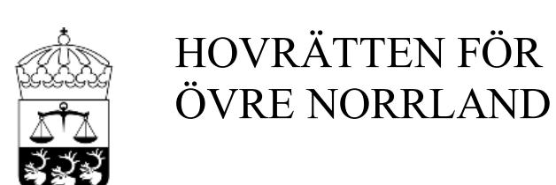
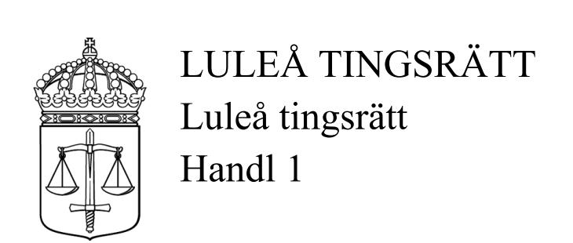
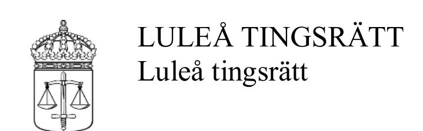
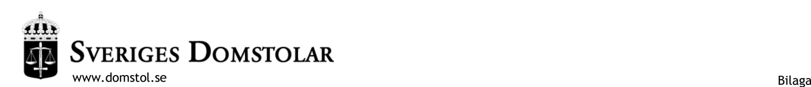

**DOM** 2020-06-25 Umeå

Mål nr T 1046-19

rotel 6

## **ÖVERKLAGAT AVGÖRANDE**

Luleå tingsrätts dom 2019-10-23 i mål T 3195-18, se bilaga A

#### **PARTER**

#### **Klagande**

Andreas Norberg, 19870306-8935 Backgatan 13, Lgh 1202 972 42 Luleå

Ombud och biträde enligt rättshjälpslagen: Jur.kand. Lina Modig Advokat Gunilla Olsson AB Mälartorget 19 111 27 Stockholm

#### **Motpart**

Helena Morén, 19810121-8900 Majvägen 13, Lgh 1003 973 31 Luleå

Ombud och biträde enligt rättshjälpslagen: Advokat Jenny Nordlund Advokatfirman Lundberg & Åkerlund HB Box 136 971 04 Luleå

## **SAKEN** Vårdnad om barn m.m. \_\_\_\_\_\_\_\_\_\_\_\_\_\_\_\_\_\_\_

#### **HOVRÄTTENS DOMSLUT**

Se sidan 2.

## **HOVRÄTTENS DOMSLUT**

- 1. Hovrätten ändrar tingsrättens dom på så sätt att följande ska gälla.
  - a. Vårdnaden om Edda Morén, 180321-6165, ska vara gemensam mellan parterna.
  - b. Edda Morén ska ha sitt stadigvarande boende hos Helena Morén.
  - c. Edda Morén ska ha rätt till umgänge med Andreas Norberg
    - varannan helg, jämna veckor, från fredag efter förskolans slut till måndag vid förskolans början, med början den 10 juli 2020.
    - Därefter, med början den 17 september 2020, varannan vecka, jämna veckor, från torsdag efter förskolans slut till måndag vid förskolans början.
    - Därefter, med början den 13 januari 2021, varannan vecka, jämna veckor, från onsdag efter förskolans slut till måndag vid förskolans början.
    - Varannan jul, jämna år, från den 21 december kl. 10.00, till den 27 december kl. 18.00, med början 2020,
    - vartannat nyår, ojämna år, från den 27 december kl. 10.00 till den 3 januari kl. 18.00 med början 2021,
    - vartannat sportlov, ojämna år, från sista skoldagen slut före lovet till första skoldagens början efter lovet, med början 2021,
    - vartannat påsklov, jämna år, från sista skoldagen slut före lovet till första skoldagens början efter lovet, med början 2022
    - vartannat höstlov, ojämna år, från sista skoldagen slut före lovet till första skoldagens början efter lovet, med början 2020
    - varje sommar under tre hela veckor med minst en vecka mellan varje umgängestillfälle med början år 2021. Beträffande sommarumgänge ska Andreas Norberg senast den 15 mars varje år meddela Helena Morén vilka veckor han önskar utöva umgänget. För det fall föräldrarna inte kan komma överens om sommarumgänget, ska Andreas Norbergs önskemål ha företräde ojämna år och Helena Moréns önskemål jämna år.

\_\_\_\_\_\_\_\_\_\_\_\_\_\_\_\_\_\_\_

Hämtning och lämning av Edda för umgänge ska i första hand ske på förskolan/skolan, och i annat fall utanför Helena Moréns bostad.

- 2. Vad hovrätten förordnat om vårdnad, boende och umgänge ska gälla utan hinder av att domen inte vunnit laga kraft.
- 3. Hovrätten fastställer ersättningen enligt rättshjälpslagen för Lina Modig till 73 801 kr. Av beloppet avser 40 014 kr arbete, 14 778 kr tidsspillan, 4 249 kr utlägg och 14 760 kr mervärdesskatt.
- 4. Hovrätten fastställer ersättningen enligt rättshjälpslagen för Jenny Nordlund till 50 775 kr varav 40 620 kr avser arbete och 10 155 kr avser mervärdesskatt.
- 5. Hovrätten förordnar att rättshjälpen för både Andreas Norberg och Helena Morén upphör.

## **YRKANDEN I HOVRÄTTEN**

Andreas Norberg har i första hand yrkat att hovrätten med ändring av tingsrättens dom ska förordna att vårdnaden om parternas dotter Edda ska vara gemensam samt att Edda ska ha rätt till umgänge med honom enligt följande.

- 1. a. Varannan helg, jämna veckor, från fredag efter förskolans slut till måndag vid förskolans början, med början den 26 juni 2020, samt
  - b. varannan vecka, ojämna veckor, från onsdag efter förskolans slut till torsdag vid förskolans början, med början den 1 juli 2020.
  - 2. Därefter varannan helg, jämna veckor, från onsdag efter förskolans slut till måndag vid förskolans början, med början den 16 september 2020.

Utöver umgänge enligt punkten 1-2 yrkar Andreas Norberg att Edda ska ha rätt till lovumgänge med honom enligt följande.

- Varannan jul, jämna år, från den 21 december kl. 10.00, till den 27 december kl. 18.00, med början 2020,
- Vartannat nyår, ojämna år, från den 27 december kl. 10.00 till den 3 januari kl. 18.00 med början 2021,
- Vartannat sportlov, ojämna år, från sista skoldagen slut före lovet till första skoldagens början efter lovet,
- Vartannat påsklov, jämna år, från sista skoldagen slut före lovet till första skoldagens början efter lovet,
- Vartannat höstlov, ojämna år, från sista skoldagen slut före lovet till första skoldagens början efter lovet,
- Varje sommar under tre hela veckor med minst en vecka mellan varje umgängestillfälle. För det fall föräldrarna inte kan komma överens om sommarumgänget ska Andreas Norbergs önskemål ha företräde ojämna år och Helena Moréns önskemål jämna år.

Hämtning och lämning av Edda för umgänge ska i första hand ske på förskolan/skolan, och i annat fall utanför Helena Moréns bostad.

För det fall hovrätten skulle finna att vårdnaden om Edda inte ska vara gemensam mellan parterna har Andreas Norberg i andra hand yrkat att vårdnaden om Edda ska tillerkännas honom ensam.

Helena Morén har motsatt sig att tingsrättens dom ändras.

För det fall hovrätten skulle besluta att vårdnaden om Edda ska vara gemensam, är parterna överens om att Edda ska vara stadigvarande boende hos Helena Morén.

Båda parterna har yrkat att hovrättens dom ska gälla utan hinder av att den inte har vunnit laga kraft.

## **UTREDNINGEN I HOVRÄTTEN**

Hovrätten har tagit del av samma bevisning som tingsrätten, med undantag från vittnesförhören med Anna Lindqvist, Emma Norberg, Jan Norberg och Torbjörn Öhman, som inte åberopats i hovrätten. Utöver det har Andreas Norberg åberopat handlingar från Kronofogdemyndigheten, sms och epostmeddelanden mellan parterna samt tilläggsförhör med honom själv, Fernanda Nilsson och Karin Karlsson. Helena Morén har som ny bevisning i hovrätten åberopat beslut från Skatteverket angående Eddas folkbokföring, orosanmälan från BVC, handlingar från Kronofogdemyndigheten, sms och epostmeddelanden mellan parterna samt tilläggsförhör med sig själv.

#### **HOVRÄTTENS DOMSKÄL**

Som grund för sin talan har Andreas Norberg anfört sammanfattningsvis följande. Han är lämplig som vårdnadshavare för Edda. Han har idag ordnade förhållanden avseende boende, har fast anställning och är drogfri. Umgänget med Edda har fungerat bra och de har fått en fin relation. Han är villig att samarbeta med Helena Morén och parterna kan kommunicera och kommer överens i frågor som rör Edda. Det föreligger inte sådana samarbetssvårigheter mellan parterna som medför att vårdnaden om Edda ska

tillkomma en av parterna ensam. För det fall hovrätten kommer fram till att en av parterna ska ha ensam vårdnad om Edda, är han den av dem som bäst kan främja att hon får en god och nära relation med båda föräldrarna. För det fall Helena Morén får ensam vårdnad om Edda, finns risk att han exkluderas från Eddas liv.

Som grund för sitt bestridande har Helena Morén anfört i huvudsak följande. Det är bäst för Edda att hon har ensam vårdnad om henne, eftersom konflikten mellan parterna är alltför djupgående för att gemensam vårdnad ska fungera. Hon känner en osäkerhet kring Andreas Norbergs stabilitet och psykiska hälsa vilket påverkar deras förutsättningar att samarbeta med varandra. Helena Morén är Eddas starkaste anknytningsperson. Hon har medverkat till umgänget och har informerat Andreas Norberg i frågor kring Edda. Även om parterna har haft mer kontakt under senare tid så har samarbetssvårigheterna kvarstått. Parterna har bl.a. haft olika uppfattning om tingsrättens dom ska frångås i fråga om umgänge. Det umgänge som yrkats är alltför omfattande sett till Eddas ålder och då anknytningen mellan Edda och Andreas Norberg ännu inte är tillräckligt stark.

#### **Hovrättens bedömning**

#### *Vårdnad*

Hovrätten delar inledningsvis tingsrättens bedömning att båda parterna är lämpliga som vårdnadshavare för Edda. De problem som Andreas Norberg haft ligger förhållandevis långt tillbaka i tiden och han har mottagit adekvat hjälp för att komma tillrätta med dem. Fråga är då om vårdnaden om Edda ska vara gemensam eller tillerkännas någon av parterna ensam. Vid bedömningen av om vårdnaden ska vara gemensam eller anförtros en av föräldrarna ska rätten fästa avseende särskilt vid föräldrarnas förmåga att samarbeta i frågor som rör barnet. Vidare ska barnets bästa vara avgörande för beslutet och rätten ska särskilt beakta barnets behov av en nära och god kontakt med båda föräldrarna.

Andreas Norberg och Helena Morén har svårt att samarbeta med varandra. Dessa svårigheter innebär i sig en risk för Eddas utveckling. Parternas samarbetssvårigheter synes främst bottna i omständigheter kring deras separation under 2018, såsom Andreas Norbergs missbruk och mående under den tiden och inte minst diskussioner kring viss egendom som tillhörde Helena Morén. Parternas samarbetssvårigheter kring Edda har i huvudsak handlat om hennes umgänge med Andreas Norberg – om det ska ske och under vilka former. Helena Morén har som stöd för att det föreligger samarbetssvårigheter mellan parterna bl.a. hänvisat till parternas svårigheter att nå överenskommelser om avsteg från domen vad gäller umgänge, Andreas Norbergs frågor kring detta och deras diskussioner om Eddas kläder och vad Edda ska ha med sig till förskolan. Hovrätten konstaterar att även om ett konfliktfritt samarbete rörande även denna typ av frågor förstås är önskvärd, är det i grunden inte detta vårdnadsfrågan handlar om. Det har inte framkommit att parterna inte kunnat fatta de beslut som krävts angående Edda. Efter tingsrättens dom har parterna också kunnat kommunicera via sms och mail i frågor kring Eddas umgänge med Andreas Norberg.

Ett beslut i vårdnadsfrågan kan vidare inte grundas endast på en bedömning av samarbetsförmåga. Det krävs även en riskbedömning av vad ensam vårdnad för respektive förälder skulle innebära. Domstolens uppgift blir sedan att väga de risker som finns vid de olika alternativen.

Vad gäller Eddas behov av en nära och god kontakt med båda sina föräldrar framgår att Helena Moréns inställning till Andreas Norberg och hans familj lett till att Eddas relation och kontakt med honom blivit lidande sedan augusti 2018. Hovrätten konstaterar bl.a. att Helena Moréns inställning inte har förändrats trots att Andreas Norberg under en längre period uppvisat intyg på drogfrihet. Det finns även andra omständigheter som visar att Helena Morén i viss mån saknar förståelse för Eddas behov av en nära och god kontakt med sin pappa. Det kan t.ex. pekas på att Edda inte fått ha presenter från Andreas Norberg och hans släkt hemma hos Helena Morén, dvs. i Eddas hem. Hovrätten ser en tydlig risk i att ett beslut om ensam vårdnad för Helena Morén skulle begränsa Eddas tillgång till sin pappa.

Ett beslut om ensam vårdnad för Andreas Norberg skulle innebär en mindre risk för att Edda inte får en nära och god tillgång till båda sina föräldrar. Det finns dock även tydliga risker med att nu anförtro vårdnaden åt Andreas Norberg. Han har trots allt haft en begränsad roll i Eddas liv hittills och det skulle innebära en stor förändring för henne att nu bo tillsammans med honom.

Hovrätten konstaterar att det alltså finns risker med alla alternativ som står till buds. Riskerna med att anförtro vårdnaden till någon av föräldrarna ensam väger dock tyngre än riskerna vid en fortsatt gemensam vårdnad. Hovrätten delar alltså, till skillnad från tingsrätten, den bedömning som görs i vårdnadsutredningen att vårdnaden om Edda bör vara gemensam. Om samarbetet mellan parterna ytterligare skulle försämras kan det emellertid bli omöjligt med fortsatt gemensam vårdnad om Edda. Med hänsyn till de risker hovrätten ser med Helena Morén som ensam vårdnadshavare och de mer övergående risker tingsrätten ser med Andreas Norberg som vårdnadshavare får det anses vara en öppen fråga vem av parterna som i så fall skulle anförtros vårdnaden om Edda. Hovrättens förhoppning är emellertid att parterna efter denna process kan flytta fokus från bristerna hos den andre och till Eddas mer grundläggande behov av två föräldrar som inte ligger i aktiv konflikt med varandra.

#### *Boende*

Parterna är överens om att Edda ska bo hos Helena Morén för det fall hovrätten skulle komma fram till att parterna ska ha gemensam vårdnad om henne. Hovrätten bedömer att detta också är för Eddas bästa och förordnar i enlighet med parternas inställning i denna del.

#### *Umgänge*

Sedan tingsrättens dom har Edda haft umgänge med Andreas Norberg i huvudsak i enlighet med domen. Enligt Andreas Norberg och de vittnen som hörts i hovrätten har umgänget fungerat bra och han och Edda har fått en fin kontakt. Helena Morén har inte ifrågasatt dessa uppgifter. Sedan april 2020 har Edda också haft övernattningsumgänge hos Andreas Norberg.

Enligt tingsrättens dom, som Helena Morén har godtagit, ska en upptrappning av umgänget ske den 10 juli 2020 till att vara varannan helg från fredag till söndag. Vidare ska sommarumgänge enligt domen ske under en hel vecka under sommaren 2020. Andreas Norberg har yrkat att upptrappning av umgänget ska ske den 26 juni 2020 och att det då ska utökas till att äga rum från fredag till måndag jämna veckor och onsdag-torsdag ojämna veckor.

Utgångspunkten är att det är till Eddas bästa att ha ett så omfattande umgänge med sin pappa som omständigheterna tillåter. Det är viktigt att hon tillåts ha en närvarande pappa även under sina tidiga levnadsår. Med hänsyn till den tid som gått sedan tingsrättens dom och det framgångsrika umgänget som varit, bör umgänget nu utökas ytterligare.

Mot bakgrund av att parterna och Edda ska kunna förbereda sig för det utökade umgänget finner hovrätten att det är lämpligt att en upptrappning sker först från och med den 10 juli 2020, vilket parterna varit inställda på sedan tidigare. Eftersom tidigare övernattningsumgänge gått bra, och det är lämpligt att hämtning och lämning i första hand sker på förskolan, anser hovrätten att umgänge från den 10 juli 2020 ska ske varannan helg från fredag efter förskolans slut till måndag vid förskolans början. Vid en sådan omfattning på helgumgänget bedömer hovrätten att det inte är för Eddas bästa att därutöver ha ett vardagsumgänge under ojämna veckor då hon också behöver få sammanhängande tid hos Helena Morén innan nästa umgängestillfälle.

Det veckovisa umgänget bör sedan trappas upp för att Edda också ska få ta del av vardagen hos Andreas Norberg. Hovrätten finner därför att från den 17 september 2020 ska umgänge ske varannan vecka, jämna veckor, från torsdag till måndag och sedan, från omkring årsskiftet 2020/2021 jämna veckor, från onsdag till måndag.

Hovrätten ser vidare inget hinder för att Edda ska ha rätt till lovumgänge med Andreas Norberg enligt de yrkanden som framställts.

#### *Rättshjälp*

Hovrätten beslutade den 12 mars 2020 att delvis bifalla Andreas Norbergs begäran om att hans rättshjälp skulle fortsätta även efter att hans biträdes arbete uppgått till 100 timmar. Hovrätten beslutade att det antal timmar som förmånen av rättshjälpsbiträde fick omfatta skulle uppgå till totalt 113 timmars arbete för biträdet. I beslutet angav hovrätten att det åligger Lina Modig, för det fall målet i hovrätten inte kan avslutas innan rättshjälpen upphör, på lämpligt sätt avsluta sitt uppdrag och anmäla till hovrätten när det arbete hon lagt ned på målet efter den 13 november 2019 uppgår till eller närmar sig 25 timmar.

Lina Modig har begärt ersättning för, rätt summerat, 29 timmar och 25 minuters arbete i hovrätten vilket innebär att det antal timmar som rättshjälpen omfattar har överskridits med 55 minuter. Lina Modig har inte anmält till rätten att den ianspråktagna tiden närmat sig eller begärt någon ytterligare utökning av rättshjälpen. Hon tillerkänns därför ersättning för 28,5 timmars arbete i hovrätten (jfr rättsfallet NJA 2007 s.752). Andreas Norbergs rättshjälp ska även omedelbart upphöra.

Jenny Nordlund har begärt ersättning för 29 timmars arbete i hovrätten vilket innebär att det högsta antal timmar som förmånen av rättshjälpsbiträde får omfatta för Helena Morén har uppnåtts. Även Helena Moréns rättshjälp ska därför omedelbart upphöra.

## **HUR MAN ÖVERKLAGAR,** se bilaga B

Överklagande senast den 23 juli 2020.

Hovrättsrådet Jonas Brodin, chefsrådmannen Mikael Forsgren och tf. hovrättsrådet Emma Granberg (referent) samt nämndemännen Robert Boström och Erik Vikström har deltagit i avgörandet. Domstolen är enig.

**Mål nr:** T 3195-18

## Rättelse/komplettering Dom, 2019-10-23

**Rättelse, 2019-10-31**

Beslut av: rådmannen Benny Wernqvist

I domslutet, punkten 6, har det skett en felaktig summering av ersättningsbeloppet till Lina Modig.

Det korrekta totala beloppet är 120 606 kr.

**DOM** 2019-10-23 Meddelad i Luleå

Mål nr T 3195-18

#### **PARTER**

#### **Kärande**

Anna Maria HELENA Morén, 19810121-8900 Majvägen 13 Lgh 1003 973 31 Luleå

Ombud och biträde enligt rättshjälpslagen: Advokat Jenny Nordlund Advokatfirman Lundberg & Åkerlund HB Box 136 971 04 Luleå

#### **Svarande**

Jan ANDREAS Norberg, 19870306-8935 Backgatan 13 Lgh 1202 972 42 Luleå

Ombud och biträde enligt rättshjälpslagen: Jur.kand. Lina Modig c/o Advokat Gunilla Olsson AB Mälartorget 19 111 27 Stockholm

\_\_\_\_\_\_\_\_\_\_\_\_\_\_\_\_\_\_\_\_\_\_

## **DOMSLUT**

- 1. Tingsrättens tidigare interimistiska beslut om vårdnad och umgänge ska inte längre gälla.
- 2. Tingsrätten anförtror vårdnaden om parternas dotter Edda, 1803021-6165, åt Helena Morén ensam.

- 3. Andreas Norberg ska ha rätt till umgänge med Edda enligt det följande:
  - inledningsvis varje torsdag från kl. 14.00 till kl. 17.00, med början den 31 oktober 2019,
  - därefter varje tisdag och torsdag från kl. 14.00 till kl. 17.00 respektive dag, med början den 26 november 2019, med undantag för vecka 52 2019 och vecka 1 2020,
  - därefter varannan helg, jämna helger, lördag och söndag från kl. 10.00 till kl. 14.00 respektive dag, samt varje onsdag från kl. 14.00 till kl. 17.00, med början den 12 januari 2020,
  - därefter varannan helg, jämna helger, från lördag kl. 10.00 till söndag kl. 18.00, samt varje onsdag från kl. 14.00 till kl. 17.00, med början den 6 april 2020, samt
  - därefter och i fortsättningen varannan helg, jämna helger, från förskolans/skolans slut på fredagen till kl. 18.00 på söndagen, med början den 10 juli 2020.
  - Varannan jul, jämna år, från den 21 december kl. 10.00, eller om Edda börjat skolan från slutet av den sista skoldagen innan julen, till den 25 december kl. 18.00, med början 2020,
  - vartannat nyår, ojämna år, från den 30 december kl. 10.00 till den 3 januari kl. 18.00, med början 2021,
  - sommaren 2020 under en hel vecka,
  - sommaren 2021 under två hela veckor, med minst en vecka mellan umgängestillfällen, samt
  - från och med sommaren 2022 under tre hela veckor med minst en vecka mellan varje umgängestillfälle. Beträffande sommarumgängena ska Andreas Norberg senast den 15 mars varje år meddela Helena Morén vilka veckor han önskar utöva umgänget. För det fall föräldrarna inte kan komma överens om sommarumgänget ska Andreas Norbergs önskemål ha företräde ojämna år och Helena Moréns önskemål jämna år.
  - Hämtning och lämning av Edda för umgänge ska i första hand ske på förskolan/skolan, och i annat fall utanför Helena Moréns bostad.

- 4. Det som beslutats om vårdnad och umgänge under punkterna 1 3 ska gälla omedelbart, utan hinder av att denna dom inte vunnit laga kraft.
- 5. Tingsrätten fastställer Jenny Nordlunds ersättning enligt rättshjälpslagen till 162 150 kr, varav 129 720 kr avser arbete och 32 430 kr mervärdesskatt.
- 6. Tingsrätten fastställer Lina Modigs ersättning enligt rättshjälpslagen till 120 626 kr, varav 95 220 kr avser arbete, 1 265 kr tidsspillan och 24 121 kr mervärdesskatt.
- 7. Tingsrätten fastställer Andreas Norbergs tidigare rättshjälpsbiträde Ellen Källströms ersättning enligt rättshjälpslagen till – rätt räknat – 26 738 kr, varav 21 390 kr avser arbete och 5 348 kr mervärdesskatt.
- 8. Helena Morén och Andreas Norberg ska var för sig svara för kostnaden för sin respektive rättshjälp enligt den fördelning och med de belopp Rättshjälpsmyndigheten bestämmer.

\_\_\_\_\_\_\_\_\_\_\_\_\_\_\_\_

#### **BAKGRUND OCH TIDIGARE BESLUT**

Helena Morén och Andreas Norberg har tidigare varit sambos och fick dottern Edda 2018. Andreas Norberg var med om en allvarlig cykelolycka utomlands under 2015. På grund av de skador han ådrog sig medicinerades han tungt med smärtstillande mediciner, vilket utvecklade sig till ett missbruk. Under sommaren 2018 separerade parterna och det blev en tvist mellan dem rörande Edda, vilket ledde till att Helena Morén väckte talan i detta mål i november i fjol.

Tingsrätten fattade den 21 december 2018 interimistiskt beslut om att Edda skulle bo hos Helena Morén, och att Andreas Norberg skulle ha rätt till umgänge med dottern vid ett tillfälle om två timmar i veckan, i närvaro av umgängesstöd som utsetts av socialnämnden. Efter detta har interimistiska beslut om fortsatt umgänge med umgängesstöd fattas den 14 april 2019 och den 29 maj 2019.

På grund av att det utsedda umgängesstödet inte kunde fortsätta sitt uppdrag fattade tingsrätten sedan den 13 september 2019 ett nytt interimistiskt beslut om umgänge utan umgängesstöd, varje torsdag kl. 13.00 till kl. 14.00 med hämtning och lämning på Eddas förskola, vilket har utövats vid tre tillfällen sedan dess.

Socialnämnden i Luleå kommun har på tingsrättens begäran gjort en vårdnads-, boende- och umgängesutredning i målet.

## **FÖRÄLDRARNAS YRKANDEN OCH INSTÄLLNINGAR**

Helena Morén har i första hand begärt ensam vårdnad om Edda, och i andra hand att dottern ska bo stadigvarande hos henne.

Andreas Norberg har bestritt yrkandet om ensam vårdnad och begärt att vårdnaden fortfarande ska vara gemensam. Han har gått med på att Edda ska bo hos Helena Morén, och begärt följande umgänge med dottern:

- under två månader vare tisdag och torsdag från kl. 13.00 till kl. 17.00,
- därefter under två månader varje tisdag, torsdag och söndag från kl. 12.00 till kl. 18.00,
- därefter under tre månader varannan helg, jämna helger, från lördag kl. 10.00 till söndag kl. 18.00, samt varje onsdag kl. 12.00 till kl. 18.00,
- därefter under tre månader, varannan helg, jämna helger, från fredag eftermiddag till söndag kl. 18.00, och
- slutligen varannan vecka från onsdag eftermiddag till måndag förmiddag.
- Under julen 2019 från den 24 december kl. 10.00 till den 25 december kl. 18.00, och därefter varannan jul, jämna år, från den 21 december kl. 10.00 till den 26 december kl. 18.00.
- Vartannat nyår, ojämna år, från den 30 december kl. 10.00 till den 3 januari kl. 18.00.
- Sommarumgänge under tre veckor med minst en vecka emellan varje umgängestillfälle. Han ska meddela Helena Morén vilka tider han önskar utöva umgänget senast den 15 mars varje år, och han ska ha förtur ojämna år.

Helena Morén har bestritt umgängesyrkandena, och förklarat att hon bara kan gå med på umgänge i första hand med umgängesstöd enligt de tidigare interimistiska besluten, och i andra hand tisdagar och torsdagar från kl. 09.00 till kl. 11.00.

## **FÖRÄLDRARNAS SYNPUNKTER I SAK**

*Helena Morén*

Hon och Andreas Norberg separerade kring midsommar i fjol. Andreas Norberg hade behandlats på beroendecenter under våren 2017, och sökte sedan hjälp på City Öppenvård. Hon ifrågasätter inte att han lämnat negativa drogtester där.

Andreas Norberg fick ett strafföreläggande för ringa narkotikabrott i december 2018. I juni 2018 gjorde Vuxenpsykiatrin en orosanmälan, sedan Andreas Norberg förts in av polis med misstankar om psykos. I juli 2018 gjorde även en granne orosanmälan. Det kom även in en orosanmälan i december 2018, men socialnämnden vidtog inga åtgärder eftersom det inte ansågs finans någon oro för Edda som var med henne.

Under deras sambotid hade Andreas Norberg humörsvängningar och kunde vara hårdhänt. Efter separationen träffade Edda Andreas Norberg varje dag tillsammans med henne, men detta upphörde den 26 augusti 2018, i samband med ett uppträde, och konflikten mellan dem förvärrades. De försökte med samarbetssamtal vid ett tillfälle, men det gav inget gott resultat. Hon tvingades ansöka om handräckning hos Kronofogdemyndigheten för att få ut sina sakar som var kvar i Andreas Norbergs lägenhet som de varit sambo i. Bostadsrättsföreningen har ansökt om att Andreas Norberg ska vräkas ur lägenheten på grund av bristande betalning av avgifterna och allvarliga störningar.

När hon var med Edda på BVC i januari 2019 kom Andreas Norberg oanmäld och ville träffa dottern, och det som skedde ledde till en orosanmälan. Andreas Norberg har numera en ny flickvän, Fernanda Nilsson, och dennas mor Ulrika Nilsson har blivit mycket orolig för sin dotter och barnbarn i anledning av Andreas Norbergs beteende och gjort en orosanmälan.

Hennes och Andreas Norberg konflikt är för djupgående för att det ska vara möjligt med gemensam vårdnad. Andreas Norberg har inte förmåga att sätta Eddas behov främst. Med hänsyn till Andreas Norberg psykiska ohälsa, och i vart fall hans instabila livssituation, måste Edda skyddas från risker.

#### *Andreas Norberg*

Han sökte på eget initiativ hjälp av City Öppenvård i samband med separationen kring midsommar 2018 och är drogfri sedan dess. Han lider inte av någon psykisk ohälsa som utgör någon risk för Edda.

Edda har behov av en nära kontakt med båda sina föräldrar, och de samarbetsproblem som finns mellan honom och Helena Morén är av övergående natur.

#### **UTREDNINGEN**

Båda föräldrarna har åberopat omfattande bevisning, som i flera fall varit av perifer betydelse för kärnfrågorna i målet.

*Helena Morén* har som skriftlig bevisning åberopat brev från familjerätten, interimistiskt beslut om särskild handräckning, ett antal orosanmälningar, strafföreläggande, yttrande gällande umgängesstöd, besiktningsblankett avseende hennes katt, socialnämndens vårdnadsutredning, utdrag från socialtjänsten, ett stort antal sms, mail, intyg och protokoll, en konversation på tjänsten Messenger mellan Andreas Norberg och Fernanda Nilsson som hon fått från Ulrika Nilsson, en utredning enligt socialtjänstlagen, samt yttrande från familjerätten. Som muntlig bevisning har hon åberopat vittnesförhör med:

- Fernanda Nilssons mor Ulrika Nilsson,
- Maria Erixon, som låtit henne och Andreas Norberg bo i sitt gårdshus en tid,
- Birgitta Nyström, som varit umgängesstöd vid Eddas tidigare umgängen

- med Andreas Norberg,
- Magnus Nilsson Mäki, som är gift med Ulrika Nilsson och således styvfar till Fernanda Nilsson,
- Torbjörn Öhman, som är medlem i Andreas Norbergs bostadsrättsförening, samt
- sin far Anders Persson.

*Andreas Norberg* har som skriftlig bevisning åberopat socialnämndens vårdnadsutredning, samt intyg rörande de drog- och alkoholtester han lämnat. Som muntlig bevisning har han åberopat vittnesförhör med:

- Mats Almqvist som behandlat honom på City Öppenvård,
- Anette Sandberg som haft honom som patient i sin egenskap av företagssjuksköterska,
- sin flickvän Fernanda Nilsson,
- kamraten Anton Fahlander som var med honom på det ovan berörda besöket på BVC i januari i år,
- Lars Bonnevier som känt honom en lång tid,
- Lars Bonneviers hustru Anna Lindqvist,
- sin far, mor och syster Jan Norberg, Karin Karlsson och Emma Norberg, samt
- Stina Lindgren, som arbetar på Eddas förskola.

## **TINGSRÄTTENS BEDÖMNINGAR**

#### *Vårdnaden*

#### *Utgångspunkter*

Det är barnets bästa som är det avgörande vid alla beslut rörande vårdnad, boende och umgänge. Vid bedömningen av vad som är det bästa för barnet ska särskilt avseende fästas vid eventuella risker för att barnet utsätts för övergrepp eller på annat sätt far illa, samt dess behov av en nära och god kontakt med båda föräldrarna (6 kap 2 a § föräldrabalken). Även om föräldrabalken således vilar på en grundtanke att det är bäst för barnet att ha tillgång till båda sina föräldrar finns det ingen presumtion för gemensam vårdnad, utan det som ska bedömas är barnets bästa i varje enskilt fall, utifrån de individuella förhållandena.

Den första frågan är om Helena Morén ska ha ensam vårdnad på den grunden att Andreas Norberg över huvud taget inte är lämplig som vårdnadshavare. Redan av hans egna uppgifter, och av berättelserna från vittnen på båda sidor, framgår att han i tiden före och närmast efter parternas separation var tydligt olämplig med hänsyn till sitt missbruk och sina psykiska problem, som bland annat yttrade sig i vanföreställningar och förföljelseidéer. Som vi närmare kommer att redogöra för nedan i frågan om umgänge så har det dock inte kommit fram något som visar att han *i dagsläget* skulle vara direkt olämplig som vårdnadshavare.

Mot bakgrund av det som kommit fram är det i stället främst frågan om en gemensam vårdnad innebär en risk att Edda far illa, främst med hänsyn till den konflikt och de samarbetsproblem som finns mellan föräldrarna. Enligt 6 kap. 5 § andra stycket föräldrabalken ska domstolen vid prövningen av om vårdnaden ska vara gemensam eller anförtros en av föräldrarna fästa särskilt avseende vid föräldrarnas förmåga att samarbeta i frågor som rör barnet. I förarbetena till denna bestämmelse sades bland annat att det inte mer eller mindre schablonmässigt får

beslutas om gemensam vårdnad mot den ena förälderns önskemål, och att det är viktigt att en förälders motstånd mot gemensam vårdnad tas på allvar. Vidare sades det att gemensam vårdnad normalt förutsätter att föräldrarna har ett "någorlunda" konfliktfritt samarbete. Det innebär inte att de alltid måste ha samma uppfattning, men de måste kunna hantera sina delade meningar på ett sätt som inte drabbar barnet. Ett barn mår inte bra av ständiga konflikter mellan föräldrarna. Om föräldrarna saknar vilja och förmåga att sätta barnets bästa före den egna konflikten, färgar detta omvårdnaden om barnet. Gemensam vårdnad bör i sådana fall inte få användas som ett medel för att "tvinga" föräldrarna att samarbeta. Gemensam vårdnad kan alltså vara oförenlig med barnets bästa, även om konflikten mellan föräldrarna inte kan sägas vara så svår och djup att det är omöjligt för dem att samarbeta.1

Enligt Högsta domstolen innebär det som sades i förarbetena att gemensam vårdnad förutsätter att det finns en realistisk möjlighet för föräldrarna att gemensamt och inom rimlig tid lösa de frågor som rör barnet och hantera de delade meningar som kan finnas, utan att de mer regelmässigt behöver hjälp utifrån för att fatta beslut och utan att det uppstår ständiga konflikter som drabbar barnet; uttryck för brist på förtroende för en andre föräldern liksom för bristande vilja eller förmåga att vara flexibel och jämka samman sin uppfattning med den andres är tecken på att en gemensam vårdnad kan vara oförenlig med barnets bästa. Högsta domstolen konstaterade dock samtidigt att en konflikt mellan föräldrarna inte behöver utesluta en gemensam vårdnad, om motsättningarna kan antas vara av övergående natur och därmed inte förhindrar ett samarbete på längre sikt.2

 1 Se prop. 2005/06:99, s. 49 ff

2 Se rättsfallet NJA 2007 s. 382.

# 2019-10-23

*Bedömningen i detta fall*

Helena Morén har för sin del bland annat berättat att de levde i ett kaos under sambotiden, Andreas Norberg tog massvis med mediciner och kunde inte ge henne något stöd under graviditeten eller i samband med förlossningen, och när Edda fötts visade han inget intresse för dottern. De hade ett samarbetssamtal men det ledde inte till något. Andreas Norberg använde de saker hon lämnat kvar i lägenheten som påtryckningsmedel mot henne. Hon har försökt att få till stånd samarbetssamtal och ordnat med umgängesstöd, men trots att hon gjort det hon kunnat har samarbetet mellan dem inte blivit bättre. Andreas Norberg har å sin sida medgett att det var problem vid bodelningen, men uppgett att han numera är ren från droger och mår efter omständigheterna bra, även om han är pressad och mår dåligt över att inte få träffa Edda. Han hoppas för sin del att problemen mellan honom och Helena Morén ska gå att lösa, eventuellt med hjälp utifrån.

Som sagts i de refererade förarbetena är det viktigt att ta en förälders, i detta fall Helena Moréns, motstånd mot gemensam vårdnad på allvar. Rätten måste dock samtidigt även vara vaksam på risken för att den förälder som inte går med på gemensam vårdnad överdriver samarbetsproblemen, i syfte att styra bedömningen mot ensam vårdnad. Mot bakgrund av det som hänt mellan parterna och Andreas Norberg tidigare problematik är det dock fullt förståeligt att Helena Morén i vart fall i dagsläget inte känner någon tillit eller förtroende för honom. Även Andreas Norberg har å sin sida, i vart fall tidigare under utredningen, varit inne på att Helena Morén för sin del skulle behöva hjälp för psykisk ohälsa och uttryckt oro för att hon skulle lämna Luleå med dottern och inte låta honom träffa Edda igen. Mot bakgrund av det som kommit fram under vårdnadsutredningen har Socialnämnden också bland annat konstaterat:

I tid för denna utredning har Eddas föräldrar en hög konfliktnivå och ingen fungerande kommunikation. Respekten och tilliten till varandra i föräldraskapet saknas. Utredarna ser en risk att Edda kommer att fortsätta att utsättas för föräldrarnas konflikt utifrån hur låst konflikten är idag. Separationen mellan parterna var för mindre än ett år sedan och svårigheterna i att samarbeta kan härröra till deras separation och tidigare händelser som inte är utredda mellan dem. Helena har under utredningens gång uttryckt oro över Andreas missbruk och ifrågasatt om han kan tillgodose Eddas behov. Det framkommer inget i utredningen som visar på att Andreas har ett pågående missbruk. I intyg från City öppenvård samt referenssamtal med Mats Almqvist styrker det Andreas egen utsago att han är drogfri.

#### men samtidigt dragit slutsatsen:

Vår bedömning är att föräldrarna har behov av professionella samtal, enskilt eller tillsammans för att få till ett fungerande samarbete och kommunikation gällande omsorgen och omvårdnaden om Edda.

- Utredarna föreslår gemensam vårdnad

Mot bakgrund av det som kommit fram i målet delar vi socialnämndens bedömning av konfliktnivån mellan föräldrarna. Då det således saknas fungerande kommunikation, respekt och tillit, och finns en risk för att Edda kommer att utsättas för fortsatta konflikter mellan föräldrarna, framstår det som något förvånande att nämnden ändå ansett att det finns förutsättningar för gemensam vårdnad. Denna slutsats bygger dock som det får förstås på att föräldrarna ska få professionell hjälp utifrån, vilket ju Andreas Norberg varit inne på. Som berörts ovan talar dock ett behov av extern hjälp mot att det skulle finnas realistiska möjligheter för föräldrarna att inom rimlig tid uppnå ett åtminstone godtagbart samarbete. De djupa motsättningarna mellan Helena Morén och Andreas Norberg kan sammantaget inte anses vara av övergående natur, och enligt vår mening innebär deras samarbetsproblem sådana risker för Eddas välmående att en gemensam vårdnad inte kan anses vara förenlig med hennes bästa. Vårdnaden måste därför anförtros en av föräldrarna.

Det är Helena Morén som tagit hand om Edda, Andreas Norberg har inte haft någon närmare kontakt med dottern under en tid och har för egen del inte begärt ensam vårdnad. Mot bakgrund av detta och det övriga som kommit fram ska Helena Morén anförtros ensam vårdnad om Edda.

2019-10-23

#### *Umgänget*

*Utgångspunkter*

Det råder ingen diskussion om att Edda ska bo hos Helena Morén. Den återstående frågan är därmed vilket – om något – umgänge hon ska ha med sin pappa.

*Är det olämpligt med umgänge mellan Andreas Norberg och Edda?*

Vi konstaterar till en början att Helena Moréns förstahandsinställning att umgänget även framöver enbart ska ske med umgängesstöd inte är realistisk, redan på den grunden att umgängesstöd enligt lag bara får pågå under en begränsad tid, men även med tanke på att det nu skett tre obevakade umgängen utan att det enligt Stina Lindgren skett något anmärkningsvärt. Utgångspunkten blir därmed att det ska vara ett normalt, obevakat, umgänge i den omfattning som är förenlig med Eddas bästa.

Helena Moréns inställning i umgängesfrågan grundar sig främst på en oro för Edda på grund av olika problem på Andreas Norbergs sida. Det är också dessa frågor som den omfattande vittnesbevisningen främst riktat in sig på.

Som redan berörts framgår det tydligt av såväl Andreas Norbergs som Helena Moréns uppgifter, de vittnen han själv åberopat, och de iakttagelser som Anders Persson gjort vid ett besök hos dottern, att Andreas Norberg under tiden fram till dess att han sökte hjälp inte varit i skick att ta hand om Edda. För att Andreas Norberg ska kunna tillerkännas umgänge i någon större omfattning måste han därför visa att han idag har en stabil drogfrihet och tillräckligt ordnade personliga förhållanden.

Andreas Norberg far, mor och syster har alla förklarat att han idag är en annan person än under missbruket, vilket stöds av det Lars Bonnevier och Anna Lindqvist berättat. Med hänsyn till dessa vittnens anknytning till Andreas Norberg är vi dock mer

benägna att lägga vikt vid vittnesmålen från Mats Almqvist och Anette Sandberg, som är utomstående och har behandlat honom i sina professionella roller. Mats Almqvist har berättat att han behandlat Andreas Norberg enligt den så kallade Minnesotamodellen/tolvstegsprogrammet under ett år. Behandlingen har gått bra och han bedömer Andreas Norberg som trovärdigt drogfri, bland annat med hänsyn till att samtliga prover som lämnats varit negativa. Anette Sandberg har även hon tagit drogtester från Andreas Norberg under det senaste året och de har varit negativa; hon har för sin del uppgett att Andreas Norberg genomgått en stor förbättring.

Frågan blir då om det finns något i den övriga utredningen som motsäger det som framförallt Mats Almqvist och Anette Sandberg uppgett. Helena Moréns vittnen Ulrika Nilsson och hennes make har bland annat hörts om en händelse i påskas, då de var tillsammans med Fernanda Nilsson och den övriga familjen på Dundret i Gällivare, och även kom att träffa Andreas Norberg. Ulrika Nilsson har till en början livligt berättat om hur hon då uppfattat Andreas Norberg som "påtänd" och även konfronterat honom med detta, vilket hon senare under förhöret gett intryck av att vilja ta tillbaka. Hennes make, som arbetar som stödpedagog för personer med missbruksproblem och neuropsykiatriska diagnoser, har för sin del menat att Andreas Norberg var i ett "jättemärkligt skick" och att han förklarade för denne att han upplevde honom som påverkad, vilket Andreas Norberg förnekade, samt att han inte kan säga hur det var med detta.

Vid bedömningen av det Ulrika Nilsson berättat kan vi – förutom motsägelserna i hennes uppgifter – inte bortse från att hon uppenbart dragits in i denna tvist på Helena Moréns sida till följd av sin tydliga motvilja mot att dottern Fernanda Nilsson och dennas barn umgås med Andreas Norberg. Detta har gått så långt att hon tagit del av förtroliga meddelanden mellan Andreas Norberg och Fernanda Nilsson och överlämnat dem till Helena Morén för att lägga fram som bevis i målet. Med hänsyn till att Anders Nilsson Mäki för sin del inte klart kunnat säga att Andreas Norberg var drogpåverkad finner vi sammantaget att det som berättats inte ger skäl att ifrågasätta Mats Almqvists och Anette Sandbergs uppgifter och bedömningar. Vår slutsats blir

därför sammantaget att det idag inte finns skäl för oro kring missbruk eller psykiska problem hos Andreas Norberg i sådan grad att det gör honom olämplig att umgås med Edda.

Helena Morén har även menat att Andreas Norberg har en oordnad tillvaro, främst med avseende på hans boendesituation, som gör ett umgänge olämpligt. I denna del har det bland annat talats tämligen utförligt parternas problem med bodelning, vräkningsansökningar hos Kronofogdemyndigheten och annat. Vad som tidigare förevarit hos Kronofogdemyndigheten är dock inte av någon större vikt, och Torbjörn Öhman har inte lämnat några uppgifter av betydelse för bedömningen. Vad som däremot är av intresse är att Andreas Norberg enligt egna uppgifter håller på att sälja sin lägenhet, och frågan blir därmed var han ska bo i fortsättningen.

Enligt Andreas Norberg är planen att han och Fernanda Nilsson ska bli sambos, tillsammans med hennes son och Edda när hon ska vara hos honom, i den lägenhet hon skaffat. Fernanda Nilsson har bekräftat Andreas Norberg uppgift om att han ska sälja sin lägenhet och att de sedan ska flytta ihop, men förklarat att det inte är klart hur nära i tid detta ligger. Enligt vår mening har det inte kommit fram något som ger tillräcklig anledning att ifrågasätta att Andreas Norberg och Fernanda Nilsson inom den närmsta framtiden verkligen kommer att bli sambos med sina barn. Att det i dagsläget inte är helt klart *när* detta ska ske har ingen egentlig påverkan på umgängesfrågan, då umgänget ska trappas upp och det inte kommer att bli aktuellt med övernattningar förrän under nästa år

Vår sammanfattade bedömning av det som lagts fram är att det inte finns några skäl mot ett normalt umgänge, anpassat efter Eddas ålder och de övriga omständigheterna. *Vilken omfattning ska umgänget ha?*

Helena Morén har i andra hand endast gått med på ett mycket sparsamt umgänge, som är långt ifrån det normala och enligt vår mening alldeles för lite för att tillgodose Eddas behov av kontakt med båda sina föräldrar.

Edda är ett och ett halvt år gammal, och har träffat sin pappa i mycket sparsam omfattning under en – i förhållande till hennes ålder – längre tid. Umgänget måste därför, som han också begärt, stegvis trappas upp. Enligt vår mening är dock den upptrappning han föreslagit alldeles för brant med hänsyn till den långa separationen och Eddas låga ålder.

Andreas Norberg har för närvarande rätt till umgänge en gång i veckan under en timme, vilket utövats vid tre tillfällen. Det framstår som lämpligt att utöka detta till fyra timmar under samma dag i en månads tid, och därefter lägga till ytterligare en dag i veckan samma tider under en månad. Vad gäller tiden för dagumgänget har Stina Lindgren uppgett att det med hänsyn till Eddas sovtider är lämpligare att inleda umgänget kl. 14.00 än som idag kl. 13.00. Efter denna inledning kan man, som Andreas Norberg föreslagit, övergå till ett umgänge varannan helg plus en dag i veckan, men enligt vår mening bör tillvänjningen pågå ytterligare en längre tid innan det kan bli aktuellt med övernattningar. Det framstår som väl avvägt med ett umgänge varannan helg, dagtid, samt en dag varje vecka, under tre månader, för att först därefter under ytterligare tre månader ha umgänge med övernattning varannan helg, samt en dag varje vecka dagtid. Efter denna upptrappning bör man ha kommit fram till ett lämpligt slutligt vardagsumgänge. Andreas Norberg yrkande om onsdagar till måndagar varannan vecka är dock enligt vår mening för mycket med hänsyn till omständigheterna, och en lämpligare omfattning är från förskolans/skolans slut fredagar till söndag eftermiddag.

Vad gäller julumgänget bör detta inte komma ifråga innevarande år, då upptrappningen fortfarande pågår, men det finns inget hinder att inleda det nästa år och därefter

Sid 17 T 3195-18

2019-10-23

vartannat jämnt år. Vi anser dock att det är väl tilltaget med umgänge ända till annandag jul, och anser att juldagen är en lämpligare slutdag. När Edda börjar skolan bör umgänget ske från sista skoldagen.

Det begärda nyårsumgänget framstår som lämpligt.

Vad så slutligen gäller sommaren, så är det alltför drastiskt att inleda med tre veckor, även om det är minst en vecka mellan varje tillfälle. Det framstår i stället som rimligt att börja med en vecka, och sedan utöka med en vecka per år till slutmålet tre veckor år 2022. Parterna är överens om att det är lämpligast att anmäla önskemål om umgänget senast den 15 mars varje år.

Det som nu beslutas om vårdnad och umgänge bör gälla omedelbart.

*Rättegångskostnaderna*

De ersättningar som begärts av ombuden får anses skäliga med hänsyn till målets art och omfattning. Helena Morén och Andreas Norberg ska enligt huvudregeln i vårdnadsmål svara för sina egna rättshjälpskostnader.

**HUR MAN ÖVERKLAGAR**, se bilaga 1

Överklagande lämnas in till tingsrätten **senast den 13 november 2019.**

\_\_\_\_\_\_\_\_\_\_\_\_

För en enig rätt

Benny Wernqvist

## **Hur man överklagar**

Dom i tvistemål, tingsrätt TR-02

Vill du att domen ska ändras i någon del kan du överklaga. Här får du veta hur det går till.

#### **Överklaga skriftligt inom 3 veckor**

Ditt överklagande ska ha kommit in till domstolen inom 3 veckor från domens datum. Sista datum för överklagande finns på sista sidan i domen.

### **Överklaga efter att motparten överklagat**

Om ena parten har överklagat i rätt tid, har den andra parten också rätt att överklaga även om tiden har gått ut. Det kallas att anslutningsöverklaga.

En part kan anslutningsöverklaga inom en extra vecka från det att överklagandetiden har gått ut. Ett anslutningsöverklagande måste alltså komma in inom 4 veckor från domens datum.

Ett anslutningsöverklagande upphör att gälla om det första överklagandet dras tillbaka eller av något annat skäl inte går vidare.

#### **Så här gör du**

- **1.** Skriv tingsrättens namn och målnummer.
- **2.** Förklara varför du tycker att domen ska ändras. Tala om vilken ändring du vill ha och varför du tycker att hovrätten ska ta upp ditt överklagande (läs mer om prövningstillstånd längre ner).
- **3.** Tala om vilka bevis du vill hänvisa till. Förklara vad du vill visa med varje bevis. Skicka med skriftliga bevis som inte redan finns i målet.

Det är inte säkert att du kan lägga fram nya bevis. Vill du göra det ska du förklara varför du inte lagt fram bevisen tidigare.

Vill du ha nya förhör med någon som redan förhörts eller en ny syn (till exempel besök på en plats), ska du berätta det och förklara varför.

Tala också om ifall du vill att motparten ska komma personligen vid en huvudförhandling.

**4.** Lämna namn och personnummer eller organisationsnummer.

Lämna aktuella och fullständiga uppgifter om var domstolen kan nå dig: postadresser, e-postadresser och telefonnummer.

Om du har ett ombud, lämna också ombudets kontaktuppgifter.

- **5.** Skriv under överklagandet själv eller låt ditt ombud göra det.
- **6.** Skicka eller lämna in överklagandet till tingsrätten. Du hittar adressen i domen.

### **Vad händer sedan?**

Tingsrätten kontrollerar att överklagandet kommit in i rätt tid. Har det kommit in för sent avvisar domstolen överklagandet. Det innebär att domen gäller.

Om överklagandet kommit in i tid, skickar tingsrätten överklagandet och alla handlingar i målet vidare till hovrätten.

Har du tidigare fått brev genom förenklad delgivning, kan även hovrätten skicka brev på detta sätt.

\_\_\_\_\_\_\_\_\_\_\_\_\_\_\_\_\_\_\_\_\_\_\_\_\_\_\_\_\_\_\_\_\_\_\_\_\_\_\_\_\_\_\_\_\_\_\_\_\_\_\_\_\_\_\_\_\_\_\_\_\_\_\_\_\_

#### **Prövningstillstånd i hovrätten**

När överklagandet kommer in till hovrätten tar domstolen först ställning till om målet ska tas upp till prövning.

Hovrätten ger prövningstillstånd i fyra olika fall.

- Domstolen bedömer att det finns anledning att tvivla på att tingsrätten dömt rätt.
- Domstolen anser att det inte går att bedöma om tingsrätten har dömt rätt utan att ta upp målet.
- Domstolen behöver ta upp målet för att ge andra domstolar vägledning i rättstillämpningen.
- Domstolen bedömer att det finns synnerliga skäl att ta upp målet av någon annan anledning.

Om du *inte* får prövningstillstånd gäller den överklagade domen. Därför är det viktigt att i överklagandet ta med allt du vill föra fram.

#### **Vill du veta mer?**

Ta kontakt med tingsrätten om du har frågor. Adress och telefonnummer finns på första sidan i domen.

Mer information finns på www.domstol.se .

## **Hur man överklagar hovrättens avgörande**

\_\_\_\_\_\_\_\_\_\_\_\_\_\_\_\_\_\_\_\_\_\_\_\_\_\_\_\_\_\_\_\_\_\_\_\_\_\_\_\_\_\_\_\_\_\_\_\_\_\_\_\_\_\_

Den som vill överklaga hovrättens avgörande ska göra det genom att skriva till Högsta domstolen. Överklagandet ska dock skickas eller lämnas till hovrätten.

#### **Senaste tid för att överklaga**

Överklagandet ska ha kommit in till hovrätten senast den dag som anges i slutet av hovrättens avgörande.

Beslut om häktning, restriktioner enligt 24 kap. 5 a § rättegångsbalken eller reseförbud får överklagas utan tidsbegränsning.

Om överklagandet har kommit in i rätt tid, skickar hovrätten överklagandet och alla handlingar i målet vidare till Högsta domstolen.

#### **Prövningstillstånd i Högsta domstolen**

Det krävs prövningstillstånd för att Högsta domstolen ska pröva ett överklagande. Högsta domstolen får meddela prövningstillstånd endast om

- 1. det är av vikt för ledning av rättstillämpningen att överklagandet prövas av Högsta domstolen eller om
- 2. det finns synnerliga skäl till sådan prövning, så som att det finns grund för resning, att domvilla förekommit eller att målets utgång i hovrätten uppenbarligen beror på grovt förbiseende eller grovt misstag.

#### **Överklagandets innehåll**

Överklagandet ska innehålla uppgifter om

- 1. klagandens namn, adress och telefonnummer,
- 2. det avgörande som överklagas (hovrättens namn och avdelning samt dag för avgörandet och målnummer),
- 3. den ändring i avgörandet som klaganden begär,
- 4. de skäl som klaganden vill ange för att avgörandet ska ändras,
- 5. de skäl som klaganden vill ange för att prövningstillstånd ska meddelas, samt
- 6. de bevis som klaganden åberopar och vad som ska bevisas med varje bevis.

#### **Förenklad delgivning**

Om målet överklagas kan Högsta domstolen använda förenklad delgivning vid utskick av handlingar i målet, under förutsättning att mottagaren där eller i någon tidigare instans har fått information om sådan delgivning.

#### **Mer information**

För information om rättegången i Högsta domstolen, se www.hogstadomstolen.se