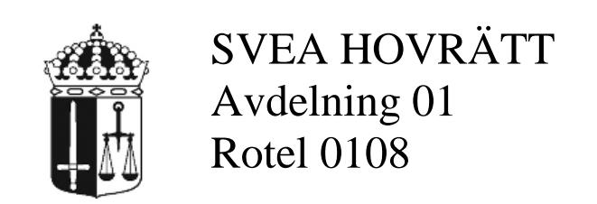
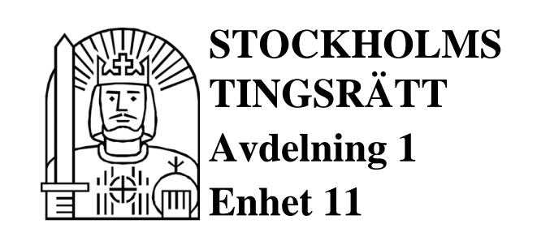
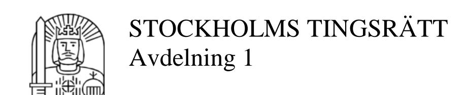

**DOM** 2012-09-27 Stockholm

Mål nr T 10094-11

# **ÖVERKLAGAT AVGÖRANDE**

Stockholms tingsrätts dom 9 november 2011 i mål nr T 9010-10, se bilaga A

#### **KLAGANDE**

Åsa de Graaff, 640826-1508 Adress hos ombudet

Ombud: Advokaten Susanne Ekberg-Carlsson Box 7100 103 87 Stockholm

#### **MOTPART**

Derek Diasti, 590315-8359 Tomtebogatan 19 113 39 Stockholm

Ombud: Advokaten Kenneth Lewis Box 2104 103 13 Stockholm

#### **SAKEN**

Vårdnad m.m.

\_\_\_\_\_\_\_\_\_\_\_\_\_\_\_\_\_\_\_

#### **HOVRÄTTENS DOMSLUT**

- 1. Med upphävande av punkterna 1 och 2 i tingsrättens dom samt hovrättens interimistiska beslut den 30 april 2012 p. 4 (umgänge) förordnar hovrätten följande.
- a) Vårdnaden om Victoria de Graaff, 060626, tillkommer Åsa de Graaff ensam.
- b) Victoria har rätt till umgänge med Derek Diasti enligt följande.
- Fem lördagar varannan vecka kl. 13.00–16.00 med start den 6 oktober 2012. Umgänget ska äga rum under medverkan av en person som utses av Östermalms stadsdelsförvaltning (umgängesstöd).

#### Dok.Id 1031964

| Postadress       | Besöksadress         | Telefon       | Telefax       | Expeditionstid  |
|------------------|----------------------|---------------|---------------|-----------------|
| Box 2290         | Birger Jarls Torg 16 | 08-561 670 00 | 08-561 670 19 | måndag – fredag |
| 103 17 Stockholm |                      | 08-561 670 10 |               | 09:00-15:00     |
|                  |                      |               |               |                 |

**E-post**: svea.avd1@dom.se

www.svea.se

- Fem lördagar varannan vecka kl. 13.00–16.00 med start den 15 december 2012. Umgänget ska äga rum utan medverkan av umgängesstöd, men med hämtning och lämning av Victoria under medverkan av en person som utses av Östermalms stadsdelsförvaltning.
- Två lördagar och söndagar varannan helg kl. 13.00–16.00 respektive dag med start den 23 och 24 februari 2013.
- Vartannat veckoslut, jämna veckor, med start den 22 mars 2013, från fredag eftermiddag kl. 16.00 till måndag morgon vid skolans början med hämtning och lämning på daghem/fritidshem/skola.
- Vartannat höstlov med början år 2013 från fredagen innan lovets början till måndag morgon efter lovets slut med hämtning och lämning på daghem/fritidshem/skola.
- Vartannat sportlov med början år 2014 från fredagen innan lovets början till måndag morgon efter lovets slut med hämtning och lämning på daghem/fritidshem/skola.
- Vartannat påsklov med början år 2015 från fredagen innan lovets början till måndag morgon efter lovets slut med hämtning och lämning på daghem/fritidshem/skola.
- Jul- och nyårsumgänge vartannat år, med början år 2013, från sista skoldagen innan lovet till första skoldagen efter lovet med hämtning och lämning på daghem/fritidshem/skola.
- Sommarumgänge under tre sammanhängande veckor varje sommar, med start år 2014, med skyldighet för Derek Diasti att senast den 30 april varje år meddela Åsa de Graaff under vilka veckor som umgänget ska ske.
- 2. Hovrätten förelägger Åsa de Graaff vid vite om 10 000 kr för varje gång att vid umgängestillfällena överlämna Victoria för umgänge. Vitesföreläggandet gäller umgängestillfällen till och med september 2013.
- 3. Vad hovrätten har förordnat under punkterna 1 och 2 ska gälla utan hinder av att domen inte har vunnit laga kraft.

# **YRKANDEN I HOVRÄTTEN**

Åsa de Graaff har yrkat att hovrätten beslutar att vårdnaden om parternas gemensamma barn Victoria, född 060626, ska tillkomma henne ensam.

Derek Diasti har i första hand bestritt ändring. I andra hand har han yrkat att hovrätten förordnar att vårdnaden om Victoria ska vara gemensam. För det fall hovrätten inte tillerkänner Derek Diasti ensam vårdnad om Victoria har han yrkat att hon ska ha rätt till umgänge med honom enligt följande.

- 1. Vartannat veckoslut, jämna veckor, från fredag eftermiddag kl. 16.00 till måndag morgon vid skolans början med hämtning och lämning på daghem/fritidshem/skola.
- 2. Vartannat höstlov med början år 2012 från fredagen innan lovets början till måndag morgon efter lovets slut med hämtning och lämning på daghem/fritidshem/skola.
- 3. Vartannat sportlov med början år 2013 från fredagen innan lovets början till måndag morgon efter lovets slut med hämtning och lämning på daghem/fritidshem/skola.
- 4. Vartannat påsklov med början år 2014 från fredagen innan lovets början till måndag morgon efter lovets slut med hämtning och lämning på daghem/fritidshem/skola.
- 5. Jul- och nyårsumgänge vartannat år, med början år 2012, från sista skoldagen innan lovet till första skoldagen efter lovet med hämtning och lämning på daghem/fritidshem/skola.
- 6. Sommarumgänge under fem sammanhängande veckor varje sommar med skyldighet för Derek Diasti att senast den 30 april varje år meddela Åsa de Graaff under vilka veckor som umgänget ska ske.

Derek Diasti har vidare yrkat att hovrätten förelägger Åsa de Graaff att vid vite om 10 000 kr vid varje umgängestillfälle under tolv månader från domens datum lämna ifrån sig Victoria till honom för umgänge enligt ovan.

Åsa de Graaff har bestritt Derek Diastis yrkanden men medgett umgänge under medverkan av umgängesstöd i första hand tre timmar en helgdag i månaden och i andra hand tre timmar en helgdag varannan helg. Hon har vidare som villkor för umgänge uppgett att det endast får äga rum i Sverige och att umgängesstödet måste behärska såväl svenska som engelska och därmed kunna fungera som tolk mellan Victoria och Derek Diasti. För det fall hovrätten skulle förordna om gemensam vårdnad har Åsa de Graaff yrkat att Victoria ska vara stadigvarande bosatt hos henne.

Derek Diasti har medgett att Victoria ska vara stadigvarande bosatt hos Åsa de Graaff.

Parterna har yrkat att hovrätten förordnar att domen ska gälla omedelbart.

#### **BAKGRUND**

Hovrätten beslutade den 5 januari 2012 att tingsrättens beslut angående vårdnad om Victoria, för tiden till dess tingsrättens dom vunnit laga kraft, tills vidare inte fick verkställas. Den 23 april 2012 höll hovrätten ett muntligt sammanträde, varefter hovrätten den 30 april 2012 förordnade en medlare mellan parterna och beslutade interimistiskt att Victoria hade rätt till visst umgänge med Derek Diasti. Efter beslut om förlängd tid för medlaren inkom denna med besked om att förutsättningar att nå en samförstånds-lösning då saknades.

#### **GRUNDER**

Parterna har som grund för sina ståndpunkter åberopat i huvudsak samma omständigheter som vid tingsrätten men med följande ändringar och tillägg.

## *Åsa de Graaff*

Med hänsyn till risken att Derek Diasti ska föra bort Victoria och med beaktande av Victorias negativa reaktioner i samband med de umgängestillfällen som förevarit i år är motpartens yrkade umgänge inte förenligt med Victorias bästa. Hon medger dock visst begränsat umgänge med umgängesstöd.

2012-09-27

T 10094-11

*Derek Diasti*

Ensam vårdnad är enda sättet för Derek Diasti att tillförsäkra sig ett umgänge med Victoria. Åsa de Graaff har fortsatt att sabotera umgänget och den 30 augusti 2012 dömde tingsrätten ut förelagt vite avseende ett umgängestillfälle i juni i år. Derek Diasti har inte vidtagit någon åtgärd för att ta Victoria från Åsa de Graaff, inte ens under den tid om ca två månader efter tingsrättens dom då han interimistiskt hade ensam vårdnad om dottern.

#### **UTREDNING**

Förhören vid tingsrätten med Derek Diasti, Åsa de Graaff, Helen Engström, Henrik Belfrage, Stefan Diasti, Marion Bäckström-Eriksson, Ingrid Laurell-Liska och Veronica Ferrerie har lagts fram i hovrätten genom uppspelning av tingsrättens ljudoch bildfiler. Vittnesförhöret med Fred Rustman har återgetts genom ljuduppspelning. I hovrätten har hållits tilläggsförhör med Derek Diasti och Åsa de Graaff samt vittnesförhör med Elisabeth Lagerqvist Nerpin, Eva Sydow, Lotta Gahrton, Margareta Lind, Vicenta Heredia och Anitha Havass. Skriftlig bevisning har åberopats.

När det gäller tiden efter tingsrättens dom har parterna uppgett i huvudsak följande.

Derek Diasti: I samband med huvudförhandlingen vid tingsrätten fick hans son Stefan Åsa de Graaffs kontaktuppgifter. Stefan ringde henne och diskuterade hur de skulle kunna komma fram till en samförståndslösning. Då han var orolig för att Åsa de Graaff skulle försvinna med Victoria försökte han folkbokföra Victoria hos sig i Sverige och spärrade hennes pass. Hans mor och Stefan tillbringade några dagar tillsammans med bl.a. Victoria och Åsa de Graaff i Stockholm. Därefter träffade även han Åsa de Graaff för att prata om hur Victoria skulle lära känna sin familj. Han stannade ett par veckor i Sverige och träffade Victoria nästan varje dag. De gick till bl.a. museer, djurparker och balettlektioner tillsammans. Efter att först ha hyrt en lägenhet köpte han sin bostad på Tomtebogatan i Stockholm.

Umgänget med Victoria fungerade bra ända till dess att hovrätten beslutade att inhibera tingsrättens dom. Han gick med på medling genom den medlare från Kanada som Åsa de Graaff föreslog. Han köpte flygbiljetter samt bokade hotell till Åsa de Graaff, hennes mor och Victoria för att de skulle komma och hälsa på honom i Florida. Samtidigt som medlingen pågick kontaktade emellertid Åsa de Graaff Skatteverket och ifrågasatte hans arbetstillstånd i Sverige samt stämde honom i Florida beträffande underhållsbidrag. Han förstod också utifrån de diskussioner som fördes mellan parterna vid såväl denna medling som vid medlingen genom den av hovrätten förordnade medlaren att Åsa de Graaff inte avsåg att ens på sikt låta honom få egen tid med Victoria.

Efter hovrättens interimistiska beslut om umgänge kom det under perioden den 30 april till slutet av juli 2012 till stånd umgänge vid fem tillfällen. Vid samtliga dessa tillfällen medverkade en av honom anlitad tolk. Vid det första tillfället var även Åsa de Graaffs vän Fralle med. Då denne senare under dagen var tvungen att avvika deltog i stället en väninna till Åsa de Graaff resten av umgängestillfället. Han visade Victoria hennes rum i hans lägenhet samt frågade vilka möbler och leksaker som hon ville att de skulle köpa till rummet.

Vid det andra umgängestillfället åkte de tillsammans till en möbelaffär och vid det tredje umgängestillfället köpte han en cykel till Victoria som hon använde på innergården i anslutning till hans lägenhet. Victoria fick även en ny iPad som hon önskade sig. Vid detta tillfälle var hon mycket glad och ringde Åsa de Graaff för att berätta om sina nya leksaker. När de hämtade Victoria till det fjärde umgängestillfället var hon spänd. På fråga uppgav Victoria att han tvingade henne att komma till Stockholm och att hon således inte kunde vara kvar på ön. Han hade dock kommit överens med Åsa de Graaff och skjutit fram umgänget en vecka just för att de inte skulle behöva lämna ön. Vidare sade Victoria att han tog hennes mors pengar. Han berättade för Victoria att hon nästa gång skulle få träffa hans bror och dennes barn som var i hennes ålder. Victoria hade tidigare träffat dessa familjemedlemmar via Skype. Efter det umgängestillfället fick han ett e-postmeddelande från Åsa de Graaff som meddelade att hon måste vara närvarande vid nästa tillfälle och att det annars inte

skulle bli av. Nästa umgängestillfälle kunde Victoria inte komma och förklaringen som gavs var att Victoria var rädd. Tingsrätten dömde ut förelagt vite.

Vid det femte umgängestillfället, som ägde rum den 28 juli 2012, sade Victoria till tolken att hon inte tänkte ta i eller krama "den där arabiska pappan". Victoria var upprörd, spänd och stressad. De skulle ha åkt till Skansen men han ansåg att det i hennes tillstånd inte var hälsosamt för henne och bad därför Åsa de Graaff att komma och hämta dottern. Därefter har det inte förekommit något umgänge.

Hans avsikt är inte att ta Victoria ifrån sin mor utan han önskar att Victoria ska kunna bo kvar hos henne och samtidigt ha ett fungerande umgänge med honom. Om han får ensam vårdnad är hans uppfattning att de helt enkelt måste komma överens om en lösning. Han har inte upplevt att Victoria är rädd för honom.

Åsa de Graaff: Efter tingsrättens dom tog Derek Diastis son Stefan kontakt med henne. Hon gav förslag på en samförståndslösning. Derek Diasti kom först långt senare med ett motförslag, som innebar att hon och Victoria skulle flytta till Florida. Derek Diasti ville att han skulle ha vårdnaden om Victoria samt att Victoria skulle få amerikanskt medborgarskap och byta till hans efternamn. Derek Diasti försökte folkbokföra Victoria på sin företagsadress i Sverige. Han har även registrerat tingsrättens dom i USA, för att kunna visa att han har rätt att ta in Victoria i landet.

Under umgänget i november och december 2011 var hon med, vilket gjorde Victoria trygg. Derek Diasti uttryckte inte att han tyckte att det var negativt att hon deltog i umgänget. Även Victorias mormor och Fredrik var delvis närvarande. Victoria fick träffa såväl Stefan som Derek Diastis mor. Det var första gången som Victoria i medveten ålder träffade sin far, som är en främling för henne. Derek Diasti var passiv i förhållande till sin dotter under umgängestillfällena. Victoria pratar bara svenska och Derek Diasti kan bara engelska. Det är märkligt att Derek Diasti ännu inte har lärt sig svenska. Derek Diasti insisterade på att träffa Victoria varannan dag. Han hotade med jämna mellanrum med att hämta Victoria med polisassistans och att han skulle göra livet surt för henne om hon överklagade tingsrättens dom. Det intensiva umgänget blev för mycket för Victoria och hon utvecklade tics.

Innan Derek Diasti fick del av den kanadensiska medlarens utkast till samförståndslösning bröt han i februari 2012 plötsligt kontakten. Dessförinnan hade han, i januari samma år, bokat lägenhet i Sälen för en gemensam skidsemester samt köpt flygbiljetter till USA för att hon och Victoria skulle hälsa på honom. Hon hade även föreslagit att han skulle följa med dem till Kärringön.

Vid det första umgängestillfället efter hovrättens interimistiska beslut om umgänge var det meningen att hennes vän Fredrik skulle närvara under viss tid. Då hans mor fick en stroke och han var tvungen att åka till sjukhuset kom i stället hennes väninna Elisabeth Lagerqvist Nerpin att delta. Efter det andra umgängestillfället beklagade sig Victoria över att hon kände sig instängd i Derek Diastis lägenhet och att de aldrig gjorde barnvänliga saker tillsammans. Victoria ville hellre gå på museum eller liknande. Vidare berättade Victoria att tolken hade lämnat henne ensam med Derek Diasti för att gå ut och köpa kakor samt att tolken inte tolkade allt som sades.

Under det tredje umgängestillfället tog Derek Diasti med Victoria två timmar till Junibacken. Victoria uppgav sedan att Derek Diasti hade somnat i sängen med skorna på när de kom tillbaka till lägenheten. Efter det fjärde umgängestillfället var Victoria samma kväll mycket rädd och kräktes. Hon förstod att något var på gång och fick av tolken reda på att Derek Diastis bröder skulle komma till Sverige på besök. Hon skulle ha varit tvungen att använda fysiskt våld för att tvinga Victoria till nästa umgängestillfälle, vilket hon inte ångrar att hon inte gjorde.

Vid det sista umgängestillfället ville Victoria inte följa med Derek Diasti utan henne. När Derek Diasti kom för att hämta Victoria sprang hon och gömde sig i garderoben. Tolken föreslog att de skulle gå till Skansen, vilket Victoria till slut gick med på om tolken lovade att inte lämna henne en sekund. Victoria ringde en stund senare från en restaurang och ville bli hämtad för att Derek Diasti sagt att han skulle skicka iväg tolken.

Med anledning av att Victoria har visat tecken på obalans har hon sökt hjälp hos socialtjänsten i Orust kommun.

Det är vansinnigt av Derek Diasti att tala om för Victoria att hon har ett rum hos honom här och ett hem i Florida när barnet är skräckslaget för att bli tagen ifrån sin mor. Om Derek Diasti skulle få vårdnaden igen skulle han omedelbart föra Victoria ut ur landet. Hon har försökt att samarbeta sedan tingsrättens dom, men det är omöjligt då Derek Diasti gör allt för att sabotera. Han har manipulerat systemet. Victoria måste själv vilja umgås med Derek Diasti för att ett umgänge ska fungera.

#### **HOVRÄTTENS DOMSKÄL**

När det gäller Åsa de Graaffs påstående om en risk att Derek Diasti skulle föra bort Victoria delar hovrätten tingsrättens överväganden och finner liksom tingsrätten att påståendet saknar varje grund. De omständigheterna att Derek Diasti under den tid efter tingsrättens dom som han var ensam vårdnadshavare försökte att folkbokföra Victoria på samma adress som hans egen i Sverige och att han spärrade hennes pass samt uppgiften om att Derek Diasti skulle ha registrerat tingsrättens dom i USA leder inte till någon annan slutsats.

Åsa de Graaff har även i hovrätten gett uttryck för att hon finner det omöjligt att samarbeta med Derek Diasti. Hovrätten delar därför tingsrättens bedömning att gemensam vårdnad är utesluten.

Hovrätten har då att ta ställning till vem av parterna som ska tillerkännas ensam vårdnad om Victoria. Det är barnets bästa som är avgörande vid ett sådant ställningstagande. Vid bedömningen av vad som är bäst för barnet ska det fästas avseende särskilt vid barnets behov av en nära och god kontakt med båda föräldrarna. Utredningen i målet visar att Derek Diasti alltsedan det år Victoria föddes har försökt att få till stånd ett regelbundet umgänge med henne. Åsa de Graaffs inställning till detta umgänge har varit negativt, trots att hon som vårdnadshavare har ett ansvar för att Victorias behov av umgänge med fadern tillgodoses. Det har såväl genom parternas egna berättelser som genom de uppgifter som vittnen som närvarat vid umgängestillfällen lämnat framkommit att Victoria vid flera tillfällen i år har visat aggressivitet mot Derek Diasti och att hon fällt missnöjda kommentarer till honom. Mot bakgrund av Victorias låga ålder och det begränsade umgänge som Victoria har haft med sin far

är det uppenbart att det är Åsa de Graaffs negativa inställning till Derek Diasti som har påverkat dottern. Åsa de Graaff har i hovrätten visserligen medgett visst begränsat umgänge, men hon har samtidigt inte gett uttryck för att hon i fortsättningen kommer att anstränga sig för att få umgänget att fungera.

Det har inte framkommit något som visar att Derek Diasti skulle vara olämplig som vårdnadshavare. Han har förklarat att han som vårdnadshavare skulle låta Victoria bo kvar hos Åsa de Graaff, förutsatt att Victoria skulle tillåtas ett normalt umgänge med honom. Hovrätten finner inte anledning att ifrågasätta hans uttalade vilja att låta Åsa de Graaff även fortsättningsvis vara boendeförälder och på så sätt främja en nära relation mellan mor och dotter samt att han har för avsikt att gå varsamt fram för att bygga upp sin relation med Victoria. Derek Diasti agerade även i linje med detta under den tid om nästan två månader efter tingsrättens dom som han hade ensam vårdnad om sin dotter. Umgänget mellan Derek Diasti och Victoria fungerade under denna period också förhållandevis väl.

Vad som hittills anförts talar för att vårdnaden ska tillerkännas Derek Diasti. Han är utan tvekan den av föräldrarna som bäst kan antas främja en god kontakt mellan Victoria och den andre föräldern. Det var även den lösning som Östermalms stadsdelsförvaltning föreslog i sin senaste utredning från april 2008, när Victoria var ett och ett halvt år gammal.

Victoria är numera sex år gammal. Hon har bott hela sitt liv hos Åsa de Graaff, som har haft ensam vårdnad om henne med undantag för den tid om ca två månader efter tingsrättens dom som Derek Diasti hade ensam vårdnad. Såvitt framkommit har Victoria en bra relation med sin mor. Umgänget med Derek Diasti har varit begränsat. Derek Diasti talar inte mycket svenska och Victoria behärskar ännu inte engelska. Vid de senaste umgängestillfällena har Victoria uppträtt oroligt och gett uttryck för att inte vara bekväm i situationen. En överflyttning av vårdnaden till Derek Diasti skulle, om Åsa de Graaff inte medverkar till umgänge mellan honom och dottern, bli en möjlig källa till ytterligare oro för Victoria och i praktiken skulle ensam vårdnad för Derek Diasti även kunna leda till stora förändringar för henne.

På grund av det anförda finner hovrätten att trots att Åsa de Graaff på ett flagrant sätt har brustit i sitt ansvar som vårdnadshavare när det gäller dotterns umgänge med Derek Diasti kan det inte under nuvarande omständigheter anses förenligt med Victorias bästa att överföra vårdnaden till Derek Diasti. Hovrätten finner därför att vårdnaden bör tillerkännas Åsa de Graaff.

Det är dock av stor vikt för Victoria att ett fungerande umgänge mellan henne och Derek Diasti snarast kommer till stånd. Mot bakgrund av vad som framkommit om Victorias reaktioner och mående under de senaste umgängestillfällena bör umgänget inledningsvis ske under medverkan av umgängesstöd och med upptrappning i enlighet med domslutet.

Med hänsyn till att Åsa de Graaff tidigare har underlåtit att följa domstolsbeslut om umgänge mellan Victoria och Derek Diasti bör hon vid vite föreläggas att vid umgängestillfällena under det närmaste året lämna över Victoria för utövande av umgänget.

Hovrättens dom bör gälla omedelbart.

**HUR MAN ÖVERKLAGAR,** se bilaga B

Överklagande senast 2010-10-25

I avgörandet har deltagit f.d. hovrättsrådet Lars Hesser, hovrättsrådet Marianne Lishajko, tf. hovrättsassessorn Evelina Säfwe, referent, samt nämndemännen Lisbeth Lidbom och Thomas Arvidson. Enhälligt.

# Rättelse/komplettering

Dom, 2011-11-09

**Rättelse, 2011-11-24**

Beslutat av: tf. rådmannen Marianne Camitz

Domslutet, punkten 1, s. 1, samt s. 6, 10, 21, 22, 24 och 26: Graaf ändras till Graaff Utveckling av talan, Åsa de Graaff, s. 15., sjätte raden: ...att aldrig kontakta henne igen ändras till ...att aldrig kontakta honom igen

**DOM** 2011-11-09 Meddelad i Stockholm

Mål nr T 9010-10

#### **PARTER**

#### **Kärande**

Derek Diasti, 590315-8359 Medborgare i USA 4010 W. Boy Scout Blvd, suite 1100 Tampa, FL 33607 USA Folkbokföringsadress: c/o Sun Dental Laboratories AB Varuvägen 9 125 30 Älvsjö

#### Ombud:

Advokaten Kenneth Lewis Box 2104 103 13 Stockholm

#### **Svarande**

Åsa de Graaff, 640826-1508 c/o jur.kand. Anna Wahlström Borgström & Bodström Advokatbyrå HB Box 3431 103 68 Stockholm

#### Ombud:

Jur.kand. Anna Wahlström Borgström & Bodström Advokatbyrå HB Box 3431 103 68 Stockholm

\_\_\_\_\_\_\_\_\_\_\_\_\_\_\_\_\_\_\_\_\_\_

# **DOMSLUT**

- 1. Tingsrätten bifaller Derek Diastis talan på så sätt att vårdnaden om parternas dotter, Victoria de Graaf, 060626, anförtros Derek Diasti.
- 2. Vad tingsrätten förordnat under punkten 1 ska gälla även för tiden intill dess domen vinner laga kraft.

Dok.Id 1005461

| Postadress       | Besöksadress   | Telefon                                | Telefax       | Expeditionstid  |
|------------------|----------------|----------------------------------------|---------------|-----------------|
| Box 8307         | Scheelegatan 7 | 08-561 651 40                          | 08-561 650 01 | måndag – fredag |
| 104 20 Stockholm |                | E-post:                                |               | 08:00-16:00     |
|                  |                | stockholms.tingsratt.avdelning1@dom.se |               |                 |
|                  |                | www.stockholmstingsratt.se             |               |                 |

STOCKHOLMS TINGSRÄTT **DOM** Avdelning 1

2011-11-09

T 9010-10

3. Åsa de Graaff ska ersätta Derek Diasti för rättegångskostnader med 12 500 kr utgörande ombudsarvode jämte ränta enligt 6 § räntelagen (1975:635) från den 9 november 2011 till dess betalning sker.

\_\_\_\_\_\_\_\_\_\_\_\_\_\_\_\_\_\_\_\_\_\_

2011-11-09

T 9010-10

#### **BAKGRUND**

Derek Diasti och Åsa de Graaff har tillsammans dottern Victoria, född 2006, om vilken Åsa de Graaff ensam har vårdnaden.

Derek Diasti, som föddes i Egypten och senare med sin familj flyttade till USA, är sedan 1993 amerikansk medborgare. Han är utbildad veterinär men driver tillsammans med främst sin bror Adam Diasti företag i tandteknikbranschen, i Sverige i bolaget Sun Dental Laboratories AB. Han är liksom större delen av sin närmaste familj bosatt i Tampa, Florida. Han har i USA sonen Stefan, som nu är 23 år gammal. Derek Diasti var 2005 i Stockholm i affärsangelägenheter och träffade då Åsa de Graaff. Hon är civilekonom och arbetade då som fastighetsmäklare.

Derek Diasti och Åsa de Graaff har aldrig levt tillsammans. Derek Diasti har uppgett att de hade en kärleksrelation under det att Åsa de Graaff hävdat att deras förbindelse var huvudsakligen affärsrelaterad och att de endast vid ett tillfälle hade samlag, vilket resulterade i att hon blev gravid. Hon födde den 26 juni 2006 dottern Victoria, som förlöstes vid ett planerat kejsarsnitt i närvaro av Derek Diasti. Deras relation bröts efter ett telefonsamtal dem emellan den 13 september 2006, om vars innehåll parterna har olika uppfattningar.

Åsa de Graaff gjorde därefter gällande att Derek Diasti hotat att föra bort Victoria ur landet. Hon och Victoria beviljades skyddade personuppgifter och senare kvarskrivning.

Den 6 oktober 2006 väckte Derek Diasti vid denna tingsrätt talan mot Åsa de Graaff med yrkanden i fråga om vårdnaden om Victoria och hennes umgänge med honom (mål T 22526-06). Vid sammanträde för muntlig förberedelse den 19 januari 2007 förordnade tingsrätten interimistiskt – i enlighet med vad parterna överenskommit – att Victoria skulle ha rätt till umgänge med Derek Diasti varannan vecka måndagar och tisdagar kl. 10.00-12.00 i närvaro av kontaktperson utsedd av Östermalms

stadsdelsförvaltning och på plats som förvaltningen anvisade. I beslut den 26 januari 2007 uppdrog tingsrätten åt stadsdelsförvaltningen att verkställa en utredning avseende vårdnad och umgänge. I beslutet angav tingsrätten att förvaltningen skulle inhämta upplysningar eller annat underlag från International Social Services (ISS), om det med hänsyn till Derek Diastis internationella anknytning fanns behov därav.

Efter sammanträde för muntlig förberedelse den 4 juni 2007 ogillade tingsrätten i beslut samma dag Åsa de Graaffs yrkande om upphävande av det interimistiska beslutet av den 19 januari 2007 och biföll Derek Diastis yrkande om att Åsa de Graaff vid vite om 10 000 kr vid varje umgängestillfälle skulle lämna ifrån sig Victoria. Efter att Åsa de Graaff överklagat beslutet med yrkande att inget umgänge tills vidare skulle ske mellan Victoria och Derek Diasti avslog Svea hovrätt i beslut den 28 juni 2007 inhibitionsyrkandet.

Efter ännu ett sammanträde för muntlig förberedelse den 14 mars 2008 förordnade tingsrätten att umgänget skulle äga rum jämna veckor måndag-onsdag kl. 10.00-14.00 i den umgängesbostad och i närvaro av kontaktperson som stadsdelsförvaltningen tillhandahöll samt förelade Åsa de Graaff att, vid vite om 20 000 kr per tillfälle, överlämna Victoria för detta umgänge. Efter överklagande av Åsa de Graaff med yrkande om att inget umgänge skulle ske tills vidare och att vitesföreläggandet skulle upphävas avslog hovrätten den 10 april 2008 överklagandet.

Med anledning av att tingsrätten, som redovisats ovan, den 26 januari 2007 uppdragit åt Östermalms stadsdelsförvaltning att verkställa en vårdnads- och umgängesutredning, uttalade utredarna, familjerättssekreterarna Marion Bäckström Eriksson och Ingrid Laurell Liska, i en utredning av den 20 maj 2007 att något umgänge mellan Victoria och Derek Diasti inte kommit till stånd, varför de inte kunnat göra någon bedömning av hans förmåga att möta och hantera Victoria, att de således på grund av svårigheter att få till stånd nödvändigt underlag för bedömningen inte kunde uttala sig i vårdnadsfrågan men att de förordade att Victoria skulle ha kontakt med sin far under

trygga förhållanden. De anförde vidare att de i samråd med enhetschefen valt att inte inhämta upplysningar från ISS.

Efter att tingsrätten förklarat att den inte betraktade ovan angivna utredning som slutlig och därför gav stadsdelsförvaltningen i uppdrag att fortsätta vårdnads- och umgängesutredningen uttalade utredarna i en kompletterande utredning, daterad den 22 oktober 2007, att vårdnaden om Victoria skulle vara gemensam och att hennes då pågående umgänge med Derek Diasti i närvaro av kontaktperson skulle trappas upp till att avse umgänge utan kontaktperson och i hans bostad. Av utredningen framgår att ett första umgängestillfälle kommit till stånd den 11 juni 2007 och att umgänge därefter ägt rum vid ytterligare elva tillfällen.

Med anledning av att tingsrätten den 4 mars 2008 begärt kompletterande upplysningar inkom stadsdelsförvaltningen den 11 mars 2008 med yttrande, av vilket framgår att Victoria haft umgänge med Derek Diasti vid sammanlagt 24 tillfällen under tiden den 11 juni 2007-5 februari 2008 men att något umgänge inte kommit till stånd från den 18 februari 2008. Av yttrandet framgår också att socialförvaltningen den 3 mars 2008 beslutat att inleda en barnavårdsutredning enligt 11 kap. 1 och 2 §§ socialtjänstlagen på grund av oro för Victorias situation.

I ett kompletterande yttrande av den 7 april 2008 uttalade stadsdelsförvaltningen genom Ingrid Laurell Liska och Marion Bäckström Eriksson att händelseutvecklingen från oktober 2007 medfört att nämndens bedömning och förslag om gemensam vårdnad och utökat umgänge enligt yttrandet av den 22 oktober 2007 inte längre framstod som realistiska, varför det vid en sammantagen bedömning framstod som bäst för Victoria att Derek Diasti ensam fick vårdnaden om henne.

Huvudförhandling hölls i målet den 22, 24 och 25 april 2008. Derek Diasti yrkade i första hand att han ensam skulle ha vårdnaden om Victoria och i andra hand att vårdnaden skulle vara gemensam och att Victoria skulle bo hos honom. Om tingsrätten skulle finna att boendeyrkandet inte kunde bifallas yrkade han att vårdnaden skulle

vara gemensam och att Victoria skulle ha umgänge med honom varannan jämn vecka från onsdag eftermiddag efter daghemmets slut till måndag morgon vid daghemmets början och i övrigt under helger, lov mm. på närmare angivet sätt. Han yrkade vidare att Åsa de Graaff skulle föreläggas vid kraftigt vite, åtminstone 50 000 kr, att överlämna Victoria vid bifall till de framställda yrkandena. Åsa de Graaff bestred samtliga yrkanden. Hon medgav umgänge per webkamera varannan vecka, via telefonkontakt och genom att Derek Diasti skrev brev till Victoria. Vidare medgav hon umgänge två gånger i månaden, varvid umgänget skulle ske i närvaro av kontaktperson och i säker lokal i Göteborg.

I dom den 16 maj 2008 ogillade tingsrätten Derek Diasti yrkanden i fråga om vårdnad och boende. Victoria tillerkändes rätt till veckoumgänge med Derek Diasti enligt ett på visst sätt upptrappat schema, till en början på "Pappis" i Göteborg, därefter i närvaro av kontaktperson utsedd av socialnämnden i Göteborgs stad, därefter med hämtning och lämning av kontaktperson, och slutligen efter sommarumgänget 2010 utan kontaktperson varje jämn vecka från onsdag eftermiddag efter daghemmets slut till måndag morgon vid daghemmets början. Victoria fick vidare rätt till umgänge med Derek Diasti under helger och lov m.m. i gängse omfattning. Tingsrätten förelade dessutom Åsa de Graaff vid vite om 10 000 kr för varje gång att vid umgängestillfällena till och med maj 2009 överlämna Victoria för umgänge. Vad tingsrätten således beslutat skulle gälla omedelbart.

I domskälen konstaterade tingsrätten bland annat att det inte framkommit omständigheter som visade att det skulle föreligga en konkret fara för att Derek Diasti skulle föra bort Victoria, att Derek Diasti framstod som lämplig som vårdnadshavare, att Åsa de Graaff underlåtit att följa domstolsbeslut om umgänge mellan Victoria och Derek Diasti och att hennes agerande inte var förenligt med Victorias bästa och talade för att vårdnaden om Victoria skulle anförtros Derek Diasti. Tingsrätten fann dock med hänsyn till Victorias låga ålder och anknytning till Åsa de Graaf att vårdnaden om henne alltjämt skulle tillkomma Åsa de Graaff. Tingsrätten uttalade därvid att

bedömningen av vårdnadsfrågan byggde på förutsättningen att Åsa de Graaff fortsättningsvis verkade för att av tingsrätten beslutat umgänge kom till stånd.

Båda parter överklagade tingsrättens dom, Derek Diasti med yrkande om ensam alternativt gemensam vårdnad med boende hos honom och ett mer omfattande umgänge samt Åsa de Graaff med yrkande att något fysiskt umgänge inte skulle äga rum alls.

Efter att Derek Diasti återkallat sitt överklagande och medgett Åsa de Graaffs efter återkallelsen framställda yrkande om att något umgänge mellan Derek Diasti inte skulle ske alls, således inte heller genom webkamera, telefonsamtal och brev, avskrev hovrätten i dom den 23 april 2009 målet såvitt avsåg Derek Diastis överklagande, varför tingsrättens dom i fråga om vårdnad och boende stod fast. Vidare förordnade hovrätten, med upphävande av vad tingsrätten beslutat om umgänge och vitesföreläggande, att Victoria inte skulle ha rätt till umgänge med Derek Diasti, varvid hovrätten anförde att annat inte hade framkommit än att det "för närvarande" fick anses bäst för Victoria att hon inte skulle ha rätt till umgänge med honom.

Något umgänge mellan Victoria och Derek Diasti under tiden från tingsrättens dom den 16 maj 2008 till dess att hovrätten upphävde umgängesförordnandena kom aldrig till stånd.

I ansökan om stämning i detta mål, vilken kom in till tingsrätten den 7 juni 2010, yrkade Derek Diasti i första hand att vårdnaden om Victoria skulle vara gemensam och i andra hand att han skulle tillerkännas vårdnaden och i sista hand att han skulle tillerkännas sedvanligt umgänge, vilket yrkande sedermera förtydligades. Han framställde dessutom yrkande om att Victoria interimistiskt skulle få rätt till umgänge med honom två gånger i veckan under fyra timmar i närvaro av kontaktperson.

I svaromål bestred Åsa de Graaff samtliga yrkanden.

Efter att tingsrätten inhämtat upplysningar enligt 6 kap. 20 § andra stycket föräldrabalken från Östermalms stadsdelsförvaltning, daterade den 12 juli 2010, ett s.k. snabbyttrande, höll tingsrätten den 28 juli 2010 sammanträde för muntlig förberedelse. I beslut den 4 augusti 2010 avslog tingsrätten Derek Diastis begäran om en vårdnads-, boende- och umgängesutredning enligt 6 kap. 19 § tredje stycket föräldrabalken, eftersom det inte ansågs finnas behov av en sådan utredning. Tingsrätten lämnade vidare utan bifall Derek Diastis interimistiska yrkande om umgänge under motiveringen att målet skulle komma att avgöras vid en huvudförhandling inom en inte alltför avlägsen framtid. Efter överklagande av Derek Diasti meddelade hovrätten i beslut den 27 augusti 2010 inte prövningstillstånd såvitt avsåg frågan om interimistiskt umgänge och avvisade överklagandet såvitt avsåg frågan om utredning enligt 6 kap. 19 § tredje stycket föräldrabalken, eftersom beslutet endast fick överklagas i samband med att tingsrättens slutliga avgörande överklagades.

I inlaga, som kom in till tingsrätten den 3 november 2010 yrkade Åsa de Graaff att Derek Diastis talan skulle avvisas med stöd av 17 kap. 11 § rättegångsbalken, eftersom det inte framkommit några nya omständigheter sedan förra processen, som avslutades med hovrättens dom den 23 april 2009. Derek Diasti bestred yrkandet. Båda parter yrkade ersättning för rättegångskostnader.

I beslut den 21 december 2010 fann tingsrätten att de av Åsa de Graaff åberopade omständigheterna inte utgjorde grund för att avvisa Derek Diastis talan och lämnade yrkandet om avvisning utan bifall.

Tingsrätten har hållit huvudförhandling i målet den 24-26 oktober 2011.

#### **YRKANDEN**

Derek Diasti har yrkat att tingsrätten i första hand ska förordna att vårdnaden om Victoria ska vara gemensam och i andra hand att han ensam ska anförtros vårdnaden om henne. Han har, oavsett om tingsrätten finner att vårdnaden ska vara gemensam

T 9010-10

eller att Åsa de Graaff fortsatt ska ha ensam vårdnad, yrkat att Victoria ska ha rätt till umgänge med honom enligt följande

- a. två gånger varannan vecka under fyra timmar per tillfälle att inledas två veckor från tingsrättens dom och fram till februari 2012,
- b. två gånger varannan vecka under sex timmar per tillfälle från och med mars månad 2012,
- c. varannan lördag från kl. 10.00 till kl. 18.00 samt söndag från kl. 10.00 till kl. 18.00 från och med juni 2012,
- d. varannan helg från och med lördag kl. 10.00 till och med söndag kl. 18.00 med start september månad 2012 och
- e. en veckas sammanhängande umgänge under semesterperioden juni-augusti 2012 och två veckors sommarumgänge från 2013 och tills vidare, varvid Derek Diasti senast den 30 april varje år ska meddela Åsa de Graaff när sommarumgänget ska ske.
- f. Umgänget under punkterna a-b ska ske med umgängesstöd utsett av socialnämnden i den kommun där Victoria bor.

Derek Diasti har vidare yrkat att Åsa de Graaff ska föreläggas vid vite om 20 000 kr att vid varje umgängestillfälle under tolv månader från domens datum lämna ifrån sig Victoria. Han har även yrkat att tingsrätten ska förordna att domen ska gälla omedelbart. Slutligen har han yrkat att Åsa de Graaff ska förpliktas ersätta Derek Diasti för rättegångskostnader i avvisningsdelen.

Åsa de Graaff har bestritt samtliga yrkanden. Hon har förklarat sig inte medge något umgänge alls mellan Victoria och Derek Diasti.

2011-11-09

T 9010-10

#### **GRUNDER**

#### **Derek Diasti**

I fråga om förstahandsyrkandet har Derek Diasti gjort gällande att han är beredd att samarbeta med Åsa de Graaff och att det är bäst för Victoria om vårdnaden om henne är gemensam. När det gäller andrahandsyrkandet har han hävdat att han är bäst lämpad att ha vårdnaden om Victoria, eftersom han till skillnad från Åsa de Graaff har förmåga att verka för att hon har kontakt med båda sina föräldrar och att sätta hennes behov före sina egna. I varje fall är det yrkade umgänget, till en början med umgängesstöd, förenligt med Victorias bästa. Ett vitesföreläggande är nödvändigt med hänsyn till Åsa de Graaffs inställning till umgänge.

Det finns inte någon grund för Åsa de Graafs påstående om bortföranderisk. Derek Diasti har inte hotat att föra bort Victoria och har inte vidtagit någon åtgärd i sådant syfte. Han har tvärtom upprepade gånger på laglig väg försökt etablera kontakt till sin dotter.

I den mån det förekommer felaktigheter i materialet från förra processen beror det på språksvårigheter och missförstånd mellan Derek Diasti och hans dåvarande ombud.

De av Derek Diasti nedlagda kostnaderna i avvisningsdelen var onödiga och ska därför bäras av Åsa de Graaff.

#### **Åsa de Graaff**

Gemensam vårdnad eller ensam vårdnad för Derek Diasti är inte förenlig med Victorias bästa. Det finns ingen historia av samarbete mellan parterna. Derek Diasti är bosatt i USA och Åsa de Graaff bor på hemlig ort med skyddade adressuppgifter. På grund av risken för att Derek Diasti ska föra bort Victoria är all form av umgänge,

även med umgängesstöd, utesluten. Derek Diasti har i september 2006 hotat att föra bort henne och har vidtagit konkreta åtgärder i sådant syfte.

Enligt en utredning av Helen Engström, utförd enligt den rekommenderade strukturerat professionella metoden för riskbedömningar, vilken metod vilar på vetenskaplig grund, finns en hög risk för att Derek Diasti ska föra bort Victoria. Enligt en utredning av Fred Rustman, CTC International Group, Ltd. har Derek Diasti använt sig av falskt födelsebevis, olika identiteter och namnteckningar, angett falsk personnummer och förtigit att han varit gripen för brott. Han har också undanhållit sig delgivning. Det har framkommit att Derek Diasti i den förra processen lämnade en mängd felaktiga uppgifter. Han talade osanning om sin kontakt med sonen Stefan och sin anknytning till Egypten respektive Sverige. Han gjorde vid huvudförhandlingen gällande att han hade omfattande anknytning till Sverige genom boende och arbete. I verkligheten förhöll det sig så att han vid tiden för förra huvudförhandlingen redan hade sålt sin lägenhet i Stockholm och att Pia Wermelin utsågs till vd i Sun Dental Laboratories AB direkt efter tingsrättens dom. Om Derek Diasti skulle föra Victoria ut ur Sverige, till USA eller Egypten, skulle det föreligga avsevärda svårigheter att återföra henne.

Något umgänge mellan Victoria och Derek Diasti har inte förekommit under lång tid. Enligt ett psykologutlåtande av leg. psykologen Malin Alfvén skulle Victoria ta skada av att tvingas till umgänge med Derek Diasti, som hon inte har någon anknytning till och som hon hyser rädsla för.

Det yrkade vitesföreläggandet är oskäligt. Yrkandet om avvisning saknade inte fog.

#### **UTVECKLING AV TALAN**

Parterna har till utveckling av talan och vid förhör under sanningsförsäkran lämnat i huvudsak följande uppgifter.

STOCKHOLMS TINGSRÄTT **DOM** Avdelning 1

2011-11-09

T 9010-10

#### **Derek Diasti**

Han är född i Egypten i en familj med fem syskon, som nu alla bor i Florida. Hans syskon är läkare, tandläkare eller ekonomer. Familjen flyttade 1979 till USA, där han bott hela sitt vuxna liv och bedrivit studier som ledde till veterinärexamen. Han är medborgare i USA sedan 1993. Han är visserligen född muslim men han utövar inte religionen. Han avstår således inte från alkohol eller griskött, han ber inte och besöker inte någon moské. Han är väletablerad i det amerikanska samhället. Han har inte någon nära anhörig i Egypten. Under åren 1989-1992 utövade han veterinäryrket men började sedan driva bolag i tandläkarbranschen tillsammans med främst brodern Adam Diasti. Bolaget, Coast Dental Services, Inc., växte snabbt och var börsnoterat under åtta år, varefter familjen köpte tillbaka bolaget. Derek Diasti blev årets entreprenör 1999 och ledamot i styrelsen för handelskammaren i Tampa 2003. Verksamheten utvidgades till att omfatta även laboratorier samt tillverkning och försäljning av tandtekniska produkter och tjänster. Bolaget etablerades i Frankrike och Sverige 2005 och i Kina 2010. Detta år köpte bolaget upp konkurrerande bolag i Florida med finansieringsstöd från Goldman Sachs Group, Inc**.**, som är en ledande internationell [investmentbank.](http://sv.wikipedia.org/wiki/Investmentbank) Bolaget har nästan 4 000 anställda och rankas som det femte största tandteknikbolaget i USA. Derek Diasti reser en hel del och är ofta i Sverige. Det svenska bolaget med säte i Stockholm och fyra anställda utgör numera basen för verksamheten i Europa. Han är sedan tre år tillbaka gift med en kvinna, som också har sitt ursprung i Egypten. De gifte sig i Kairo. Hans hustru är professor i datavetenskap och arbetar på IBM. Hennes anhöriga bor i New Jersey. Hon stöttar honom i hans strävan att få kontakt med sitt barn. Samtliga familjemedlemmar har vid olika tidpunkter bytt namn från Eldiasti till Diasti, detta för att det är lättare att ha ett västerländskt namn. Under våren 2005 träffade han Åsa de Graaff på en restaurang i Stockholm och de umgicks under sommaren. Han träffade hennes vänner och bjöds med ut på en ö i Göteborgs skärgård. Under hösten 2005 blev hans far sjuk och han var tvungen att återvända till USA. I december 2005 ringde Åsa de Graaff till honom och berättade att hon var gravid. Han blev förvånad, eftersom hon sagt att hon använde preventivmedel. Den 11 mars 2006 hade de kontakt och Åsa de Graaff sade att hon önskade att han skulle vara delaktig i

barnets liv, vilket han accepterade. De utväxlade e-meddelanden och han kom till Stockholm i april 2006. Han var med vid Victorias förlossning i juni 2006 och klippte navelsträngen. Ett dna-test bekräftade att han var far till henne och han skrev den 28 juni 2006 under ett faderskapserkännande. Han trodde att han därigenom också skrev under ett avtal om att vårdnaden om Victoria skulle vara gemensam och att hon skulle få hans efternamn. Det visade sig senare vara felaktigt. I september 2006 köpte han en bostadsrättslägenhet på Kommendörsgatan nära Åsa de Graaffs bostad. Åsa de Graaff skickade fotografier av Victoria till honom och förslog att det skulle hållas dop på ön utanför Göteborg och ett islamiskt firande i Stockholm. I ett e-meddelande den 8 oktober 2006 framställde hon krav mot honom på 85 000 kr avseende kostnader för Victoria och visade honom en lägenhet som han skulle köpa för 4,2 milj. kr i Victorias namn. Hennes ombud ställde krav på underhållsbidrag uppgående till 4 100 dollar per månad. I telefonsamtal den 13 oktober 2006 tillbakavisade han kravet på 85 000 kr efter att han rådgjort med sina anställda Pia Wermelin och Veronica Ferrerie om vad som gällde för svenska förhållanden. Samtalet handlade endast om pengarna. Han hotade inte att föra bort Victoria. Han har aldrig diskuterat äktenskap med Åsa de Graaff eller att de skulle flytta till USA. Planen var att han skulle vara delaktig i Victorias liv i Sverige; det var därför han köpte lägenheten. Efter samtalet den 13 oktober 2006 fick han inte längre träffa Victoria. Han stämde då Åsa de Graaff med yrkande om bl.a. umgänge med Victoria. Trots domstolens beslut vägrade Åsa de Graaff att medverka. Till slut kom umgänge till stånd vid sammanlagt 24 tillfällen under tiden den 11 juni 2007- februari 2008. Åsa de Graaff medverkade endast motvilligt och ställde orimliga krav på umgängeslokal och närvarande personer. I februari 2008 stoppade hon helt umgänget med Victoria. Åsa de Graaff trakasserade honom, hans ombud och familjerätten. Hon ringde till Migrationsverket och amerikanska ambassaden och anklagade honom för att vara terrorist. Hon anlitade privatdetektiver i USA som försökte misstänkliggöra honom. Han har gått till domstol för att få till stånd ett umgänge, vilket han inte skulle ha gjort om han haft avsikt att kidnappa Victoria. Han har under alla år känt till sin son Stefan, även om faderskapet inte var fastställt förrän Stefan, då han var 16 år gammal, tog kontakt med honom. Stefan har alltid varit en del av hans liv, även om de inte haft kontakt. Han har aldrig

försökt kidnappa Stefan eller smugit omkring hans hem. Efter tingsrättens dom i maj 2008 stannade han kvar ett år i Sverige men gav sedan upp försöken att få träffa Victoria. Han trodde att Åsa de Graaff skulle komma till sans och lugna sig. I april 2009 återkallade han således sitt överklagande i hovrätten och medgav yrkandet om att ingen form av umgänge skulle ske. Han var pressad. Han hade via stadsdelsförvaltningen fått reda på att han var mordhotad och hade skaffat livvakter. Han sålde lägenheten på Kommendörsgatan, möjligen skedde det redan före huvudförhandlingen i tingsrätten i april 2008. Han kunde ändå inte bo där på grund av mordhotet. Han är inte dömd för något brott. Han har inte något egyptiskt pass men vet inte om det egyptiska medborgarskapet upphörde i och med att han blev amerikansk medborgare. Han har endast ett amerikanskt personnummer och vet inte hur det kan ha blivit fel på vissa av de av Fred Rustman presenterade handlingarna. Han har inte hållit sig undan delgivning och har inte krävts på underhållsbidrag, varken av Försäkringskassan eller av motsvarande myndighet i Florida. Via sitt ombud fick han kännedom om att han förväntades betala underhållsstöd med 1 273 kr per månad, vilket belopp han sedan dess betalat till Försäkringskassan. Han har nu ett tvåårigt arbets- och uppehållstillstånd i Sverige och är folkbokförd här med ett svenskt personnummer. Han har möjlighet att arbeta och vistas här för att träffa eller ha hand om Victoria. Han håller på och lär sig svenska. Det finns inte något hinder för honom att ha dubbla bostäder. Han betalar skatt i USA och via bolaget även i Sverige. Han är beredd att samarbeta med Åsa de Graaff och gemensam vårdnad är enligt hans uppfattning möjlig. Trots alla anklagelser ser han inte Åsa de Graaff som någon ovän. Vid gemensam vårdnad skulle han tillbringa den tid med Victoria som domstolen beslutar. Om vårdnaden om Victoria skulle anförtros honom kommer han att bo och arbeta här och Victoria skulle få träffa sin mor. Victoria skulle också i det fallet kunna bo kvar hos Åsa de Graaff förutsatt att hon medgav att han skulle få träffa Victoria. En överflyttning av vårdnaden skulle ske långsamt och utan konflikter. Han skulle ta hjälp av all tillgänglig expertis.

STOCKHOLMS TINGSRÄTT **DOM** Avdelning 1

2011-11-09

T 9010-10

# **Åsa de Graaff**

Hon träffade Derek Diasti i augusti 2005 i samband med en diskussion om finansiering av ett äldreboende som hon var involverad i. De träffades vid ett antal tillfällen angående detta, varefter Derek Diasti backade ut. De träffades även ett tiotal gånger i sociala sammanhang med vänner till henne. Vid ett tillfälle hade de sex, vilket resulterade i att hon blev gravid. Då hon meddelade honom detta bad han henne per sms att aldrig kontakta henne igen. Hon försökte ändå ta kontakt med honom, varefter han i mars 2006 kom till Stockholm och anklagade henne för att vara ute efter hans pengar. Hon föreslog likväl att han skulle vara med på det planerade kejsarsnittet. Så blev fallet och han stannade en timme. Han besökte henne och Victoria vid ett tillfälle medan de var kvar på BB. Han skev då under faderskapserkännandet och lämnade därefter Sverige. Han försökte via en väninna till henne i Paris att övertala henne till att han skulle få vara ensam med Victoria. Derek Diasti bror Tim, kom till Stockolm och förslog att de skulle gifta sig för familjens skull. Han menade att hon i och med födseln hade skändat Derek Diastis heder inför hans familj. Om de gift sig hade det automatiskt blivit gemensam vårdnad och om hon i sådant fall hade rest till USA hade familjen kunnat hindra henne från att resa därifrån. Victoria hade ett hjärtfel, som numera växt bort, och var kallad till en specialist men Derek Diasti tyckte det var viktigare att ta med sin bror på sightseeing. Mellan den 26 juni och 13 september 2006 träffades de sex-sju gånger. Victoria är döpt. På grund av vad Derek Diasti berättat att barn enligt islam inte döps föreslog hon i e-meddelande av den 10 juli 2006 en fest i Stockholm enligt islamsk tradition. Under telefonsamtalet den 13 september 2006 sade Derek Diasti att hon var slödder, att Victoria tillhörde hans familj och att han kunde försvinna med Victoria så att hon aldrig skulle hitta dem igen. Nämnda dag hade hon planerat en mottagning tillsammans med släkten. Han valde just den dagen för telefonsamtalet på grund av att han inte ville bli utfrågad av hennes släkt eftersom han inte hade rent mjöl i påsen. Hon polisanmälde honom för olaga hot, kontaktade amerikanska ambassaden och ansökte om skyddade personuppgifter för att hindra Derek Diasti att få ut ett födelsebevis för Victoria och med det söka om egyptiskt pass för Victoria. Den 29 september 2007 beviljades hon kvarskrivning av Länsrätten i

Stockholm. Telefonsamtalet den 13 september 2006 handlade inte alls om ekonomi. Kostnadssammanställningen avseende ca 85 000 kr tillkom på grund av att Derek Diasti ville ha kännedom om underhållskostnaderna. Hennes lägenhet var under stambyte och avsikten var att hyra en ersättningsbostad. Derek Diasti tyckte att det var viktigt att de hade en bra lägenhet för att ta emot hans familj och han lovade att betala hyran. Det gjorde han inte och hans familj kom inte heller. Det var inte meningen att han skulle köpa en lägenhet åt Victoria. Underhållskravet avseende 4 100 dollar framställdes av hennes ombud och var inte sanktionerat av henne och hon drog tillbaka det direkt. Efter att hon hotats den 13 september 2006 och därefter blivit stämd av Derek Diasti var hon skrämd. Hon var rädd att Derek Diasti skulle manipulera tingsrätten till att besluta om umgänge, varvid Derek Diasti skulle bortföra Victoria. Hon fick kontakt med Maureen Dabbagh som satte henne i förbindelse med CTC International Group, Inc., och Fred Rustman. Stadsdelsförvaltningen tyckte det var för dyrt att använda ISS så hon gjorde en egen kontroll av Derek Diasti, varvid det hela tiden kom fram nya saker. Derek Diasti hade t.ex. tillgång till två amerikanska pass och ett egyptiskt pass. Hon är rädd på grund av hans hot, lögner i inlagor och hans manipulationer. Stadsdelsförvaltningen ville inte flytta det av tingsrätten föreskrivna umgänge till Göteborg, där hon då var bosatt, varför det blev väldigt mycket resor för Victoria och henne. Umgänget ägde rum på säkra ställen med låsta dörrar och vakter. Derek Diasti ringde på dörren när han kom och Victoria reagerade med att vilja lämna rummet, vilket familjerättssekreteraren Susanne Hellkvist vittnat om i den förra processen. Efter umgängestillfällena åt Victoria inte och var som ett plåster på Åsa de Graaff och sedan somnade hon direkt. Hon reagerar fortfarande på dörrklockor. Barnpsykologen Malin Alfvén är av uppfattningen att det inte är möjligt att påverka ett barn i ettårsåldern om hur hon ska reagera mot fadern. Umgänget avbröts eftersom det blev outhärdligt. Det stämmer inte att Åsa de Graaff medförde flera personer vid umgängestillfällena; Susanne Hellkvist var den enda som var närvarande. Efter en anonym anmälan om mordhot mot Derek Diasti, som han fick del av via stadsdelsförvaltningen, polisanmälde han henne. Anmälan lades dock ned. Hon har erfarit att det var stadsdelsförvaltningen som tog tillfället i akt på grund av att den känt sig ansatt av det pågående ärendet. Huvudförhandling i det förra målet hölls i en

säkerhetssal, dit Derek Diasti inställde sig med privata livvakter. Han beviljades inte polisskydd. Efter tingsrättens dom i maj 2008 lämnade Derek Diasti Sverige men fortsatte att driva vitesfrågorna. Åsa de Graaff fick kontakt med Angie, mor till Derek Diastis son Stefan, bosatt i USA. Angie och Stefan kände då inte till Åsa de Graaffs och Victorias existens. Angie berättade att hon övergavs av Derek Diasti då hon skulle föda Stefan och att hon fick kontakt med honom igen då Stefan var sex-sju år gammal. Derek Diastis syster kontaktade då Angie och uttalade att nu var det Derek Diastis familjs tur att ta hand om Stefan. Angie berättade också att Derek Diasti smugit runt Stefans skola och skrämt honom. Stefan var då adopterad av sin styvfar. Adoptionen utgjorde ett skydd för Stefan. Angie har även berättat att Pia Wermelin, som en månad efter tingsrättens dom erhöll vd-posten i Derek Diastis svenska bolag, befann sig i Florida med sin dotter, då Angie och Stefan träffade Derek Diasti för första gången sedan kontakten mellan Stefan och Derek Diasti etablerats. Angie fick uppfattningen att Derek Diasti och Pia Wermelin hade ett förhållande. Då Derek Diasti fick reda på att Åsa de Graaff och Angie fått kontakt med varandra återkallade Derek Diasti sitt överklagande till hovrätten av tingsrättens dom från maj 2008. Under en period bröt Stefan den nyetablerade kontakten med Derek Diasti på grund av trakasserier från Derek Diastis sida. Angie har vägrat att vittna på grund av att hon känner att hon måste skydda sina fyra yngre barn. Åsa de Graaff har inte manipulerat e-meddelandena från Angie. Derek Diasti har rejält med kopplingar till Egypten. Hans syster gifte sig förra sommaren och hennes man konverterade till islam före giftermålet. Han har inte kunnat delges Försäkringskassans krav på underhållsstöd. Victoria lever ett normalt liv och utvecklas normalt. Hon lever inte i någon rädsla. Hon går i förskola, dansar, reser en del, har fin kontakt med släkten och har kompisar även utanför dagis. Hon har en bonuspappa Fredrik eller Fralle, med vilken Åsa de Graaff numera har en enbart vänskaplig relation. Hon känner inte till om Fredrik dömts för skattebrott. Hon vet vem Johanna Piper är och känner till att hon har varit misstänkt för mordförsök i samband med ett familjemål och att Fredrik hämtade hennes barn när hon greps. Hon har inte förtroende för socialtjänstens utredare, varför hon inför socialtjänstens s.k. snabbyttrande inte ville upplysa om var hon och Victoria bor. Åsa de Graaff har lagt ned ca 700 000 kr i avseende kostnader i processerna. Hon lever på lånade pengar och

driver ett mindre företag. Hon har en deklarerad inkomst på 200 000 kr. Hon kan inte ha någon anställning, eftersom hon har skyddade personuppgifter. De bor i en bra hyrd bostad. Hon har skulder hos kronofogden avseende två utdömda vitesbelopp. Victoria vet om att Derek Diasti är hennes pappa och att han utgör en kidnappningsrisk. Att tvinga in en flicka i något som hon har fått lära sig är farligt är traumatiserande. Hon kommer att tappa förtroendet för Åsa de Graaff som mamma. Studien "Innerst inne var man rädd" om barn som har vuxit upp med övervakat umgänge ligger till grund för bestämmelsen om att umgänge med umgängesstöd ska vara tidsbegränsat. Åsa de Graaff är av uppfattningen att det inte finns några trygga, säkra umgängesplatser i Sverige. Hon kan inte se hur ett umgänge mellan Victoria och Derek Diasti skulle kunna komma till stånd. När Victoria blir vuxen får hon själv välja om hon vill ta kontakt med sin far.

#### **BEVISNING**

Parterna har åberopat omfattande skriftlig bevisning.

Parterna har hörts under sanningsförsäkran och därvid berättat i huvudsak vad som framgår under rubriken Utveckling av talan.

På Derek Diastis begäran har vittnesförhör hållits med hans bror Adam Diasti, hans son Stefan Diasti, Pia Wermelin, styrelseledamot och vd i hans svenska bolag Sun Dental Laboratories AB, och Veronica Ferrerie, tidigare anställd hos honom, samt med familjerättssekreterarna Marion Bäckström Eriksson och Ingrid Laurell Liska, ansvariga för vårdnadsutredningarna 2007-2008.

På Åsa de Graaffs begäran har professorn i kriminologi Henrik Belfrage och utredaren Helen Engström samt utredaren, f.d. CIA-agenten, Fred Rustman från CTC International Group, Ltd., hörts som vittnen.

# 2011-11-09

T 9010-10

# **DOMSKÄL**

När en domstol har att ta ställning till en fråga rörande ett barns vårdnad, boende och umgänge ska enligt bestämmelserna i [6 kap.](https://www5.infotorg.se/rb/MainServlet?query=rbdoc&sf=HY&link=SFSS+SFSS_1949_381_kap6#6) [föräldrabalken](https://www5.infotorg.se/rb/MainServlet?query=rbdoc&sf=HY&link=SFSS+SFSS_1949_381) barnets bästa vara avgörande. Vid bedömningen av vad som är bäst för barnet ska fästas avseende särskilt vid barnets behov av en nära och god kontakt med båda föräldrarna. Vidare ska beaktas risken för att barnet utsätts för övergrepp, olovligen förs bort eller hålls kvar eller annars far illa. Rätten ska besluta om ändring i vårdnaden, om en förälder vid dess utövande gör sig skyldig till missbruk eller försummelse eller i övrigt brister i omsorgen om barnet på ett sätt som medför bestående fara för barnets hälsa eller utveckling. Står barnet under endast en förälders vårdnad i ett sådant fall, ska rätten flytta över vårdnaden till den andra föräldern eller, om det är lämpligare, till särskilt förordnad vårdnadshavare.

I förarbetena till bestämmelserna uttalas att frågan om vad som ska anses vara barnets bästa måste avgöras i varje enskilt fall utifrån en bedömning av de individuella förhållandena och att hänsyn måste tas till allt som rör barnets fysiska och psykiska välbefinnande och utveckling, varvid så långt möjligt ska beaktas såväl kortsiktiga som långsiktiga effekter för barnet.

En avgörande fråga i detta mål är om det, som Åsa de Graaff hävdat, finns risk för att Derek Diasti ska föra bort Victoria.

Högsta domstolen (HD) har i ett avgörande (NJA 1995 s. 727) uttalat sig i frågan huruvida umgänge ska vägras med hänsyn till risken för att barnet blir olovligen bortfört. HD uttalade sig därvid om hur stor risken för bortförande ska vara för att den ska inverka på bedömningen av frågan om umgänge enligt följande. "Det är tydligt att det för en sådan inverkan inte är tillräckligt att den förälder vars umgänge med barnet är i fråga har sitt ursprung i annat land och har anknytning till det landet genom anhöriga eller på annat liknande sätt. Det måste krävas att det föreligger en mera konkret fara för bortförande." … "Som exempel på omständigheter som kan utvisa en sådan risk som bör inverka på umgängesfrågan kan nämnas en faktisk åtgärd som framstår som vidtagen för att förbereda ett senare bortförande eller uttalanden som tyder på ett sådant syfte hos föräldern. Det måste dock beaktas att åtgärder eller uttalanden, som sedda för sig kan väcka misstänksamhet, kan ha en naturlig förklaring om de sätts in i sitt sammanhang".

I fallet fanns det enligt HD anledning att utgå från att fadern vid flera tillfällen fällt uttalanden som innebar hot om bortförande, hot som var föremål för åtal. HD konstaterade emellertid att uttalandena, som låg två år tillbaka i tiden, gjorts vid en tid då relationen mellan parterna förhållandevis nyligen upplösts och starka motsättningar rådde mellan dem, varför det fanns skäl att inte tillmäta uttalandena någon avgörande betydelse.

Av de av Derek Diasti åberopade e-meddelandena framgår att parterna i tiden omkring Victorias födelse hade en åtminstone vänskaplig relation och att Åsa de Graaff fortlöpande informerade Derek Diasti om Victorias utveckling och mående. Han var ostridigt med vid hennes förlossning, han hade redan 2005 startat ett bolag, Sun Dental Laboratories AB, med säte i Stockholm och han förvärvade en bostadsrättslägenhet i Stockholm. Det saknas anledning att ifrågasätta Derek Diastis uppgift att parterna då planerade att gemensamt ta ansvar för dottern och att Derek Diasti avsåg att utöva sin del av ansvaret i Sverige.

Vad sedan gäller innehållet i telefonsamtalet den 13 september 2006, då parternas relation bröts, stöds Derek Diastis uppgifter om att han då hade krävts på en större summa pengar för Victorias underhåll och hyra av bostad för Åsa de Graaff av ett emeddelande den 8 september 2006. Hans uppgifter om kravet och att han tillbakavisade detta vinner också stöd av vad Pia Hermelin och Veronica Ferrerie berättat. Åsa de Graaffs uppgifter, å sin sida, om att Derek Diasti vid samtalet hotade att föra bort Victoria ur landet stöds av att hon samma dag polisanmälde honom för olaga hot. Sedan han gjort en motanmälan mot henne för falsk angivelse återtog hon emellertid anmälan om olaga hot. Anklagelserna mot Derek Diasti har således inte varit föremål för åtal.

Det står klart att Åsa de Graaffs påstående om att det finns risk för att Derek Diasti ska föra bort Victoria framför allt grundar sig på vad hon säger sig ha utsatts för vid telefonsamtalet den 13 september 2006. Även om Derek Diasti skulle ha uttalat sig på det sätt som hon angett, vilket han bestämt förnekat, har uttalandet gjorts för mer än fem år sedan och får anses ha gjorts i ett tillstånd av upprördhet över det enligt hans uppfattning oskäliga kravet på pengar. Det har inte framkommit att Derek Diasti vid något senare tillfälle uttalat hot av angiven art. Åsa de Graaffs påståenden om hotelser vid samtalet i september 2006 kan därför inte tilläggas någon avgörande betydelse för frågan om bortföranderisken.

Åsa de Graaf har inte påstått att Derek Diasti gjort något faktiskt försök att föra bort Victoria.

Frågan är då om Derek Diasti vidtagit någon annan faktisk åtgärd, som framstår som vidtagen för att förbereda ett bortförande av Victoria. Åsa de Graaff har därvid gjort gällande att omständigheter hänförliga till hans person utgör konkreta åtgärder innebärande att det finns en betydande risk för att han för bort Victoria.

Utredningen i detta mål om Derek Diastis personliga förhållanden visar att han är född i Egypten, att han efter att han med familjen flyttat till USA studerade och avlade veterinärexamen där. Han är sedan lång tid tillbaka en i USA väletablerad affärsman, delägare och styrelseledamot i ett bolag med verksamhet i tandteknikbranschen med förgreningar i USA, Kina och Europa, bland annat i Sverige genom Sun Dental Laboratories AB, i vilket bolag han är styrelseledamot och ordförande. Han var ensam styrelse och firmatecknare i bolaget till dess att Pia Hermelin i maj 2008 blev vd och styrelseledamot. Det framgår vidare att det inte finns något hinder för honom att driva verksamheten från Sverige och att han har såväl praktisk som ekonomisk möjlighet att här skaffa sig en bostad, även om han har kvar sin fasta adress i Tampa, Florida. Han har uppgett att han sedan tre år tillbaka är gift med en kvinna, som visserligen har sitt ursprung i Egypten men som lever och verkar i Florida och som stöttar honom i hans strävan att få kontakt med dottern. Han har sonen Stefan, som bor och arbetar i

Indiana. Derek Diasti har numera ett tvåårigt arbets- och uppehållstillstånd i Sverige och är folkbokförd här.

Åsa de Graaf har till stöd för påståendet om bortföranderisken åberopat att Derek Diasti bland annat i den förra rättegången inför svensk domstol lämnat oriktiga uppgifter om sin relation till sonen Stefan och om sin anknytning till Sverige och Egypten samt att han inte låtit sig delges av den amerikanska motsvarigheten till Försäkringskassan. Hon har med stöd av uppgifter från och e-korrespondens med Stefans mor gjort gällande att det även kring Stefan funnits en kidnappningsrisk. Hon har vidare med huvudsakligt stöd av utredningen från CTC International Group, Ltd. (i fortsättningen benämnd Fred Rustmans utredning) åberopat att Derek Diasti inte avsagt sig sitt egyptiska medborgarskap och sin muslimska tro, att han i olika sammanhang använt olika identiteter och olika namnteckningar, att han inför amerikanska myndigheter företett falskt födelsebevis, använt falskt personnummer och förtigit att han varit gripen för grov stöld och förfalskning samt att han även förtigit att han har kontakt med ett stort antal släktingar i Egypten. Hon har även åberopat Helen Engströms riskbedömning med slutsatsen att det finns hög risk för bortförande av Victoria.

Vad först gäller Derek Diastis relation till Stefan har denne inför denna tingsrätt vittnat om att han alltid vetat om att Derek Diasti var hans far, att det aldrig funnits någon oro omkring honom avseende något kidnappningshot, att han själv tog kontakt med Derek Diasti då han var 16 år gammal och att han sedan dess har en god och hjärtlig relation till sin far. Han har berättat om hur mycket Derek Diasti betytt för hans utveckling och hur han stöttat honom, både psykiskt och ekonomiskt, i hans studier, så att han i dag har en bra anställning och försörjer sig själv. I tingsrättens dom i maj 2008 har antecknats att Derek Diasti uppgett att han hade en god relation med sin son, som då var 19 år gammal och studerade på college, vilket enligt vad Stefan Diasti själv uppgett är överensstämmande med sanningen. I domskälen har tingsrätten endast antecknat att den inte betvivlade uppgiften att Derek Diasti hade en snart vuxen son som bodde i USA.

Det har inte framkommit att Derek Diasti – och hans bror Adam Diasti, vilket också gjorts gällande – inför tingsrätten vid förra rättegången lämnat uppgifter om Derek Diastis relation till Stefan som har betydelse för frågan om bortföranderisken.

Genom Stefan Diastis utsaga är även Åsa de Graaffs påståenden om vad hon inhämtat via Stefan Diastis mor om kidnappningshot mot Stefan motsagda. Att det inte tycks finnas något otalt mellan Derek Diasti och Stefan Diastis mor kan också sägas framgå av ett e-meddelande från henne till honom i januari 2006.

Vad gäller Derek Diastis anknytning till Sverige har det inte framkommit att de uppgifter som Derek Diasti under den förra processen lämnat om bostaden i Stockholm och hans delaktighet i det svenska bolaget skulle ha varit felaktiga på ett sätt som har betydelse för bortföranderisken.

I fråga om påståendet om att Derek Diasti undanhållit sig delgivning av krav på underhållsbidrag eller -stöd har Åsa de Graaff åberopat handlingar från Försäkringskassan, av vilka synes framgå att kassan via motsvarande amerikansk myndighet försökt delge honom, under namnet Terek Diasti, krav på underhållsbidrag. Hon har vidare åberopat en handling från Försäkringskassan, av vilken framgår att kassan "inte frivilligt avskrivit ärendet". Derek Diasti har, å sin sida, uppgett att han inte nåtts av något sådant krav annat än det han fått kännedom om via sitt ombud, vilket fått till följd att han – ostridigt - månatligen betalat 1 273 kr till Försäkringskassan. Han har åberopat en handling, daterat den 7 juli 2011, från den amerikanska motsvarigheten till Försäkringskassan, av vilken framgår att kravet på underhåll återkallats av Åsa de Graaff. Innehållet i handlingarna tyder närmast på att det inte finns något krav mot Derek Diasti av angiven art. Oavsett hur det förhåller sig därmed kan det inte anses visat att Derek Diasti medvetet undanhållit sig delgivning, något som framstår som nära nog omöjligt för en man i Derek Diastis position.

När det sedan gäller Helen Engströms utredning har Henrik Belfrage vittnat om att hennes riskbedömning förefaller vara gjord enligt "den strukturerat professionella ansatsen", som rekommenderas av bland andra honom. Han har dock betonat att en förutsättning för en korrekt utförd riskbedömning självklart är att de uppgifter som ligger till grund för bedömningen är korrekta.

Av Helen Engströms utredning, som beställts av Åsa de Graaf, och förhöret med Helen Engström framgår att hennes slutsats om att det föreligger en hög risk för bortförande av Victoria bygger på uppgifter, som härrör från antingen Åsa de Graaf eller Fred Rustman. Hon har såvitt framgår av utredningen inte beaktat för Derek Diasti positiva omständigheter, t.ex. hans yrkesverksamhet samt slutsatserna i vårdnadsutredningarna och tingsrättens dom i maj 2008.

Samma kritik kan riktas mot Fred Rustmans utredning, som också beställts av Åsa de Graaf och som också till viss del bygger på uppgifter från henne. Tingsrätten kan inte avhålla sig från att nämna att Fred Rustman, på fråga från Derek Diastis ombud om varför han inte redovisat några för Derek Diasti positiva omständigheter, svarade att det i hans utredning visst finns en mängd positiva uppgifter, Derek Diasti "har ju inte mördat någon". Det finns inte någon dokumentation såvitt gäller påståendena i den s.k. egyptiska utredningen om falskt födelsebevis och ett stort antal egyptiska släktingar, som ska ha uppgett sig ha kontakt med Derek Diasti, och Fred Rustman har inte velat ange källan till uppgifterna.

Det kan vidare noteras att vissa av de uppgifter, som enligt Helen Engströms och Fred Rustmans utredningar bidrar till bedömningen att det finns en betydande risk för bortförande, rör förhållanden i tiden innan Åsa de Graaff och Derek Diasti träffades.

I fråga om påståendena i Helen Engströms och Fred Rustmans utredningar om Derek Diastis olika identiteter, namnteckningar och brottslighet har följande framkommit. Av utredningen i målet framgår att Derek Diasti ursprungliga namn var Tarek A. Eldiasti, vilket han enligt beslut i juli 1990 ändrade till Terek A. Diasti, vilket namn han i sin

tur i juli 2006 ändrade till Derek T. Diasti. Ändringen skedde strax efter Victorias födelse, då förhållandet mellan parterna ännu var gott och kan knappast ha varit ett led i en plan för Victorias bortförande. Något anmärkningsvärt i att Derek Diasti successivt amerikaniserat sitt namn och använt sig av olika namnteckningar kan inte anses föreligga. Vad gäller påståendet om att han förtigit att han gripits för brott framgår av utredningen att han hörts av polis om någon form av stöld (grand theft, third degree) under åren 1990-1991 men att saken kom att handläggas som ett ärende angående underlåtenhet att redovisa licensmärken för rabies, för vilken förseelse han 1995 betalade en avgift på 1 380 dollar. Att han i namnändringsansökan 2006 påstås ha uppgett att han inte hade någon "criminal record" framstår därför inte som anmärkningsvärt. Av åberopade handlingar framgår att han ansökt om och fått beviljat borttagande av anteckningen om händelsen i registren.

Nu berörda omständigheter kan inte ses som ett led i planer för ett eventuellt bortförande av Victoria.

Sammantaget framstår uppgifterna i Fred Rustmans utredning, som i sin tur ligger till grund för Helen Engströms riskbedömning, som i hög grad partiska och vara av sådan beskaffenhet att ingen av de båda utredningarna kan tillmätas betydelse vad angår risken för bortförande.

Sammanfattningsvis finner tingsrätten att ingen av de ovan redovisade och övriga av Åsa de Graaff åberopade omständigheterna varken var för sig eller tillsammans kan bedömas som faktiska åtgärder som framstår som vidtagna för att förbereda ett bortförande av Victoria. Påståendet om att det finns risk att Derek Diasti skulle föra bort Victoria saknar således varje grund. Det finns därför såvitt gäller hans person inte något hinder för hans kontakt med Victoria. Han är även lämplig som vårdnadshavare för henne. Av förhöret med honom framgår dock att vad han framför allt önskar, trots vårdnadsyrkandet, är ett umgänge i normal omfattning med henne. Hans yrkanden i den delen framstår som väl avvägda.

Emellertid står det klart att Åsa de Graaf finner varje form av umgänge utesluten. Hon har inte ställt sig till efterrättelse vad som tidigare föreskrivits om rätt för Victoria till umgänge med Derek Diasti under former som måste anses ha varit betryggande, även för det fall att risk för bortförande verkligen funnits. Av förhöret med henne vid huvudförhandlingen framgår klart att hon inte heller i fortsättningen avser att efterkomma föreskrifter från domstol av detta slag. Med hänsyn härtill samt till att alla hittills vidtagna ansträngningar att genom vitesförelägganden samt insatser från socialförvaltningen, vilka redovisats ovan under rubriken Bakgrund och framgår av de tidigare vårdnadsutredningarna, söka förmå henne att ändra sin inställning har blivit resultatlösa, får det anses uteslutet att Victoria inom de närmaste åren kommer att få träffa Derek Diasti, om vårdnaden om henne alltjämt ska vara anförtrodd Åsa de Graaff.

Förutsättningen för gemensam vårdnad är att parterna åtminstone i viss mån kan samarbeta. Med hänsyn till Åsa de Graaffs inställning till Derek Diasti är gemensam vårdnad utesluten.

Victoria är endast fem år gammal. Hon har bott hela sitt liv hos Åsa de Graaff och hon har inte träffat Derek Diasti sedan februari 2008. Såvitt framkommit är Victoria ett harmoniskt barn, som av Åsa de Graaff får en god och kärleksfull omvårdnad. Hon har dock genom Åsa de Graaffs agerande och uttalanden kommit att få en negativ inställning till sin far och hysa fruktan för att han ska föra bort henne. En överflyttning av vårdnaden till Derek Diasti skulle innebära en fullständig omvälvning i hennes liv, en lösning som uppenbarligen är förenad med risker.

En så drastisk förändring i Victorias liv som en överflyttning av vårdnaden skulle medföra bör endast komma i fråga om det finns alldeles speciella skäl härför.

Som redovisats ovan ska rätten besluta om ändring i vårdnaden, om en förälder brister i omsorgen om barnet på ett sätt som medför bestående fara för barnets utveckling.

2011-11-09

T 9010-10

Hänsyn ska tas till barnets psykiska välbefinnande och utveckling, varvid även långsiktiga effekter för barnet ska beaktas.

Åsa de Graaffs oförsonliga inställning till Derek Diasti och till hans önskemål om att få kontakt med sin dotter innebär att hennes lämplighet som vårdnadshavare måste starkt ifrågasättas. Hon saknar förmåga eller vilja att inse att Victoria har rätt att få kännedom om sitt ursprung på fädernesidan och att hon således behöver fortlöpande kontakt med sin far och hans närmaste släktingar. Till detta kommer att det innebär stora risker för ett barns hälsotillstånd att leva gömd. Uppenbarligen är det på sikt hämmande för Victorias utveckling att - utan orsak - leva gömd med skyddad identitet och i ständig rädsla för att bli bortförd. Så småningom torde hon komma att få reda på att hon av sin mor berövats kontakt med sin far och de möjligheter en sådan kontakt kunnat ge henne, vilket kan försvåra för henne att som vuxen skapa trygga relationer.

I sammanhanget ska det erinras om tingsrättens uttalande i domen i maj 2008 om att bedömningen då av vårdnadsfrågan, innebärande fortsatt ensam vårdnad för Åsa de Graaff, byggde på förutsättningen att hon verkade för att av tingsrätten beslutat umgänge kom till stånd. Så blev inte fallet.

Att Derek Diasti trots allt fortfarande driver frågan om vårdnad och om umgänge med Victoria måste bero på en uppriktig önskan hos honom att ta del i Victorias framtid. Han har förklarat att han avser att bo och arbeta i Sverige i den mån han får ha hand om Victoria. På sikt torde en uppväxt med kontakt med Derek Diasti och hans familj utgöra en god miljö för Victorias anpassning till ett vuxet liv. Det saknas anledning att betvivla att han som vårdnadshavare skulle komma att sörja väl för hennes materiella och emotionella behov samt tillgodose hennes behov av en god kontakt med Åsa de Graaff. Derek Diasti har förklarat att han är fullt medveten om de svårigheter för Victoria som en överflyttning av vårdnaden skulle komma att föra med sig. Av de tidigare vårdnadsutredningarna och förhören med Marion Bäckström Eriksson och Ingrid Laurell Liska framgår att han vid umgängestillfällena på ett hänsynsfullt sätt närmat sig Victoria och det saknas anledning att anta att han inte nu skulle agera på

liknande sätt. Han har uppgett att han inte skulle genomföra någon omedelbar faktisk överflyttning av henne, att en sådan skulle ske i samförstånd med Åsa de Graaff, om det var möjligt, och att han i varje fall skulle ta hjälp av all tillgänglig expertis. Sammantaget finns det inte anledning att befara att Derek Diasti skulle komma att genomföra en överflyttning på ett sådant sätt att Victoria skulle lida men.

Vid sammanvägande av vad som sålunda förekommit och med beaktande särskilt av ett långsiktigt perspektiv framstår en överflyttning av vårdnaden till Derek Diasti som bäst för Victoria. Förordnandet bör gälla omedelbart.

Derek Diasti har yrkat ersättning för rättegångskostnader med 12 500 kr inklusive moms avseende ombudsarvode i den del som gällde avvisning av hans talan. I fråga om kostnader i mål om vårdnad, boende eller umgänge gäller enligt 6 kap. 22 § föräldrabalken att vardera parten ska bära sin kostnad. Dock kan en part förpliktas att helt eller delvis ersätta motparten dennes rättegångskostnad om han eller hon på sätt som anges i 18 kap. 6 § rättegångsbalken genom påstående eller invändning som han eller hon insett eller bort inse saknade fog vållat kostnad för motparten. Åsa de Graaff hade genom sitt ombud bort känna till att en dom, som vunnit laga kraft, angående vårdnaden om ett barn, inte hindrar att vårdnadsfrågan prövas på nytt. Hon hade således bort inse att invändningen om res judicata enligt 17 kap. 11 § rättegångsbalken saknade fog och ska därför ersätta Derek Diasti för rättegångskostnader i denna del. Det yrkade beloppet framstår som skäligt.

#### **ANVISNING FÖR ÖVERKLAGANDE**, se bilaga (DV 401)

Ett överklagande ställs till Svea hovrätt och ska ha kommit in till tingsrätten senast den 30 november 2011. Prövningstillstånd krävs.

Marianne Camitz